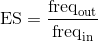

# Enrichment Scores

In this document I explain the code found in [001\_enrichment\_scores.R](./001_enrichment_ecores.R), containing the steps I took to calculate enrichment scores.

Unless stated otherwise, all the code in this document is written in R.

## 1. Load data

We first load the files generated in the raw sequencing file processing [pipeline](../003_Processing_sequencing_data/001_Phylogeny_library_in_HEK293). Output replicates are labelled BR (for **B**iological **R**eplicates):

```r
# load biological replicates
for (i in 1:9) {
  # the name of the file I need to read
  This.File.Name <- paste("Phylogeny_HEK293_BR_Rep_", i, ".3072.counts", sep = "")
  # load it in R with a generic variable name
  This.Data.Frame <- read.table(This.File.Name)
  # set column names
  colnames(This.Data.Frame) <- c("Sequence", "Counts", "Mutations")
  # set row names
  rownames(This.Data.Frame) <- as.character(This.Data.Frame$Sequence)
  # variable name I want to assign it to
  This.Variable.Name <- paste("BR", i, sep = "")
  # give it the new variable name
  assign(x = This.Variable.Name, value = This.Data.Frame)
}
```

And the input replicates are labelled TR (for **T**echnical **R**eplicates):
 
```r
# load technical replicates
for (i in 1:3) {
  # the name of the file I need to read
  This.File.Name <- paste("Phylogeny_HEK293_TR_Rep_", i, ".3072.counts", sep = "")
  # load it in R with a generic variable name
  This.Data.Frame <- read.table(This.File.Name)
  # set column names
  colnames(This.Data.Frame) <- c("Sequence", "Counts", "Mutations")
  # set row names
  rownames(This.Data.Frame) <- as.character(This.Data.Frame$Sequence)
  # variable name I want to assign it to
  This.Variable.Name <- paste("TR", i, sep = "")
  # give it the new variable name
  assign(x = This.Variable.Name, value = This.Data.Frame)
}
```

Clean up the environment:

```r
# cleanup
rm(This.Data.Frame,
   This.Variable.Name,
   This.File.Name,
   i)
```


## 2. Calculate enrichment scores

Combine all the loaded data into one data frame:

```r
All.Expts <- data.frame(TR1 = TR1[rownames(TR1), "Counts"],
                        TR2 = TR2[rownames(TR1), "Counts"],
                        TR3 = TR3[rownames(TR1), "Counts"],
                        BR1 = BR1[rownames(TR1), "Counts"],
                        BR2 = BR2[rownames(TR1), "Counts"],
                        BR3 = BR3[rownames(TR1), "Counts"],
                        BR4 = BR4[rownames(TR1), "Counts"],
                        BR5 = BR5[rownames(TR1), "Counts"],
                        BR6 = BR6[rownames(TR1), "Counts"],
                        BR7 = BR7[rownames(TR1), "Counts"],
                        BR8 = BR8[rownames(TR1), "Counts"],
                        BR9 = BR9[rownames(TR1), "Counts"],
                        Sequence = as.character(TR1[rownames(TR1), "Sequence"]),
                        Mutations = TR1[rownames(TR1), "Mutations"])
All.Expts$Sequence <- as.character(All.Expts$Sequence)
rownames(All.Expts) <- rownames(TR1)
```
Next, we will calculate the frequency of each genotype in each input and output replicate:

```r
# Frequency of each sequence in the output
Output.Frequency <- apply(X = All.Expts[,4:12],
                          MARGIN = 2,
                          FUN = function(x){
                            return(x/sum(x, na.rm = T))
                          })

# Frequency of each sequence in the input
Input.Frequency <- apply(X = All.Expts[,1:3],
                         MARGIN = 2,
                         FUN = function(x){
                           return(x/sum(x, na.rm = T))
                         })
```
Calculate the median input frequency for every genotype:

```r
# Median frequency in the input
Input.Median.Frequency <- apply(X = Input.Frequency,
                                MARGIN = 1,
                                FUN = median, na.rm = T)
```
Finally, calculate enrichment scores using the formula

<p align="center">
  
</p>

```r
# calculate enrichment scores
Enrichment.Scores <- Output.Frequency / Input.Median.Frequency
Enrichment.Scores <- as.data.frame(Enrichment.Scores)
```
Save the R object for later use.

```r
# save data frame
save(Enrichment.Scores, file = "001_enrichment_scores.RData")
```
