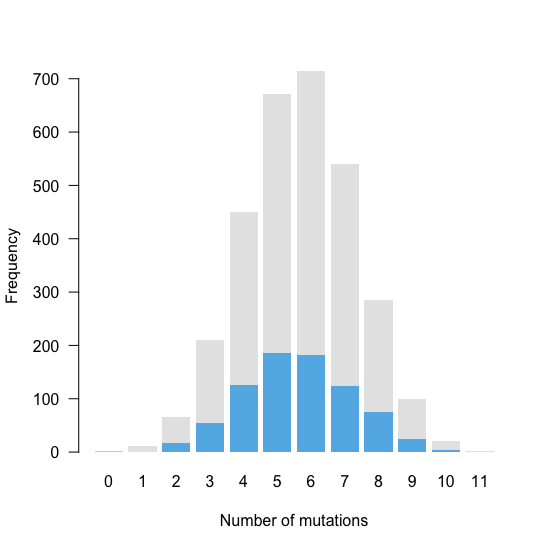
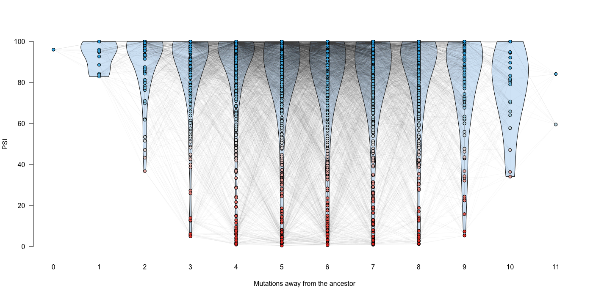
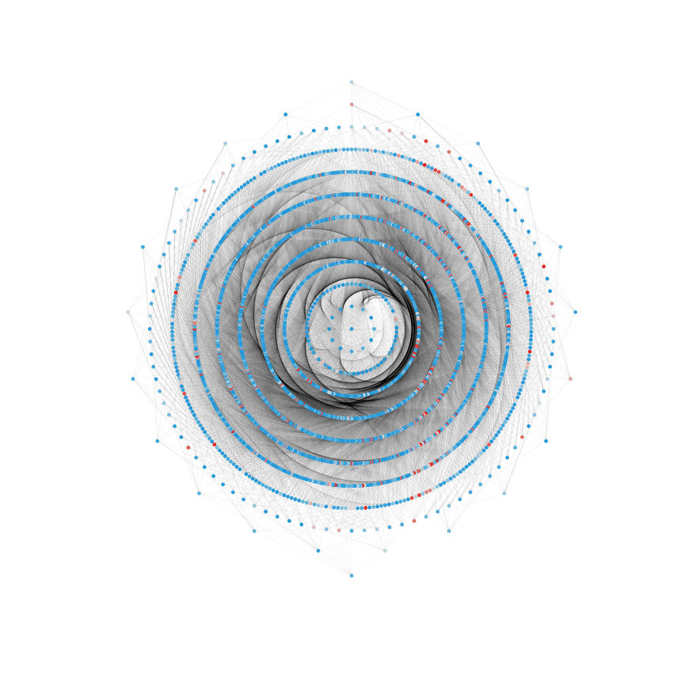

# PSI values throughout the library

In this document I explain the code found in [003\_psi\_across\_the\_library.R](./003_psi_across_the_library.R), where I visualise the overall trends in the data set.

Unless stated otherwise, all the code in this document is written in R.


## 1. Number of genotypes per Hamming distance

To visualise the number of genotypes each Hamming distance away from the ancestor, we first need to load the `Whole.Dataset` data frame generated in the previous section:

```r
# load the file containing the entire dataset
load("002_whole_dataset.RData")
```
We use this data frame to extract the number of genotypes with 0, 1, 2... 11 mutations relative to the ancestor:

```r
# the number of genotypes each Hamming distance away from the ancestor
Counts.All <- as.numeric(table(Whole.Dataset$No.Mutations))
```
And the corresponding numbers for just the high-confidence genotypes:

```r
# index of genotypes with standard deviation < 10 PSI units
Low.Noise.Rows <- which(Whole.Dataset$SD < 10)

# the number of low-sd genotypes each Hamming distance away from the ancestor
Counts.Low.SD <- as.numeric(table(Whole.Dataset$No.Mutations[Low.Noise.Rows]))
Counts.Low.SD <- c(Counts.Low.SD, 0)
```
We'll now combine the two sets of numbers into a format that will allow us to visualise them in a bar plot:

```r
# combine the two 'Counts' vector into a data frame
Stacked.Barplot.Table <- data.frame(No.Mutations = as.character(0:11),
                                    Low.Noise = Counts.Low.SD,
                                    High.Noise = Counts.All - Counts.Low.SD)

# and re-format the data frame so the barplot function can read it
Stacked.Barplot.Matrix <- t(as.matrix(Stacked.Barplot.Table[,2:3]))
```
Draw the bar plot:

```r
# square plot
par(pty = "s")

# barplot (blue bars show the low SD genotypes)
barplot(Stacked.Barplot.Matrix,
        col = c(rgb(99/255,182/255,230/255), "gray90"),
        border = NA,
        ylim = c(0,700),
        las = 1,
        ylab = "Frequency",
        xlab = "Number of mutations",
        names.arg = 0:11)
```
<p align="center">
  
  <br>Figure S1G
</p>


## 2. Genotype network

To visualise the entire library as a genotype network where each node represents a genotype and each edge connects two genotypes one hamming distance away, we first load the `Whole.Dataset` data frame into R:

```r
# load the file containing the entire dataset
load("002_whole_dataset.RData")
```
For this visualisation, we'll manually change some of the PSI values from the library. First, the PSI corresponding to the human WT sequence was manually altered to the value estimated by RT-PCR (59.5%):

```r
# there was human WT contamination in the library; therefore we'll 
# manually change the PSI to what we determined in the RT-PCR assay
Human.WT.Seq <- "GATCCAGATCTAACTTGGGGTGGCTTTGTCTTCTTCTTTTGCCAATTCCACTAATTGTTTGGG"
WT.Row <- which(as.character(Whole.Dataset$Sequence) == Human.WT.Seq)
Whole.Dataset$Mean[WT.Row] <- 59.5
```
In addition, all PSIs estimated to be greater than 100 were set to 100:

```r
# set all psi's estimated > 100 to 100
Whole.Dataset$Mean[which(Whole.Dataset$Mean > 100)] <- 100
```
The points in the graph below will be coloured according to the PSI of the genotype they represent:

```r
# load library
library(plotrix)

# point colours will depend on the PSI of the genotype
# (lowest = red; highest = blue; intermediate = grey)
Colour.Scale <- color.scale(x = Whole.Dataset$Mean,
                            extremes = c(rgb(231/255,55/255,37/255),
                                         "gray90",
                                         rgb(39/255,170/255,225/255)),
                            alpha = 1)

```

Set the plot coordinates of the network nodes:

```r
# where each point will be drawn in the plot
Plot.Coordinates = data.frame(X.Coordinate = Whole.Dataset$No.Mutations,
                              Y.Coordinate = Whole.Dataset$Mean,
                              ID = Whole.Dataset$Mutation.IDs)

```
Build a matrix containing the Hamming distances between all genotypes in our dataset.

```r
# load library
library(stringdist)

# get all sequences (genotypes) in our library
All.Sequences <- as.character(Whole.Dataset$Sequence)

# Creates a matrix of all possible hamming distances between mutants
Hamming.Matrix <- outer(X = All.Sequences,
                        Y = All.Sequences,
                        FUN = function(x1, x2){
                          stringdist(a = x1,
                                     b = x2,
                                     method = "hamming")
                        })
```
Build a data frame containing information about the edges in the network (i.e. starting and final coordinates in the plot). This uses the `Hamming.Matrix` created just before:

```r
# load library
library(parallel)

# vector with genotype IDs
Mutation.IDs = as.character(Whole.Dataset$Mutation.IDs)

# For each index (column 1), add at column two the ids of mutants at hamming distance 1
Edges <- do.call(what = "rbind",
                 args = mclapply(X = as.list(1:ncol(Hamming.Matrix)),
                                 FUN = function(x){
                                   cbind(Mutation.IDs[x],
                                         Mutation.IDs[Hamming.Matrix[,x] == 1])
                                 },
                                 mc.cores = 8))

Edges <- as.data.frame(Edges)

Edges <- merge(x = Edges,
               y = Plot.Coordinates,
               by.x="V1",
               by.y="ID")

Edges <- merge(x = Edges,
               y = Plot.Coordinates,
               by.x="V2",
               by.y="ID")

Edges <- Edges[,c(2,1,3:6)]
```
Plot:

```r
par(pty="m")

# set up an empty canvas
plot(NULL,
     xlim = c(0, 11),
     ylim = c(0,100),
     xlab = "",
     ylab = "",
     main = "",
     axes = F)

# draw some violin plots in the background
library(vioplot)
par(bty = "n")
for (i in 0:10){
  Variants.i <- Whole.Dataset$Mean[which(Whole.Dataset$No.Mutations == i)]
  vioplot(x = Variants.i, 
          at = i,
          add = T,
          col = rgb(215/255,232/255,247/255),
          drawRect = F,
          axes = F)
  
}

# draw the edges
with(data = Edges,
     expr = {
       segments(x0 = X.Coordinate.x,
                y0 = Y.Coordinate.x,
                x1 = X.Coordinate.y,
                y1 = Y.Coordinate.y,
                col = rgb(0.3,0.3,0.3,0.4),
                lwd = 0.05)
       })

# draw the points
par(new=T)
plot(Whole.Dataset$No.Mutations,
     Whole.Dataset$Mean,
     col = "black",
     bg = Colour.Scale,
     pch = 21,
     cex = 1,
     xlim = c(0, 11),
     ylim = c(0,100),
     axes = F,
     xlab = "Mutations away from the ancestor",
     ylab = "PSI")

# add the axes
axis(side = 1, at = c(0:11), lty = 0)
axis(side = 2, las = 1)
```
<p align="center">
  
  <br>Figure 1E
</p>

To visualise the genotype network with concentric circles (Figure S1), the previous code needs to be slightly modified. First, we'll split the `Whole.Data` data frame according to the number of mutations each genotype has relative to the ancestral sequence:

```r
# split 'Whole.Dataset' according to the Hamming distance of the genotype
Split.Whole.Dataset <- split(x = Whole.Dataset,
                            f = Whole.Dataset$No.Mutations)
```
Next, figure out the coordinates of each point in the new plot (this is slightly different from before since we're plotting things around a circle):

```r
# Where each point will be drawn in the plot
Plot.Coordinates <- do.call(what = "rbind",
                            args = lapply(X = Split.Whole.Dataset,
                                          FUN = function(x){
                                            x <- x[order(x$Mutation.IDs),]
                                            n <- x$No.Mutations[1]
                                            s <- seq(0,2*pi,length.out = nrow(x)+1)
                                            coord <- sapply(X = 1:(length(s)-1),
                                                            FUN = function(y){
                                                              c(n*cos(s[y]), n*sin(s[y]))
                                                            })
                                            coord <- as.data.frame(t(coord))
                                            coord$ID <- x$Mutation.IDs
                                            coord
                                          }))
names(Plot.Coordinates) = c("Y.Coordinate","X.Coordinate","ID")
```
We define the edges as previously, using the new coordinates we have just generated:

```r
# define the edges as previously
Edges <- do.call(what = "rbind",
                 args = mclapply(X = as.list(1:ncol(Hamming.Matrix)),
                                 FUN = function(x){
                                   cbind(Mutation.IDs[x],
                                         Mutation.IDs[Hamming.Matrix[,x] == 1])
                                 },
                                 mc.cores=8))

Edges <- as.data.frame(Edges)

Edges <- merge(x = Edges,
               y = Plot.Coordinates,
               by.x = "V1",
               by.y = "ID")

Edges <- merge(x = Edges,
               y = Plot.Coordinates,
               by.x = "V2",
               by.y = "ID")

Edges <- Edges[,c(2,1,3:6)]
```
We re-do the colour scale:

```r
# Have to redo the colour scale because when I split the dataset I
# changed the order in which I draw all the points in the plot
# 1st make a new dataset where genotypes are in the same order as the plot
Whole.Dataset2 = do.call(what = "rbind",
                         args = lapply(X = Split.Whole.Dataset,
                                       FUN = function(x){
                                         x = x[order(x$Mutation.IDs),]
                                       }))

# next use plotrix::color.scale to build the colour scale
library(plotrix)
Colour.Scale <- color.scale(x = Whole.Dataset2$Mean,
                            extremes = c(rgb(231/255,55/255,37/255),
                                         "gray90",
                                         rgb(39/255,170/255,225/255)),
                            alpha = 1)
```
And plot:

```r
# open an empty canvas
par(pty="s")
plot(NULL,
     type="n",
     xlim=c(-max(Whole.Dataset$No.Mutations),
            max(Whole.Dataset$No.Mutations)),
     ylim=c(-max(Whole.Dataset$No.Mutations),
            max(Whole.Dataset$No.Mutations)),
     axes=F,
     xlab="",
     ylab="")

# draw the edges
with(data = Edges,
     expr = {
       segments(x0 = X.Coordinate.x,
                y0 = Y.Coordinate.x,
                x1 = X.Coordinate.y,
                y1 = Y.Coordinate.y,
                col = "#00000005")
     })

# draw the points
points(x = Plot.Coordinates$X.Coordinate,
       y = Plot.Coordinates$Y.Coordinate,
       col = Colour.Scale,
       pch = 19,
       cex = 0.5)
```
<p align="center">
  
  <br>Figure S1H
</p>
