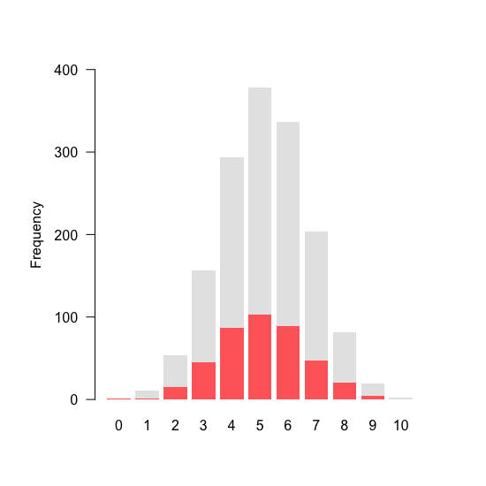
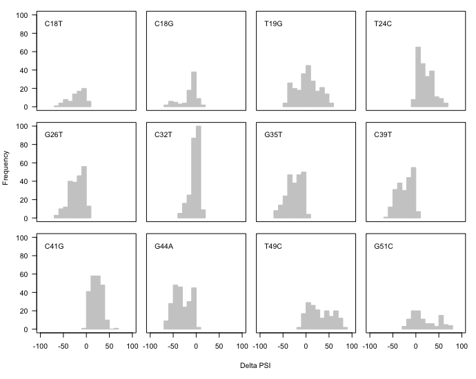
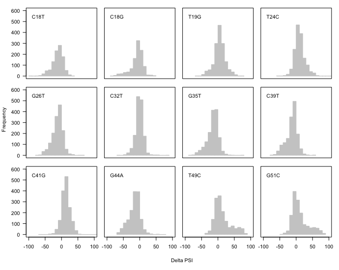

# Mutation effects


In this document I explain the code found in [004\_mutation\_effects.R](./004_mutation_effects.R), where I analyse the distribution of effects per mutation.

Unless stated otherwise, all the code in this document is written in R.

## 1. Data preparation

Before doing any sort of analysis we need to create a list of data frames, where each data frame contains information about the effects of a particular mutation on exon inclusion. For example, the data frame for mutation **C-41-G** would look something like this:

| Genotype.Final              | Genotype.Starting | Final.PSI | Starting.PSI | Delta.PSI   |
|-----------------------------|-------------------|-----------|--------------|-------------|
| T-19-G;T-24-C;**C-41-G**... | T-19-G;T-24-C...  | 83.09151  | 97.48439     | -14.3928775 |

First, we'll load the `Whole.Data` data frame prepared in [section 002](./002_psi_scores.md):

```r
# load the file containing the entire dataset
load("002_whole_dataset.RData")
```
Next, we create a vector containing the 12 single mutations that occur in the library:

```r
# vector containing the identity of the 12 point mutations found in the library
Single.Mutations <- c("C-41-G",
                      "T-49-C",
                      "T-24-C",
                      "T-19-G",
                      "G-51-C",
                      "C-18-G",
                      "C-32-T",
                      "C-18-T",
                      "C-39-T",
                      "G-26-T",
                      "G-35-T",
                      "G-44-A")
```
We then initialise an empty list of length 12 (the number of individual mutations in our library) and name each element in the list after one of the 12 mutations:

```r
# start an empty list of length 12
Final.Vs.Starting.PSI.List <- vector(mode = "list",
                                     length = length(Single.Mutations))

# each element in the list is named after one of the 12 mutations
names(Final.Vs.Starting.PSI.List) <- as.character(Single.Mutations)

```
Next, we'll loop through each of the 12 mutations to build a data frame similar to the one described above:

```r
for (i in 1:(length(Single.Mutations))) {
    # some code here
}
```
In this markdown document I'll go through the code inside the loop as it would apply to one mutation, but any readers should be aware that the following code is repeated 12 times, once for each of the mutations.

Inside the loop, we first take the identity of the mutation whose effects we want to look at:

```r
# which is this mutation?
My.ID <- Single.Mutations[i]

# keep track of the iteration we're in...
print(My.ID)
```
Next, we take the rows in `Whole.Dataset` that contain the mutation we're iterating through:

```r
# Get the rows containing my target mutation
Rows.With.My.ID.Plus.SomethingElse <- sapply(X = as.character(Whole.Dataset$Mutation.IDs),
                                             FUN = function(x){
                                               x.vector <- strsplit(x, ";")[[1]]
                                               My.ID %in% x.vector
                                             })

```
We use those rows to extract the "final PSIs" (the PSIs after the mutation has been introduced into the exon):

```r
# get final psis
Final.PSI <- Whole.Dataset$Mean[Rows.With.My.ID.Plus.SomethingElse]
Low.Final.PSI <- Whole.Dataset$Low.PSI[Rows.With.My.ID.Plus.SomethingElse]
High.Final.PSI <- Whole.Dataset$High.PSI[Rows.With.My.ID.Plus.SomethingElse]
```
Now we need to match these final PSIs to the corresponding starting PSIs. To do this, we must first find determine which are the background mutations that would have been present in the exon before the mutation of interest was made:

```r
# Extract all those "and something else" that are in the background
Mutations.In.Background <- sapply(X = as.character(Whole.Dataset$Mutation.IDs)[Rows.With.My.ID.Plus.SomethingElse],
                                  FUN = function(x){
                                    x.vector <- strsplit(x, ";")[[1]]
                                    which.is.my.id <- which(x.vector == My.ID)
                                    x.vector <- x.vector[-which.is.my.id]
                                    if (length(x.vector) == 0){
                                      x.vector <- ""
                                    }
                                    x.vector
                                  })
```
Next, we find the rows in `Whole.Dataset` containing the background mutations for each of the final PSI genotypes whose PSI we already extracted:

```r
# Find the rows that contain ONLY those "something else" IDs
Index.Starting.Sequence <- lapply(X = Mutations.In.Background,
                                  FUN = function(x){
                                    x <- as.character(x)
                                    ID.To.Search <- paste(x, collapse = ";")[[1]]
                                    
                                    which(as.character(Whole.Dataset$Mutation.IDs) == ID.To.Search)
                                  })

# unlist
Index.Starting.Sequence <- unlist(Index.Starting.Sequence)
```
Now that we have the rows, we can use them to get the final PSI values:

```r
# get starting psis
Starting.PSI <- Whole.Dataset$Mean[Index.Starting.Sequence]
Low.Starting.PSI <- Whole.Dataset$Low.PSI[Index.Starting.Sequence]
High.Starting.PSI <- Whole.Dataset$High.PSI[Index.Starting.Sequence]
```
The effect of the mutation is given by the difference between the final and starting PSIs:

```r
# delta psi is final minus starting psi
Delta.PSI <- Final.PSI - Starting.PSI
```
All the information gathered up to this point will be organised in the form of a data frame:

```r
# save as a data frame
This.ID.Dataframe <- data.frame(Genotype.Final = as.character(Whole.Dataset$Mutation.IDs)[Rows.With.My.ID.Plus.SomethingElse],
                                Genotype.Starting = as.character(Whole.Dataset$Mutation.IDs)[Index.Starting.Sequence],
                                Final.PSI = Final.PSI,
                                Low.Final.PSI = Low.Final.PSI,
                                High.Final.PSI = High.Final.PSI,
                                Starting.PSI = Starting.PSI,
                                Low.Starting.PSI = Low.Starting.PSI,
                                High.Starting.PSI = High.Starting.PSI,
                                Delta.PSI = Delta.PSI)

```
And this data frame is then thrown into the list that we created before starting the loop.

```r
Final.Vs.Starting.PSI.List[[i]] <- This.ID.Dataframe
```
After the final iteration of the loop, the list is saved as [004\_final\_vs\_starting\_psi\_list.RData](./004_final_vs_starting_psi_list.RData), which is also available for download in the current folder:

```r
save(Final.Vs.Starting.PSI.List, file = "004_final_vs_starting_psi_list.RData")
```

## 2. Backgrounds where a mutation can be added

In Figure 2B, we showed the distribution of genotypes in which T19G can be introduced, according to their Hamming distance away from the ancestor. To plot this, we first load `Whole.Data` and `Final.Vs.Starting.PSI.List` into the R environment:

```r
# load files
load("002_whole_dataset.RData")
load("004_final_vs_starting_psi_list.RData")
```
From the list of data frames, we'll extract the one corresponding to T19G:

```r
# T19G is in the 4th position in the list
This.DF <- Final.Vs.Starting.PSI.List[[4]]
```
To draw this distribution, we first need to check the number of mutations in each starting genotype as well as their standard deviations (to show the distributions in two colours):

```r
# change row names from sequence to genotype id
rownames(Whole.Dataset) <- as.character(Whole.Dataset$Mutation.IDs)

# number of mutations in starting genotype id
Number.Of.Mutations <- Whole.Dataset[as.character(This.DF$Genotype.Starting), "No.Mutations"]

# standard deviation of PSI in starting genotypes
SD <- Whole.Dataset[as.character(This.DF$Genotype.Starting), "SD"]
```
Now we build a table containing the information that the bar plot function can take:

```r
# table for bar plot
Table.Barplot <- rbind(
  c(1, as.vector(table(Number.Of.Mutations[which(SD < 10)])), 0),
  c(1, as.vector(table(Number.Of.Mutations))) - c(1, as.vector(table(Number.Of.Mutations[which(SD < 10)])), 0)
)
```
And plot:

```r
# draw the bar plot
par(pty="s")
barplot(Table.Barplot,
        col = c("indianred1", "gray90"),
        border = NA,
        ylim = c(0,400),
        names.arg = 0:10)
```
<p align="center">
  
  <br>Figure 2B
</p>


## 3. Distribution of mutation effects


To see whether the same mutation has different effects, we visualised the distribution of Delta PSIs for all 12 mutations. For this, we will need to load `Whole.Data` and `Final.Vs.Starting.PSI.List` if they have not been loaded yet:


```r
# load files
load("002_whole_dataset.RData")
load("004_final_vs_starting_psi_list.RData")
```
Apart from this, we will make a vector containing the identity of the 12 mutations in the order in which they appear in the exon sequence:

```r
# mutations in the order in which they occur along the exon
Names.In.Sequence.Order <- c("C-18-T",
                             "C-18-G",
                             "T-19-G",
                             "T-24-C",
                             "G-26-T",
                             "C-32-T",
                             "G-35-T",
                             "C-39-T",
                             "C-41-G",
                             "G-44-A",
                             "T-49-C",
                             "G-51-C"
)
```
We also need to get a vector with the genotypes that have low variance (SD < 10) in order to plot histograms for the high-confidence subset of the library:

```r
# before plotting, get the IDs of genotypes with low variance
Low.Noise.Genotypes <- as.character(Whole.Dataset$Mutation.IDs)[which(Whole.Dataset$SD < 10)]
```
To plot the 12 histograms in the same figure, I changed some of R's plotting parameters:

```r
par(mar = c(0,0,1,1) + 0.1)
par(oma = c(5,4,0,0) + 0.1)
par(mfrow=c(3,4))
par(pty="s")
```
I plotted the histograms in a loop:

```r
for (i in 1:12){
    # code here
}
```
I'll go through the code inside this loop, but note that the code will be read 12 times, once for each mutation. First, we'll take the identity of the mutation and extract its corresponding data frame from `Final.Vs.Starting.PSI.List`:

```r
This.Number <- i

# what is the ID of this mutation?
This.Mutation <- as.character(Names.In.Sequence.Order)[This.Number]

# extract the data frame
This.Mutation.DF <- Final.Vs.Starting.PSI.List[[This.Mutation]]
```
Filter high-variance genotypes out from the data frame:

```r
# Get low noise rows
Low.Noise.Rows <- which(as.character(This.Mutation.DF$Genotype.Final) %in% Low.Noise.Genotypes & as.character(This.Mutation.DF$Genotype.Starting) %in% Low.Noise.Genotypes)

# subset This.Mutation.DF
This.Mutation.DF <- This.Mutation.DF[Low.Noise.Rows,]
```
Plot the histogram, adjusting the number of breaks such that the bars in all 12 plots have the same width and are therefore easier to comapre:

```r
if (! This.Mutation %in% c("C-32-T", "T-24-C", "C-41-G")) {
  hist(This.Mutation.DF$Delta.PSI,
       xlim = c(-100,100),
       ylim = c(0,100),
       col = "gray80",
       border = "gray80",
       ann = F,
       axes = F,
       breaks = 10)
} else {
  hist(This.Mutation.DF$Delta.PSI,
       xlim = c(-100,100),
       ylim = c(0,100),
       col = "gray80",
       border = "gray80",
       ann = F,
       axes = F,
       breaks = 5)
}
```
Add the ID of the mutant to the plot:

```r
text(x = -100,
       y = 90,
       labels = paste(strsplit(This.Mutation, split = "-")[[1]], sep = "", collapse = ""),
       pos = 4, cex = 1)
```
The final step is to surround the plot with a box and add axes if necessary:

```r
# surround the plot with a box (no axes were drawn yet)
box()

# draw left-hand side axis if this plot is to the left
if (i %in% c(1,5,9)){
  axis(side = 2, las = 1)
}

# draw bottom axis if this plot is at the bottom
if (i %in% c(9,10,11,12)) {
  axis(side = 1)
}
```
After the final iteration of the loop, we add the axis titles:

```r
title(xlab = "Delta PSI",
      ylab = "Frequency",
      outer = TRUE, line = 3)
```
And return the graphical parameters to their original state:

```r
par(mar = c(5,4,4,2)+0.1)
par(oma = c(0,0,0,0))
par(mfrow=c(1,1))
```
Running this code should result in a plot like this:

<p align="center">
  
  <br>Figure 2C
</p>


We can also run the code (with some slight changes, see [004\_mutation\_effects.R](./004_mutation_effects.R)) without removing high-variance genotypes, and this is the result:

<p align="center">
  
  <br>Figure 2C
</p>
