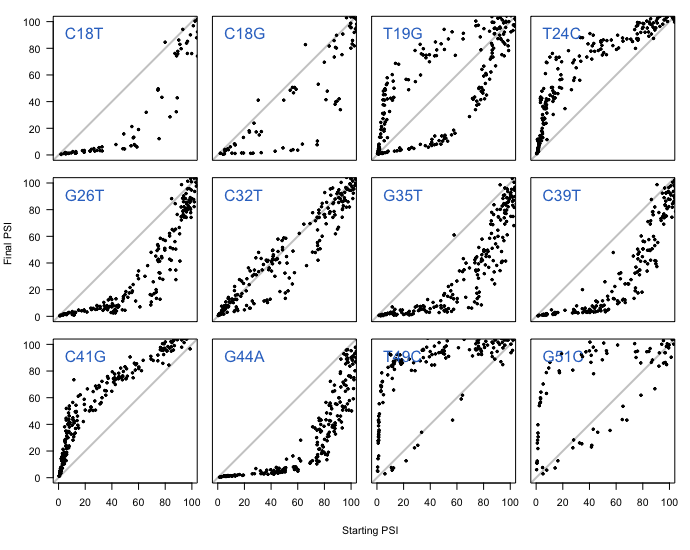
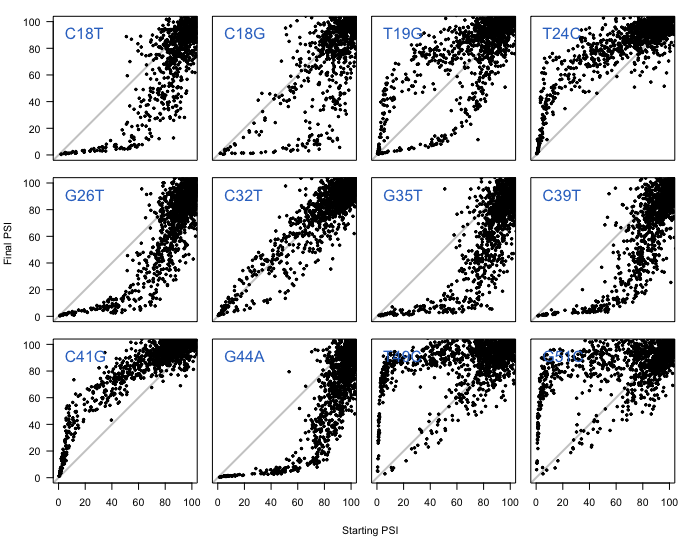
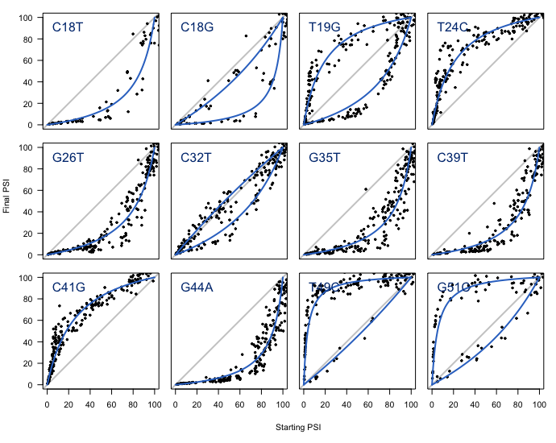
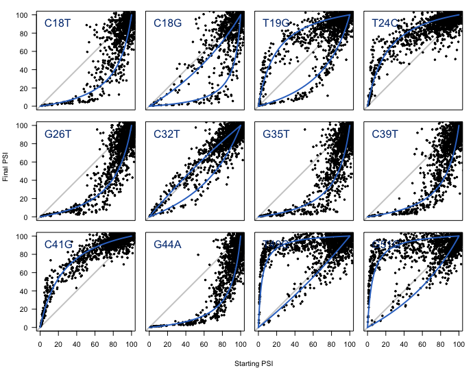
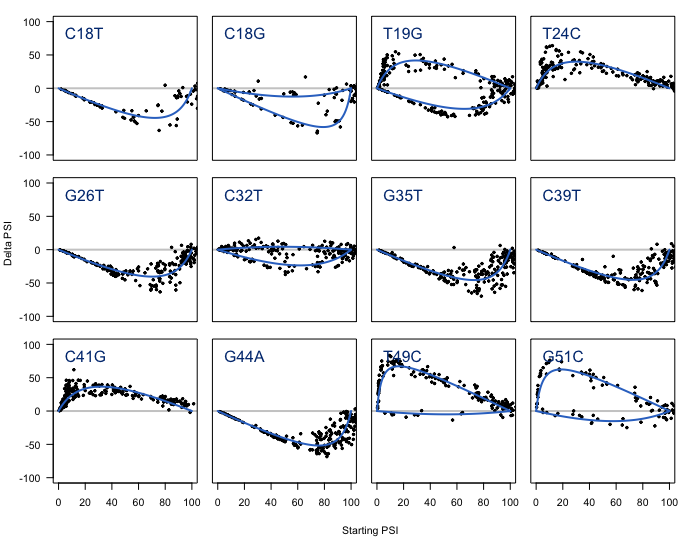
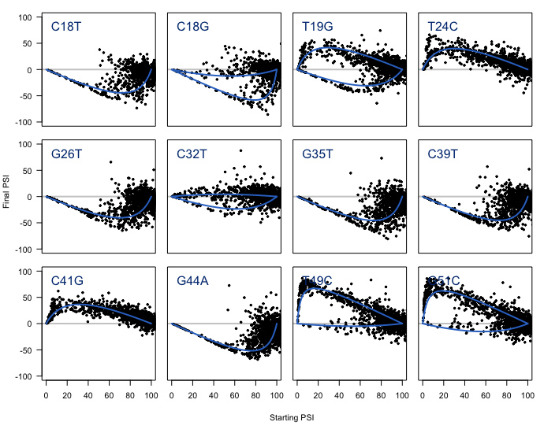

# Non-monotonic scaling of mutation effects

In this document I explain the code found in [005\_non\_monotonic\_scaling.R](./005_non_monotonic_scaling.R), where I visualise the effect of mutations as a function of the starting PSI in which they are introduced.

Unless stated otherwise, all the code in this document is written in R.

## 1. Plot final vs starting PSI

We first load `002_whole_dataset.RData` and `004_final_vs_starting_psi_list.RData` into R:


```r
# load Whole.Dataset
load("002_whole_dataset.RData")

# load Final.Vs.Starting.PSI
load("004_final_vs_starting_psi_list.RData")

```
Make a vector with the low-variance genotypes:

```r
# use Whole.Dataset to get the genotypes with low variance
Low.Noise.Genotypes <- as.character(Whole.Dataset$Mutation.IDs)[which(Whole.Dataset$SD < 10)]
```
And a vector with the mutations in the order in which they are found along the exon:

```r
# mutations in the order in which they occur along the exon
Names.In.Sequence.Order <- c("C-18-T",
                             "C-18-G",
                             "T-19-G",
                             "T-24-C",
                             "G-26-T",
                             "C-32-T",
                             "G-35-T",
                             "C-39-T",
                             "C-41-G",
                             "G-44-A",
                             "T-49-C",
                             "G-51-C"
)
```
To plot the 12 scatterplots in the same figure, I changed some of R's graphical parameters:

```r
par(mar = c(0,0,1,1) + 0.1)
par(oma = c(5,4,0,0) + 0.1)
par(mfrow=c(3,4))
par(pty="s")
```
I generated the scatterplots in a loop:

```r
for (i in 1:12){
    # code here
}
```
I'll go through the code inside this loop, but note that the code will be read 12 times, once for each mutation. First, we'll take the identity of the mutation and extract its corresponding data frame from `Final.Vs.Starting.PSI.List`:

```r
This.Number <- i

# what is the ID of this mutation?
This.Mutation <- as.character(Names.In.Sequence.Order)[This.Number]

# extract the data frame
This.Mutation.DF <- Final.Vs.Starting.PSI.List[[This.Mutation]]
```
Filter high-variance genotypes out from the data frame:

```r
# Get low noise rows
Low.Noise.Rows <- which(as.character(This.Mutation.DF$Genotype.Final) %in% Low.Noise.Genotypes & as.character(This.Mutation.DF$Genotype.Starting) %in% Low.Noise.Genotypes)

# subset This.Mutation.DF
This.Mutation.DF <- This.Mutation.DF[Low.Noise.Rows,]
```
Generate the scatterplot:

```r
# plot final vs starting PSI
par(pty="s")
plot(NULL,
     xlim = c(0,100),
     ylim = c(0,100),
     xlab = "",
     ylab = "",
     axes = F)
abline(0,1, col = "gray80", lwd = 2)
par(new=T)
plot(This.Mutation.DF$Starting.PSI,
     This.Mutation.DF$Final.PSI,
     pch = 19,
     cex = 0.5,
     xlim = c(0,100),
     ylim = c(0,100),
     xlab = "",
     ylab = "",
     main = "",
     axes = F)
```

Add the ID of the mutant to the plot:

```r
# stick the name of the mutation in the top left part of the plot
text(x = 0,
     y = 90,
     labels = paste(strsplit(This.Mutation, split = "-")[[1]],
                    sep = "",
                    collapse = ""),
     pos = 4,
     cex = 1.5,
     col = "3375CA")
```
The final step is to surround the plot with a box and add axes if necessary:

```r
# surround the plot with a box (no axes were drawn yet)
box()

# draw left-hand side axis if this plot is to the left
if (i %in% c(1,5,9)){
  axis(side = 2, las = 1)
}

# draw bottom axis if this plot is at the bottom
if (i %in% c(9,10,11,12)) {
  axis(side = 1)
}
```
After the final iteration of the loop, we add the axis titles:

```r
# axis labels
title(xlab = "Starting PSI",
      ylab = "Final PSI",
      outer = TRUE,
      line = 3)
```
And return the graphical parameters to their original state:

```r
par(mar = c(5,4,4,2)+0.1)
par(oma = c(0,0,0,0))
par(mfrow=c(1,1))
```
Running this code should result in a plot like this:

<p align="center">
  
</p>


The same code without filtering high-variance genotypes out from the data frame (see [005\_non\_monotonic\_scaling.R](./005_non_monotonic_scaling.R)) produces the following plot:

<p align="center">
  
</p>

## 2. Add exon competition model curve

If we want to draw the curve predicted by the exon competition model, we will need to add some code to what was described above. Since some mutations appear to display two very distinct behaviours (for example, see T19G above), it makes sense to fit different curves to each of these behaviours. These behavioural changes are brought about by pairwise epistatic interactions, so we'll first make a note of what these interactions are:

```r
Important.Epistatic.Pairs <- data.frame(Main =      c("C-18-G","T-19-G","C-32-T","T-49-C","G-51-C"),
                                        Epistatic = c("T-19-G","C-18-G","G-35-T","G-51-C","T-49-C"))
```
Next, we'll run the loop as above, but adding a bit of code that will allow us to draw a curve in each of the generated plots. This extra bit of code is wrapped in an if-else statement:

```r
if (This.Mutation %in% as.character(Important.Epistatic.Pairs$Main)) {
    # what to do if there are two behaviours
} else {
    # what to do if there is just one behaviour
}
```
If there are two behaviours, we first take the data corresponding to genotypes containing the epistatic mutation:

```r
# if we fit 2 curves, check which is the epistatic mutation that causes the second behaviour
Epistatic.Pair <- as.character(Important.Epistatic.Pairs$Epistatic)[which(as.character(Important.Epistatic.Pairs$Main) == This.Mutation)]

# Which rows in This.Mutation.DF contain the epistatic mutation?
Rows.With.Epistatic.Partner <- which(sapply(as.character(This.Mutation.DF$Genotype.Final),
                                            function(x){
                                              Epistatic.Pair %in% strsplit(x, ";")[[1]]
                                            }))


# Prepare to draw the first curve:
# a) which starting + final genotypes contain the epistatic mutation?
X <- 0.01*This.Mutation.DF$Starting.PSI[Rows.With.Epistatic.Partner]
Y <- 0.01*This.Mutation.DF$Final.PSI[Rows.With.Epistatic.Partner]
```
And we then run the code that allows us to draw the curve:

```r
# b) logit transform
Logit.X <- log((X)/(1-X))
Logit.Y <- log((Y)/(1-Y))

# c) stuff estimated > 100 will give an na, so need to remove those
Remove.Indices <- union(which(is.na(Logit.X)), which(is.na(Logit.Y)))
Logit.X <- Logit.X[-Remove.Indices]
Logit.Y <- Logit.Y[-Remove.Indices]

# d) calculate the effect ln(A) of our mutation
Effect.K <- mean(Logit.Y - Logit.X)

# e) a function for the relationship between Starting and Final PSI
Curve.Fit <- function(X, K){
  (exp(K)*X)/(1-X+exp(K)*X)
}

# f) create the curve
New.X <- seq(0,1,0.01)
New.Y <- Curve.Fit(X = New.X, K = Effect.K)

# g) and draw it
lines(x = New.X*100,
      y = New.Y*100,
      col = "#3375CA",
      lwd = 2)
```
For the other curve, we take the genotypes that do NOT contain the epistatic mutation:

```r
# Now draw the second curve. Same as above, with the rows we didn't use earlier
# a) which starting + final genotypes do NOT contain the epistatic mutation?
X <- 0.01*This.Mutation.DF$Starting.PSI[-Rows.With.Epistatic.Partner]
Y <- 0.01*This.Mutation.DF$Final.PSI[-Rows.With.Epistatic.Partner]
```
And then run the code that allows us to draw the curve:

```r
# b) logit transform
Logit.X <- log((X)/(1-X))
Logit.Y <- log((Y)/(1-Y))

# c) stuff estimated > 100 will give an na, so need to remove those
Remove.Indices <- union(which(is.na(Logit.X)), which(is.na(Logit.Y)))
Logit.X <- Logit.X[-Remove.Indices]
Logit.Y <- Logit.Y[-Remove.Indices]

# d) calculate the effect ln(A) of our mutation
Effect.K <- mean(Logit.Y - Logit.X)

# e) a function for the relationship between Starting and Final PSI
Curve.Fit <- function(X, K){
  (exp(K)*X)/(1-X+exp(K)*X)
}

# f) create the curve
New.X <- seq(0,1,0.01)
New.Y <- Curve.Fit(X = New.X, K = Effect.K)

# g) and draw it
lines(x = 100*New.X,
      y = 100*New.Y,
      col = "#3375CA",
      lwd = 2)

```
If there is just one behaviour, then we simply run this code in the `else` clause (the same as above, without subdividing `This.Mutation.DF` into epistatic and non-epistatic sub data frames:

```r
# If there is only one clear behaviour, then we don't need to worry about epistasis
# a) starting + final psis
X <- 0.01*This.Mutation.DF$Starting.PSI
Y <- 0.01*This.Mutation.DF$Final.PSI

# b) logit transform
Logit.X <- log((X)/(1-X))
Logit.Y <- log((Y)/(1-Y))

# c) stuff estimated > 100 will give an na, so need to remove those
Remove.Indices <- union(which(is.na(Logit.X)), which(is.na(Logit.Y)))
Logit.X <- Logit.X[-Remove.Indices]
Logit.Y <- Logit.Y[-Remove.Indices]

# d) calculate the effect ln(A) of our mutation
Effect.K <- mean(Logit.Y - Logit.X)

# e) a function for the relationship between Starting and Final PSI
Curve.Fit <- function(X, K){
  (exp(K)*X)/(1-X+exp(K)*X)
}

# f) create the curve
New.X <- seq(0,1,0.01)
New.Y <- Curve.Fit(X = New.X, K = Effect.K)

# g) and draw it
lines(x = 100*New.X,
      y = 100*New.Y,
      col = "#3375CA",
      lwd = 2)
```
Adding this to the code inside the loop results in the following plots:

<p align="center">
  
  <br> Figure S3A
</p>

<p align="center">
  
  <br> Figure S3C
</p>


## 3. Delta PSI vs starting PSI

To draw Delta PSI on the y axis instead of the final PSI, we need to change all instances of `This.Mutation.DF$Final.PSI` into `This.Mutation.DF$Final.PSI - This.Mutation.DF$Starting.PSI` and update the y axes accordingly.

<p align="center">
  
  <br> Figure S3B
</p>

<p align="center">
  
  <br> Figure S3D
</p>