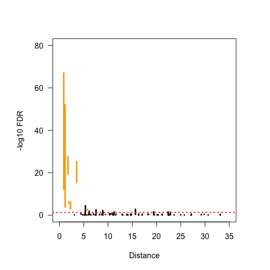
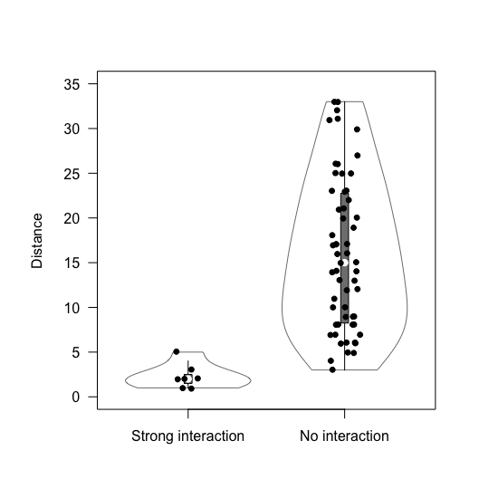
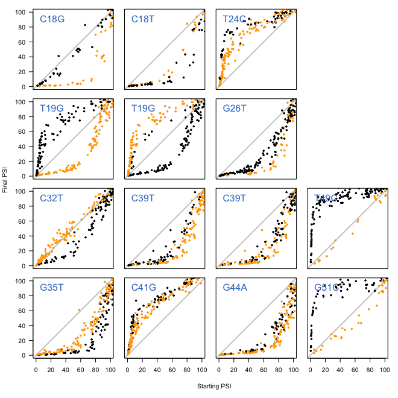
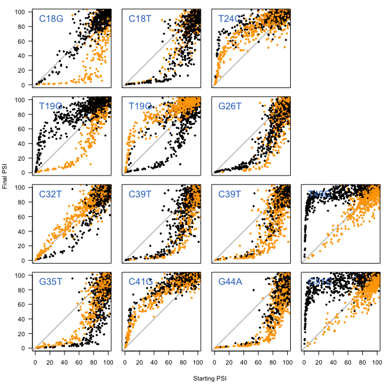

# Pairwise epistasis

In this document I explain the code found in [006\_pairwise\_epistasis.R](./006_pairwise_epistasis.R), where I discover and visualise the pairwise epistatic interactions present in the mutant library.

Unless stated otherwise, all the code in this document is written in R.

## 1. Testing for pairwise interactions

First, load `Whole.Dataset` and `Final.Vs.Starting.PSI.List` into R:

```r
# load Whole.Dataset
load("002_whole_dataset.RData")

# load Final.Vs.Starting.PSI
load("004_final_vs_starting_psi_list.RData")
```
Create a logit transformation function that we'll use later on:

```r
# logit transform function
Logit.Transform <- function(x){
  log((x)/(1-x))
}
```
We'll also start an empty data frame where we'll store all the information about the epistatic interactions tested:

```r
# initialise an empty data frame that I'll fill in with information
P.Values.Distance.DF <- data.frame(Main = c(),
                                   Epistatic = c(),
                                   Position.Main = c(),
                                   Position.Epistatic = c(),
                                   Distance = c(),
                                   Magnitude = c(),
                                   P.Value = c(),
                                   Minus.Log10.P.Value = c())
```

To test for all the interactions, we'll loop through each mutation, and test for interactions with all other mutations (i.e. a for loop inside a for loop). In the main loop we're only identifying the mutation whose interactions we'll be testing, we're preparing its `This.Mutation.DF` data frame (from `Final.Vs.Starting.PSI.List`) so it only contains low-variance genotypes, and we create some empty vectors that we'll fill in with information inside the secondary for loop:

```r
for (k in 1:length(Final.Vs.Starting.PSI.List)){
  
  print(k)
  # Define Mutation
  This.Mutation <- names(Final.Vs.Starting.PSI.List)[k]
  
  # Make dataframe with before/after Mutation
  This.Mutation.DF <- Final.Vs.Starting.PSI.List[[This.Mutation]]
  
  # which rows in This.Mutation.DF contain only low-variance genotypes?
  Low.Noise.Indices <- which(as.character(This.Mutation.DF$Genotype.Final) %in% Low.Noise.Genotypes & as.character(This.Mutation.DF$Genotype.Starting) %in% Low.Noise.Genotypes)
  
  # filter high-variance genotypes out of This.Mutation.DF
  This.Mutation.DF <- This.Mutation.DF[Low.Noise.Indices,]
  
  # Find which other mutations are there
  Other.Mutations <- names(Final.Vs.Starting.PSI.List)[which(names(Final.Vs.Starting.PSI.List) != This.Mutation)]
  
  # Cannot have 2 mutations in the same position
  if (This.Mutation == "C-18-G") {
    Other.Mutations <- Other.Mutations[-which(Other.Mutations == "C-18-T")]
  } else if (This.Mutation == "C-18-T") {
    Other.Mutations <- Other.Mutations[-which(Other.Mutations == "C-18-G")]
  }
  
  # open empty vectors that we'll fill in later with information
  P.Values.Vector <- vector()
  Magnitude.Effect.Vector <- vector()
  Mains.Vector <- vector()
  Epistatics.Vector <- vector()
  
  # loop through the other mutations with which This.Mutation could potentially interact
  for (i in 1:length(Other.Mutations)){
    # code for the secondary loop here
  }
  
  # some more code here (read description)
  
}
```
The secondary for loop is where we'll be testing for epistatic interactions. In this loop, we'll iterate through each of the other possible mutations that our "main" mutation could potentially interact with:

```r
# id of the mutation with which we'll perform a test to see if there is epistasis
Each.Other.Mutation <- Other.Mutations[i]
```
Once we know which other mutation we'll be performing a test for, we take the rows in `This.Mutation.DF` with genotypes containing this mutation:

```r
# which rows in This.Mutation.DF contain the other mutation?
Rows.With.Other.Mutation <- which(sapply(X = as.character(This.Mutation.DF$Genotype.Final),
                                         FUN = function(x){
                                           Mutations.Here <- strsplit(x, ";")[[1]]
                                           Each.Other.Mutation %in% Mutations.Here
                                         }))
```
Using **equation S9** from the supplementary text, we can calculate the effect of the mutation in logit space in each possible genetic background, and save it in a vector called `All.Effects`:

```r
# Calculate the effect [ln(A)] of This.Mutation in all the backgrounds of This.Mutation.DF
All.Effects <- Logit.Transform(0.01*This.Mutation.DF$Final.PSI) - Logit.Transform(0.01*This.Mutation.DF$Starting.PSI)
```
We then gather some information about the data points we'll use in our test for epistasis. In particular, for each row in `This.Mutation.DF`:

* What is the effect of the mutation (calculated above)?
* Which is the mutation we're testing this interaction with?
* Is that other mutation present in the genetic background?

```r
# Build a vector saying whether each genotype in This.Mutation.DF contains
# the potentially epistatic mutation
Contains.Other.Mutation <- rep("No", nrow(This.Mutation.DF))
Contains.Other.Mutation[Rows.With.Other.Mutation] <- "Yes"

# A vector repeating the ID of the Other.Mutation the number of rows in This.Mutation.DF
Other.Mutation.Vector <- rep(Each.Other.Mutation, nrow(This.Mutation.DF))

# a data frame containing the three vectors we have just built
Temporary.DF <- data.frame(Effect = All.Effects,
                           Contains.Other.Mutation = Contains.Other.Mutation,
                           Other.Mutation = Other.Mutation.Vector)
```
Before performing the test, we will split `All.Effects` in two vectors, depending on whether or not the genetic background contains the potential epistatic mutation:

```r
# to perform a test, take all the effects in the presence of the Other.Mutation
Effects.With.Other.Mutation <- All.Effects[Rows.With.Other.Mutation]
Effects.With.Other.Mutation <- Effects.With.Other.Mutation[complete.cases(Effects.With.Other.Mutation)]

# and in the absence of the Other.Mutation
Effects.Without.Other.Mutation <- All.Effects[-Rows.With.Other.Mutation]
Effects.Without.Other.Mutation <- Effects.Without.Other.Mutation[complete.cases(Effects.Without.Other.Mutation)]
```
Perform a t test if we have enough observations (which we always did):

```r
# if we have more than 3 observations in each group, perform the test
if (length(Effects.With.Other.Mutation) >= 3 & length(Effects.Without.Other.Mutation) >=3) {
  T.Test.Object <- t.test(Effects.With.Other.Mutation, Effects.Without.Other.Mutation)
  P.Value <- T.Test.Object$p.value
  Magnitude.Effect <- T.Test.Object$estimate[1] - T.Test.Object$estimate[2]
} else {
  P.Value <- NA
  Magnitude.Effect <- NA
}
```
Finally, save all the information we collected in the vectors that we created just before entering the secondary loop:

```r
# add the values we have calculated to the corresponding vectors:
P.Values.Vector <- c(P.Values.Vector, P.Value)
Magnitude.Effect.Vector <- c(Magnitude.Effect.Vector, Magnitude.Effect)
Mains.Vector <- c(Mains.Vector, This.Mutation)
Epistatics.Vector <- c(Epistatics.Vector, Each.Other.Mutation)
```
If you look at the code above, when I described the main loop, you'll see that after the secondary loop, there was some more code that had to be run. I'll describe what it is now. We'll gather information about the distance between the tested "main" and "potentially epistatic" mutations. Although this is not necessary for the tests that we did, it will become releant later on when we look at the relationship between significance and distance between mutations:

```r
# a vector with the position of This.Mutation
Position.Mutation <- rep(as.numeric(strsplit(This.Mutation, "-")[[1]][2]), length(P.Values.Vector))

# a vector with the position of each of the Other.Mutations
Position.Episatic.Mutations <- as.numeric(sapply(strsplit(Other.Mutations, "-"),
                                                 function(x){
                                                   x[2]
                                                 }))

# distance between both mutations
Distance <- abs(Position.Mutation - Position.Episatic.Mutations)
```
We'll -log10 the p values from the tests performed, and then save everything done in this iteration of the main loop inside a data frame:

```r
# minus log10 of the p values from before...
Minus.Log10.P.Values <- -1*log10(P.Values.Vector)

# a data frame with information about the tests done with This.Mutation
P.Value.Temp.DF <- data.frame(Main = Mains.Vector,
                              Epistatic = Epistatics.Vector,
                              Position.Main = Position.Mutation,
                              Position.Epistatic = Position.Episatic.Mutations,
                              Distance = Distance, 
                              Magnitude = Magnitude.Effect.Vector,
                              P.Value = P.Values.Vector,
                              Minus.Log10.P.Value = Minus.Log10.P.Values)
```
Before moving on to the next iteration of the loop, we'll store the data produced inside the `P.Values.Distance.DF` that was created before entering the loop:

```r
# Combine the data frame above with the data frame containing information about all the mutations
P.Values.Distance.DF <- rbind(P.Values.Distance.DF, P.Value.Temp.DF)
```
After the final iteration of the loop, we'll FDR-adjust the p values obtained:

```r
# fdr-adjust all the 130 p values
P.Values.Distance.DF$FDR <- p.adjust(p = P.Values.Distance.DF$P.Value, method = "fdr")

# minus log 10 the fdr scores
P.Values.Distance.DF$Minus.Log10.FDR <- -1*log10(P.Values.Distance.DF$FDR)

# convert some factors into characters because that's easier to work with
P.Values.Distance.DF$Main <- as.character(P.Values.Distance.DF$Main)
P.Values.Distance.DF$Epistatic <- as.character(P.Values.Distance.DF$Epistatic)
```
At this point, we're now ready to plot the results of this analysis. We'll create a matrix with all the possible two-way interactions that could occur and set a significance threshold to call epistasis (here we se this to FDR < 0.05, but the same interactions are found if we set this to < 0.01 or < 0.1):

```r
# a matrix of all possible pairwise combinations except C18G and C18T
All.Possible.Interactions <- combn(x = names(Final.Vs.Starting.PSI.List), m = 2)
All.Possible.Interactions <- All.Possible.Interactions[,-47]

# set the FDR threshold to call something 'significant'
Significance.Level <- 0.05
```
The following code will plot the results. Since each interaction was tested twice (once for the effect of mutation X on mutation Y, and another for the effect of mutation Y on mutation X, we will draw bars spanning the two FDR values of a particular interaction (y axis) versus the distance between mutations (x axis):

```r
# set a seed because I'll use jitter in the plots below and I want this to be reproducible
set.seed(2)

# start an empty plot
par(pty="s")
plot(NULL,
     xlim = c(0,35),
     ylim = c(0,80),
     xlab = "Distance",
     ylab = "-log10 FDR",
     las = 1)

# for each possible interaction, confirm whether both tests were significant at the FDR threshold defined above
for (i in 1:ncol(All.Possible.Interactions)) {
  
  # what are the two mutations involved in this potential interaction?
  Mut.1 <- All.Possible.Interactions[1,i]
  Mut.2 <- All.Possible.Interactions[2,i]
  
  # what are the two indices in P.Values.Distance.DF matching this interaction?
  First.Index <- which(P.Values.Distance.DF$Main == Mut.1 & P.Values.Distance.DF$Epistatic == Mut.2)
  Second.Index <- which(P.Values.Distance.DF$Main == Mut.2 & P.Values.Distance.DF$Epistatic == Mut.1)
  
  # is this interaction significant?
  Significant <- P.Values.Distance.DF$FDR[First.Index] < Significance.Level & P.Values.Distance.DF$FDR[Second.Index] < Significance.Level
  
  # jitter the bar (so we can see overlapping bars)
  Jittered.X <- jitter(x = P.Values.Distance.DF$Distance[First.Index], factor = 10)
  Colour <- "black"
  
  # if the interaction is significant, colour the bar orange
  if (Significant){
    Colour <- "orange"
  }
  
  # draw the bar
  segments(x0 = Jittered.X,
           y0 = P.Values.Distance.DF$Minus.Log10.FDR[First.Index],
           x1 = Jittered.X,
           y1 = P.Values.Distance.DF$Minus.Log10.FDR[Second.Index],
           lwd = 3,
           col = Colour)
}

# draw a dashed red line at the Significance level used as a threshold
abline(h = -1*log10(Significance.Level),
       lwd = 2, lty = 3, col = "red")
```
And this is the graph we obtain:
<p align="center">
  
  <br> Figure 5A
</p>

Alternatively, we can visualise the results as two violin plots showing the distribution of inter-mutation distances between interactions that were significant and those that were not. To do this, we first need to create two vectors containing the distance between mutations depending on whether the interaction tested was significant or not:

```r
# prepare for violin plot

# These are the columns (in  All.Possible.Interactions) that we found were significant
Significant.Interactions <- c(8, 14, 28, 32, 34, 54, 62)

# start two empty vectors, which we will fill with the distance between mutations involved
# in significant (Strong) or not significant (Weak) interactions
Distances.Weak.Interactions <- vector()
Distances.Strong.Interactions <- vector()

# loop through each of the interactions and:
# 1. look at the distance between both mutations
# 2. put this distance inside the Weak or Strong.Interactions vector
for (i in 1:ncol(All.Possible.Interactions))  {
  
  # get one index for this interaction
  Mut.1 <- All.Possible.Interactions[1,i]
  Mut.2 <- All.Possible.Interactions[2,i]
  First.Index <- which(P.Values.Distance.DF$Main == Mut.1 & P.Values.Distance.DF$Epistatic == Mut.2)
  
  # distance between mutations
  This.Distance <- P.Values.Distance.DF$Distance[First.Index]
  
  # send to distances vector
  if (i %in% Significant.Interactions){
    Distances.Strong.Interactions <- c(Distances.Strong.Interactions, This.Distance)
  } else {
    Distances.Weak.Interactions <- c(Distances.Weak.Interactions, This.Distance)
  }
  
}

```

And then we can generate the violin plots using this code:

```r
# load violin plot library
library(vioplot)

# plot
set.seed(3)
plot(NULL,
     xlim = c(0.5,2.5),
     ylim = c(0,35),
     axes = F,
     xlab = "",
     ylab = "")
vioplot(Distances.Strong.Interactions,
        Distances.Weak.Interactions,
        col = "white",
        ylim = c(0,35),
        names = c("Strong", "Weak"),
        add = T, border = c("gray50"), rectCol = c("gray50"))
par(new=T)
Scatterplot.X <- c(rep(1,length(Distances.Strong.Interactions)), rep(2, length(Distances.Weak.Interactions)))
Scatterplot.Y <- c(Distances.Strong.Interactions, Distances.Weak.Interactions)
plot(x = jitter(Scatterplot.X, factor = 0.5),
     y = jitter(Scatterplot.Y, factor = 0.5),
     xlim = c(0.5,2.5),
     ylim = c(0,35),
     axes = F,
     xlab = "",
     ylab = "Distance",
     pch = 19,
     col = "black",
     cex = 0.8)
axis(side = 1,
     at = c(1,2),
     labels = c("Strong interaction", "No interaction"))
axis(side = 2,
     las = 1)
```
This is what the output looks like:

<p align="center">
  
  <br> Figure 5A
</p>

## 2. Visualising pairwise interactions

To visualise the significant interactions we identified, the code use is practically the same as the one used for Figure S3A/S3C (see [005\_non\_monotonic\_scaling.md](./005_non_monotonic_scaling.md)), with the difference that the points are coloured according to whether or not the epistatic mutation is found in the background. After loading `002_whole_dataset.RData` and `004_final_vs_starting_psi_list.RData`:

```r
# load Whole.Dataset
load("002_whole_dataset.RData")

# load Final.Vs.Starting.PSI
load("004_final_vs_starting_psi_list.RData")
```
And creating a vector with the low-variance genotypes:

```r
# use Whole.Dataset to get the genotypes with low variance
Low.Noise.Genotypes <- as.character(Whole.Dataset$Mutation.IDs)[which(Whole.Dataset$SD < 10)]
```
Build a vector with the single mutations whose behaviour I want to plot and in which order:

```r
# mutations in the order in which I'll plot them
Single.Mutations <- c("C-18-G", "C-18-T", "T-24-C", "nothing",
                      "T-19-G", "T-19-G", "G-26-T", "nothing",
                      
                      "C-32-T", "C-39-T", "C-39-T", "T-49-C",
                      "G-35-T", "C-41-G", "G-44-A", "G-51-C")
```
And another vector with the epistatic mutations corresponding to the mutations in the vector above:

```r
Epistatic.Mutations <- c("T-19-G", "T-19-G", "G-26-T", "nothing",
                         "C-18-G", "C-18-T", "T-24-C", "nothing",
                         
                         "G-35-T", "C-41-G", "G-44-A", "G-51-C",
                         "C-32-T", "C-39-T", "C-39-T", "T-49-C")
```
We next loop through `Single.Mutations` to generate the scatter plots as we did in [005\_non\_monotonic\_scaling.md](./005_non_monotonic_scaling.md). The main difference are these lines just before plotting:

```r
# which is the epistatic mutation?
Epistatic.Mutation <- as.character(Epistatic.Mutations)[i]
Epistatic.Rows <- which(sapply(as.character(This.Mutation.DF$Genotype.Final),
                               function(x){
                                 Epistatic.Mutation %in% strsplit(x,";")[[1]]
                               }))

# colours for dots in scatterplot
Plot.Colour <- rep("black", nrow(This.Mutation.DF))
Plot.Colour[Epistatic.Rows] <- "orange"
```
The figures produced look like this for the low-variance data points:

<p align="center">
  
  <br> Figure 5D
</p>

Or like this for all the data points:
<p align="center">
  
  <br> Figure S6A
</p>