# Genetic prediction

In this document I go over the code found in [007\_genetic\_prediction.R](./007_genetic_prediction.R), where I build several different models to predict the PSI of an exon based on the mutations it contains.

Unless stated otherwise, all the code in this document is written in R.

## 1. Independent linear effects (ancestral background)

In this section, I'll describe how I built a model assuming the 12 mutations in our library present independent linear effects that are absolutely independent of the background in which they occur. To do this, I trained the model only on the ancestor and the 12 single mutant genotypes (relative to the ancestral sequence). Therefore, this model takes into account the effect of each of the 12 mutations in only one specific genetic background. To do this, we first load the `Whole.Dataset` data frame into R:

```r
# load Whole.Dataset
load("002_whole_dataset.RData")
```
To build a model using only the low-variance data set, we will create a vector with the low-variance genotypes:

```r
# use Whole.Dataset to get the genotypes with low variance
Low.Noise.Genotypes <- as.character(Whole.Dataset$Mutation.IDs)[which(Whole.Dataset$SD < 10)]
```
And a vector with the mutations in the order in which they are found along the exon:

```r
# mutations in the order in which they occur along the exon
Names.In.Sequence.Order <- c("C-18-T",
                             "C-18-G",
                             "T-19-G",
                             "T-24-C",
                             "G-26-T",
                             "C-32-T",
                             "G-35-T",
                             "C-39-T",
                             "C-41-G",
                             "G-44-A",
                             "T-49-C",
                             "G-51-C"
)
```
Now, before building any sort of model, I'll create some functions which I'll be using throughout the whole document. This includes some plotting functions, given that I'll be plotting variations of the same plots over and over again. First, a function to calculate the root-mean-square error:

```r
# 1) Function that returns Root Mean Squared Error
rmse <- function(error){
  sqrt(mean(error^2))
}
```
A function to plot observed vs predicted PSIs:

```r
# 2) function to plot observed vs predicted
plotObservedVsPredictions <- function(Pred, Obs){
  par(pty = "s")
  
  # plot
  plot(NULL,
       xlim = c(-0.5,2),
       ylim = c(0,1),
       xlab = "",
       ylab = "",
       axes = F)
  abline(0,1,col = "gray80", lwd = 3)
  par(new=T)
  plot(Pred,
       Obs,
       xlim = c(-50,200),
       ylim = c(0,100),
       pch = 19,
       cex = 0.5,
       las = 1,
       xlab = "Predicted PSI",
       ylab = "Observed PSI")
}
```
And a function to plot residuals (observed - predicted) vs predicted. This function includes a Loess fit to the data at the very end:

```r
# 3) residuals plot function
residualsPlot <- function(Pred, Residuals){
  par(pty = "s")
  
  # plot
  plot(NULL,
       ylim = c(-100,100),
       xlim = c(0,1),
       xlab = "",
       ylab = "",
       axes = F)
  abline(h=0,col = "gray80", lwd = 3)
  par(new=T)
  plot(Pred,
       Residuals,
       ylim = c(-100,100),
       pch = 19,
       cex = 0.5,
       las = 1,
       xlab = "Predicted PSI",
       ylab = "Predicted - Observed",
       xaxt = "n",
       yaxt = "n")
  
  # draw axes
  axis(side = 2, las = 1)
  axis(side = 1)
  
  # loess regression between X and Y
  Loess.X <- Pred
  Loess.Y <- Residuals
  Loess.Regression <- loess(Loess.Y ~ Loess.X)
  
  # x and y coordinates for loess line
  Line.X <- ceiling(min(Loess.X)):floor(max(Loess.X))
  Loess.Model <- predict(object = Loess.Regression,
                         newdata = data.frame(Loess.X = Line.X),
                         se = T)
  Line.Y <- Loess.Model$fit
  
  # loess confidence interval
  polygon(x = c(Line.X, rev(Line.X)),
          y = c(Loess.Model$fit - qt(0.975,Loess.Model$df)*Loess.Model$se,
                rev(Loess.Model$fit + qt(0.975,Loess.Model$df)*Loess.Model$se)),
          col = rgb(1,0,0,0.2),
          border = NA)
  
  # loess line
  lines(x = Line.X,
        y = Line.Y,
        col = "red",
        lwd = 3)
  
}
```
Since the first model will be trained on only 13 genotypes (the ancestor and the 12 single mutants relative to the ancestor), we need to figure out the rows (in the `Whole.Dataset` data frame where these 13 genotypes are found:

```r
# empty vector...
Rows.With.Training.Genotypes <- vector()

# add ancestral exon index to 'Rows.With.Training.Genotypes'
Ancestor.Index <- which(as.character(Whole.Dataset$Mutation.IDs) == "")
Rows.With.Training.Genotypes <- c(Rows.With.Training.Genotypes, Ancestor.Index)

# add the 12 single mutant indices/rows
for (i in 1:length(Names.In.Sequence.Order)) {
  Index <- which(as.character(Whole.Dataset$Mutation.IDs) == Names.In.Sequence.Order[i])
  Rows.With.Training.Genotypes <- c(Rows.With.Training.Genotypes, Index)
}
names(Rows.With.Training.Genotypes) <- c("Ancestor", as.character(Names.In.Sequence.Order))
```
Once we have their rows, we take their genotype IDs:

```r
# Collect the Genotype IDs from ancestor + 12 singles in a vector
Training.Genotypes.IDs <- as.character(Whole.Dataset$Mutation.IDs)[Rows.With.Training.Genotypes]
```
This first model will take the presence or absence of each of the 12 mutations as variables taking the values 0 (mutation not present) or 1 (mutation is present). Therefore, we need to figure out the combinations of 0's and 1's for the 13 genotypes that we will use to build the model. First, initialise an empty matrix with 12 columns, one for each mutation that could occur in our exon:

```r
Variables.To.Train.Model <- matrix(data = 0,
                                   ncol = length(Names.In.Sequence.Order),
                                   nrow = 0)
colnames(Variables.To.Train.Model) <- Names.In.Sequence.Order
```
And fill it in with the corresponding 0's and 1's:

```r
# now fill in the 'Variables.To.Train.Model' matrix with 13 rows of 1's and 0's,
# corresponding to the ancestor and 12 single mutants
invisible(sapply(Training.Genotypes.IDs,
                 function(x){
                   
                   # what mutations are there in this genotype?
                   singles.here <- strsplit(x, ";")[[1]]
                   
                   # build a one-row matrix with 12 columns full with 0's
                   Temporary.Matrix <- matrix(data = 0,
                                              ncol = length(Names.In.Sequence.Order),
                                              nrow = 1)
                   colnames(Temporary.Matrix) <- Names.In.Sequence.Order
                   
                   # for each mutation present in the genotype, change the 0 for a 1
                   for (each.single in singles.here){
                     Temporary.Matrix[1,each.single] <- 1
                   }
                   
                   # append the one-row matrix to the bottom of 'Variables.To.Train.Model'
                   Variables.To.Train.Model <<- rbind(Variables.To.Train.Model, Temporary.Matrix)
                   
                 }))
```
Builld a data frame containing all the information necessary to build our model. This includes the variables matrix above as well as the real PSI values of the 13 genotypes:

```r
# organise the training set in a data frame
Model.DF <- cbind(data.frame(Y = Whole.Dataset$Mean[Rows.With.Training.Genotypes]),
                  Variables.To.Train.Model)

# change the name of the variable names and remove all hyphens (easier to work with)
colnames(Model.DF)[2:13] <- sapply(as.character(colnames(Model.DF)[2:13]),
                                   function(x){
                                     paste(strsplit(x, "-")[[1]],
                                           sep = "",
                                           collapse = "")
                                   })
```
Build the model:

```r
# build the model
Model <- lm(Y ~ (.), data = Model.DF)
```
To see how well (or poorly) this model predicts our data, we will generate a variables matrix, but for the entire library (not just the 13 genotypes above):

```r
# start an empty matrix containing 12 columns, one for each mutation that could
# occur in an exon. These mutations will be variables in our model, where each
# variable will take either the value 1 (mutation present) or 0 (not present)
Variables.To.Test.Model <- matrix(data = 0,
                                  ncol = length(Names.In.Sequence.Order),
                                  nrow = 0)
colnames(Variables.To.Test.Model) <- Names.In.Sequence.Order

# now fill in the 'Variables.To.Test.Model' matrix with lots of rows of 1's and 0's,
# corresponding to the ancestor and 12 single mutants
invisible(sapply(as.character(Whole.Dataset$Mutation.IDs),
                 function(x){
                   
                   # what mutations are there in this genotype?
                   singles.here <- strsplit(x, ";")[[1]]
                   
                   # build a one-row matrix with 12 columns full with 0's
                   Temporary.Matrix <- matrix(data = 0,
                                              ncol = length(Names.In.Sequence.Order),
                                              nrow = 1)
                   colnames(Temporary.Matrix) <- Names.In.Sequence.Order
                   
                   # for each mutation present in the genotype, change the 0 with a 1
                   for (each.single in singles.here){
                     Temporary.Matrix[1,each.single] <- 1
                   }
                   
                   # append the one-row matrix to the bottom of 'Variables.To.Train.Model'
                   Variables.To.Test.Model <<- rbind(Variables.To.Test.Model, Temporary.Matrix)
                   
                 }))

# change the name of the variable names and remove all hyphens
colnames(Variables.To.Test.Model) <- sapply(as.character(colnames(Variables.To.Test.Model)),
                                            function(x){
                                              paste(strsplit(x,"-")[[1]],
                                                    sep = "",
                                                    collapse = "")
                                            })
```

Get the index/row number for genotypes with PSI above 100 or with standard deviation > 10 PSI points:

```r
# remove stuff with PSI above 100 or sd > 10
Observations.To.Remove <- which(Whole.Dataset$Mean > 100 | Whole.Dataset$SD > 10)
```
And create a `New.Data` data frame with the 0's and 1's corresponding to the genotypes that passed the filter above and which I'll use as input to make predictions. I'll also extract their corresponding PSIs:

```r
# subset 'Variables.To.Test.Model' so it only includes stuff with PSI < 100
New.Data <- Variables.To.Test.Model[-Observations.To.Remove,]
New.Data <- as.data.frame(New.Data)
PSIs.For.New.Data <- Whole.Dataset$Mean[-Observations.To.Remove]
```
Now use the model to make the predictions:

```r
# use our model to make predictions
Predictions <- predict(Model, newdata = New.Data)
```
And plot the observed vs predicted data points:

```r
# plot
plotObservedVsPredictions(Pred = Predictions, Obs = PSIs.For.New.Data)
```
<p align="center">
  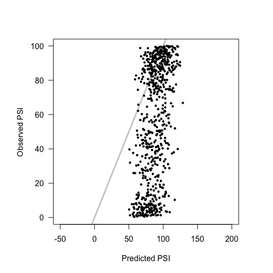
  <br> Figure 2D
</p>

And the residuals plot:

```r
# plot
residualsPlot(Pred = Predictions, Residuals = PSIs.For.New.Data - Predictions)
```
<p align="center">
  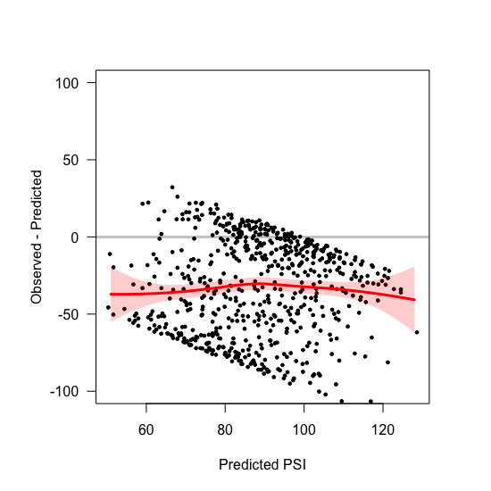
  <br> Figure 2D
</p>

The error in our predictions can be measured by calculating the RMSE:

```r
Errors <- PSIs.For.New.Data - Predictions
rmse(Errors)
```
We can set the rule that inclusion cannot be predicted to be greater than 100 or lower than 0:

```r
# set rule that predictions between 0 and 100
Predictions[which(Predictions < 0)] <- 0
Predictions[which(Predictions > 100)] <- 100
```
And plot the results again

```r
# plot
plotObservedVsPredictions(Pred = Predictions, Obs = PSIs.For.New.Data)
residualsPlot(Pred = Predictions, Residuals = PSIs.For.New.Data - Predictions)

# error in our predictions
Errors <- PSIs.For.New.Data - Predictions
rmse(Errors)
```
<p align="center">
  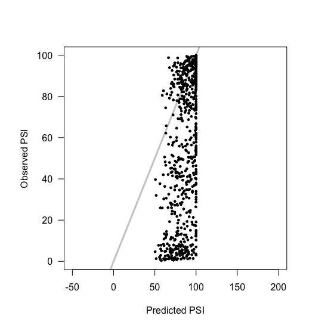
  <br> Figure ???
</p>
<p align="center">
  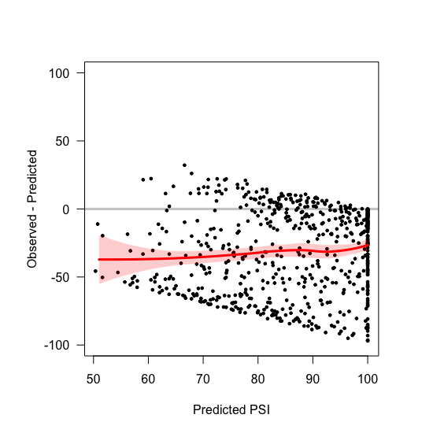
  <br> Figure ???
</p>

-----

Can repeat this analysis without filtering by the standard deviation:

```r
# now without restricting by SD

# remove stuff with PSI above 100 but any sd
Observations.To.Remove <- which(Whole.Dataset$Mean > 100)

# subset 'Variables.To.Test.Model' so it only includes stuff with PSI < 100
New.Data <- Variables.To.Test.Model[-Observations.To.Remove,]
New.Data <- as.data.frame(New.Data)
PSIs.For.New.Data <- Whole.Dataset$Mean[-Observations.To.Remove]

# use our model to make predictions
Predictions <- predict(Model, newdata = New.Data)
```
And plot the results without forcing predictions to lie between 0 and 100:

```r
# plot
plotObservedVsPredictions(Pred = Predictions, Obs = PSIs.For.New.Data)
residualsPlot(Pred = Predictions, Residuals = PSIs.For.New.Data - Predictions)

# error in our predictions
Errors <- PSIs.For.New.Data - Predictions
rmse(Errors)
```
<p align="center">
  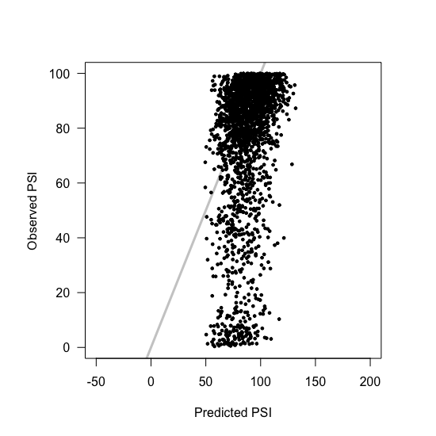
  <br> Figure ???
</p>
<p align="center">
  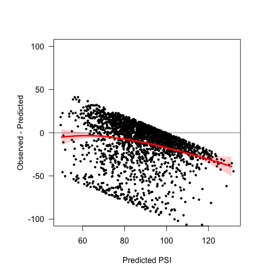
  <br> Figure ???
</p>

Or forcing predictions to be between 0 and 100:

```r
# set rule that predictions between 0 and 100
Predictions[which(Predictions < 0)] <- 0
Predictions[which(Predictions > 100)] <- 100

# plot
plotObservedVsPredictions(Pred = Predictions, Obs = PSIs.For.New.Data)
residualsPlot(Pred = Predictions, Residuals = PSIs.For.New.Data - Predictions)

# error in our predictions
Errors <- PSIs.For.New.Data - Predictions
rmse(Errors)
```
<p align="center">
  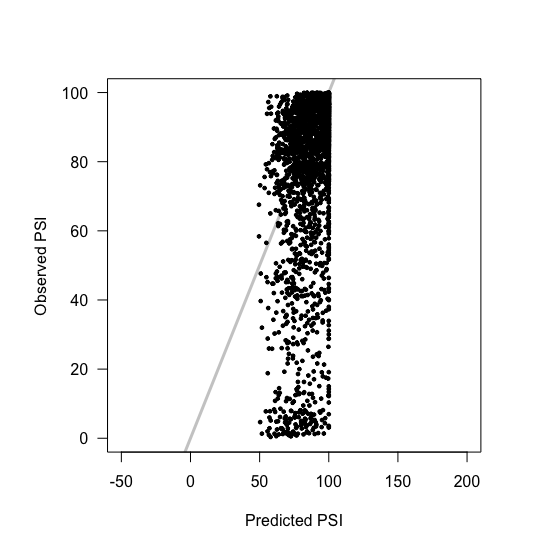
  <br> Figure ???
</p>
<p align="center">
  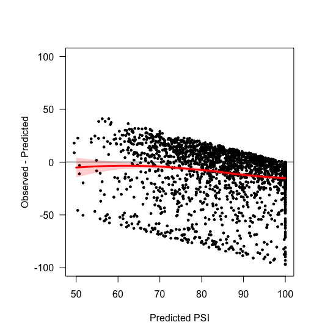
  <br> Figure ???
</p>


## 2. Independent linear effects (mean effects)

This model is very similar to the previous one, except we know train it on a lot of different sequences. This means that the predicted effect of, say, mutation T-19-G, will be an average of this mutation's effects across all the data fed to the model. We build a model data frame exaclty like we did before, except that we calculate the 1's and 0's for all genotypes in the library, not just the 13 chosen previously:


```r
# New variables to train model -> use everything

# start an empty matrix containing 12 columns, one for each mutation that could
# occur in an exon. These mutations will be variables in our model, where each
# variable will take either the value 1 (mutation present) or 0 (not present)
Variables.To.Train.Model <- matrix(data = 0,
                                   ncol = length(Names.In.Sequence.Order),
                                   nrow = 0)
colnames(Variables.To.Train.Model) <- Names.In.Sequence.Order

# Collect the Genotype IDs from ancestor + 12 singles in a vector
Training.Genotypes.IDs <- as.character(Whole.Dataset$Mutation.IDs)

# now fill in the 'Variables.To.Train.Model' matrix with 13 rows of 1's and 0's,
# corresponding to the ancestor and 12 single mutants
invisible(sapply(Training.Genotypes.IDs,
                 function(x){
                   
                   # what mutations are there in this genotype?
                   singles.here <- strsplit(x, ";")[[1]]
                   
                   # build a one-row matrix with 12 columns full with 0's
                   Temporary.Matrix <- matrix(data = 0,
                                              ncol = length(Names.In.Sequence.Order),
                                              nrow = 1)
                   colnames(Temporary.Matrix) <- Names.In.Sequence.Order
                   
                   # for each mutation present in the genotype, change the 0 for a 1
                   for (each.single in singles.here){
                     Temporary.Matrix[1,each.single] <- 1
                   }
                   
                   # append the one-row matrix to the bottom of 'Variables.To.Train.Model'
                   Variables.To.Train.Model <<- rbind(Variables.To.Train.Model, Temporary.Matrix)
                   
                 }))

# We will now build a linear model using 'Variables.To.Train.Model' as the
# training set

# organise the training set in a data frame
Model.DF <- cbind(data.frame(Y = Whole.Dataset$Mean),
                  Variables.To.Train.Model)

# change the name of the variable names and remove all hyphens (easier to work with)
colnames(Model.DF)[2:13] <- sapply(as.character(colnames(Model.DF)[2:13]),
                                   function(x){
                                     paste(strsplit(x, "-")[[1]],
                                           sep = "",
                                           collapse = "")
                                   })
```
This is a model that will be trained on, and used to predict, only those genotypes with a low standard deviation:

```r
# remove stuff with PSI above 100 or sd > 10
Rows.To.Keep <- which(Whole.Dataset$SD < 10 & Whole.Dataset$Mean <= 100)
```
We then build the model:

```r
# build the model
Model <- lm(Y ~ (.), data = Model.DF[Rows.To.Keep,])
```
We use the model to make some predictions:

```r
# subset 'Variables.To.Test.Model' so it only includes stuff with PSI < 100
New.Data <- Variables.To.Test.Model[Rows.To.Keep,]
New.Data <- as.data.frame(New.Data)
PSIs.For.New.Data <- Whole.Dataset$Mean[Rows.To.Keep]

# use our model to make predictions
Predictions <- predict(Model, newdata = New.Data)
```
And generate some plots to see how good our predictions were:

```r
#plot
plotObservedVsPredictions(Pred = Predictions, Obs = PSIs.For.New.Data)
residualsPlot(Pred = Predictions, Residuals = PSIs.For.New.Data - Predictions)
```
<p align="center">
  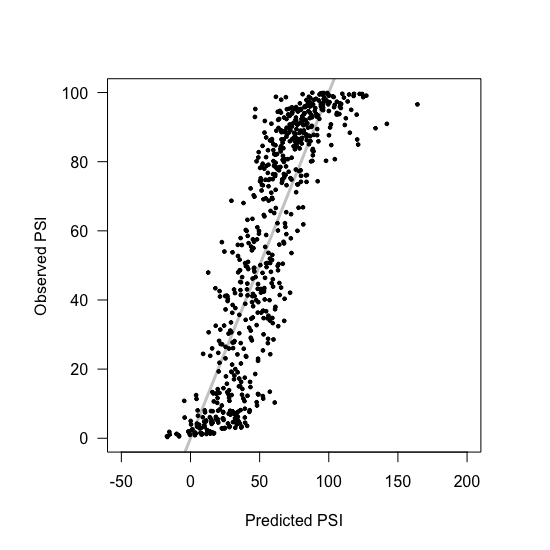
  <br> Figure 2E
</p>
<p align="center">
  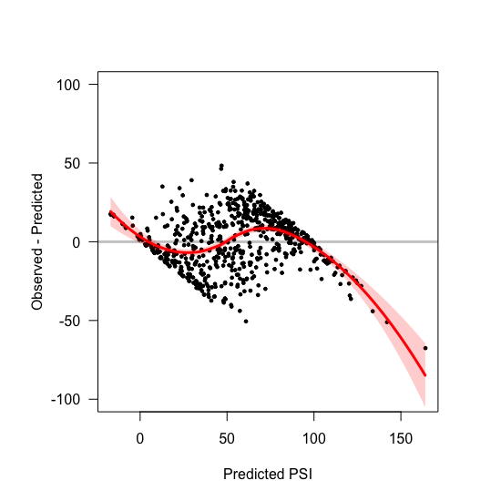
  <br> Figure 2E
</p>

Because we're using the same training and testing data sets, we need to use cross-validation to obtain an accurate estimate of the RMSE. For this, I created a new function (I'll do this repeatedly further down) that takes a `Model.DF` object as well as a model formula, and calculates the aggregated 10-fold RMSE:

```r
# library with createFolds function
library(caret)

# function to calculate 10-fold cross validation
Ten.Fold.CV <- function(Model.Dataframe, Model.Formula, hardBounds = F, A.Space = F){
  
  # Create 10 folds
  Testing.Sets <- createFolds(Model.Dataframe$Y,
                              k = 10,
                              returnTrain = F)
  
  # a vector where we'll store the different RMSE values calcualted
  Vector.of.RMSEs <- c()
  
  # Calculate model RMSE for each of the 10 folds
  for (i in 1:10){
    
    # take a training and a testing set
    This.Training.Set <- Model.Dataframe[ -Testing.Sets[[i]], ]
    This.Testing.Set <- Model.Dataframe[ Testing.Sets[[i]], ]
    
    # Build a model for this fold
    Trained.Model <- lm(Model.Formula, data = This.Training.Set)
    
    # Make predictions
    Predictions.on.Testing.Set <- predict(object = Trained.Model, newdata = This.Testing.Set)
    
    # if there are hard bounds to be set, set them
    if (hardBounds) {
      if (length(which(Predictions.on.Testing.Set > 100)) > 0) {
        Predictions.on.Testing.Set[which(Predictions.on.Testing.Set > 100)] <- 100
      }
      
      if (length(which(Predictions.on.Testing.Set < 0)) > 0) {
        Predictions.on.Testing.Set[which(Predictions.on.Testing.Set < 0)] <- 0
      }
    }
    
    if (A.Space) {
      Predictions.on.Testing.Set <- 100*ConvertBackToPSI(Predictions.on.Testing.Set)
      # Calculate the error
      Errors <- 100*ConvertBackToPSI(This.Testing.Set$Y) - Predictions.on.Testing.Set
    } else {
      # Calculate the error
      Errors <- This.Testing.Set$Y - Predictions.on.Testing.Set
    }
    
    
    
    # calculate the rmse
    RMSE <- rmse(Errors)
    
    # add this rmse to the vector of rmses
    Vector.of.RMSEs <- c(Vector.of.RMSEs, RMSE)
    
  }
  
  # To combine RMSEs, use the formula in the best answer in:
  # https://stats.stackexchange.com/questions/85507/what-is-the-rmse-of-k-fold-cross-validation
  
  Overall.RMSE <- sqrt((sum(Vector.of.RMSEs^2))/10)
  print(Overall.RMSE)
  
}
```
Use the function we just defined to calculate the 10-fold cross validation RMSE:

```r
# model formula
Model.Formula <- Y ~ .

# set the seed
set.seed(123)

# calculate 10-fold cross validation
Ten.Fold.CV(Model.Dataframe = Model.DF[Rows.To.Keep,],
            Model.Formula = Model.Formula)
```

We can repeat the analysis setting hard limits to the model predictions:

```r
# set rule that predictions between 0 and 100
Predictions[which(Predictions < 0)] <- 0
Predictions[which(Predictions > 100)] <- 100

# plot
plotObservedVsPredictions(Pred = Predictions, Obs = PSIs.For.New.Data)
residualsPlot(Pred = Predictions, Residuals = PSIs.For.New.Data - Predictions)

# set the seed
set.seed(123)

# calculate 10-fold cross validation
Ten.Fold.CV(Model.Dataframe = Model.DF[Rows.To.Keep,],
            Model.Formula = Model.Formula,
            hardBounds = T)

```
<p align="center">
  
  <br> Figure ??
</p>
<p align="center">
  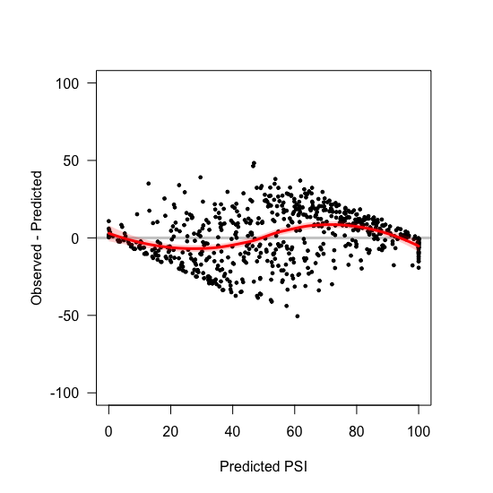
  <br> Figure ??
</p>

And without filtering by the standard deviation:

```r
# remove stuff with PSI above 100 or sd > 10
Rows.To.Keep <- which(Whole.Dataset$Mean <= 100)

# build the model
Model <- lm(Y ~ (.), data = Model.DF[Rows.To.Keep,])

# subset 'Variables.To.Test.Model' so it only includes stuff with PSI < 100
New.Data <- Variables.To.Test.Model[Rows.To.Keep,]
New.Data <- as.data.frame(New.Data)
PSIs.For.New.Data <- Whole.Dataset$Mean[Rows.To.Keep]

# use our model to make predictions
Predictions <- predict(Model, newdata = New.Data)

#plot
plotObservedVsPredictions(Pred = Predictions, Obs = PSIs.For.New.Data)

residualsPlot(Pred = Predictions, Residuals = PSIs.For.New.Data - Predictions)

# set the seed
set.seed(123)

# calculate 10-fold cross validation
Ten.Fold.CV(Model.Dataframe = Model.DF[Rows.To.Keep,],
            Model.Formula = Model.Formula)
```
<p align="center">
  
  <br> Figure S2D
</p>
<p align="center">
  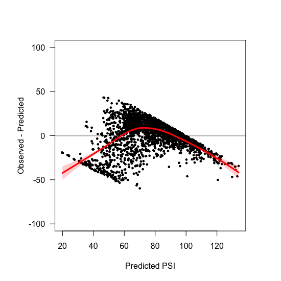
  <br> Figure S2E
</p>

We can also set hard limits on the model predictions:

```r
# set rule that predictions between 0 and 100
Predictions[which(Predictions < 0)] <- 0
Predictions[which(Predictions > 100)] <- 100

# plot
plotObservedVsPredictions(Pred = Predictions, Obs = PSIs.For.New.Data)
residualsPlot(Pred = Predictions, Residuals = PSIs.For.New.Data - Predictions)

# set the seed
set.seed(123)

# calculate 10-fold cross validation
Ten.Fold.CV(Model.Dataframe = Model.DF[Rows.To.Keep,],
            Model.Formula = Model.Formula,
            hardBounds = T)
```

<p align="center">
  
  <br> Figure ???
</p>
<p align="center">
  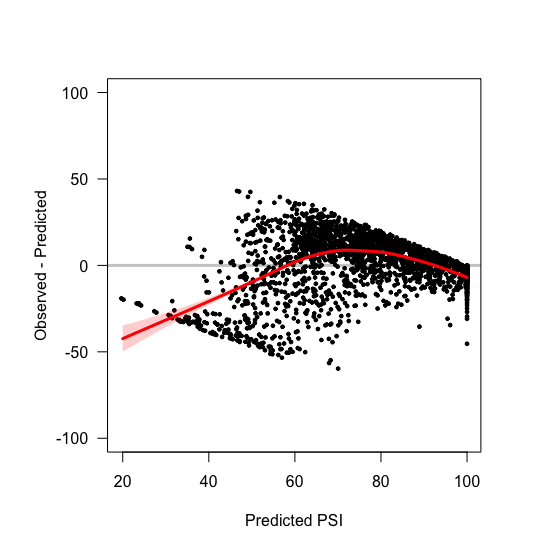
  <br> Figure ???
</p>


## 3. Non-independent linear effects (7 interactions)

The third model is exactly like the second model, except that we allow for the 7 pairwise interactions identified in [006\_pairwise\_epistasis.R](./006_pairwise_epistasis.R). For the low-variance genotypes:

```r
# remove stuff with PSI above 100 or sd > 10
Rows.To.Keep <- which(Whole.Dataset$SD < 10 & Whole.Dataset$Mean <= 100)

# build the model
Model <- lm(Y ~  . + C41G:C39T + T49C:G51C + T24C:G26T + T19G:C18G + T19G:C18T + C32T:G35T + C39T:G44A, data = Model.DF[Rows.To.Keep,])

# subset 'Variables.To.Test.Model' so it only includes stuff with PSI < 100
New.Data <- Variables.To.Test.Model[Rows.To.Keep,]
New.Data <- as.data.frame(New.Data)
PSIs.For.New.Data <- Whole.Dataset$Mean[Rows.To.Keep]

# use our model to make predictions
Predictions <- predict(Model, newdata = New.Data)

#plot
plotObservedVsPredictions(Pred = Predictions, Obs = PSIs.For.New.Data)
residualsPlot(Pred = Predictions, Residuals = PSIs.For.New.Data - Predictions)

# set the seed
set.seed(123)

# model formula now allows 7 interactions
Model.Formula <- Y ~  . + C41G:C39T + T49C:G51C + T24C:G26T + T19G:C18G + T19G:C18T + C32T:G35T + C39T:G44A

# calculate 10-fold cross validation
Ten.Fold.CV(Model.Dataframe = Model.DF[Rows.To.Keep,],
            Model.Formula = Model.Formula)
```
<p align="center">
  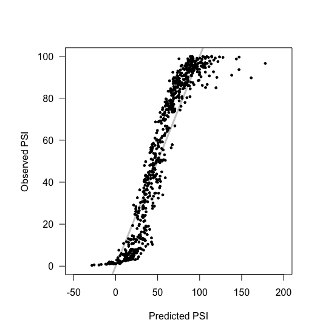
  <br> Figure ???
</p>
<p align="center">
  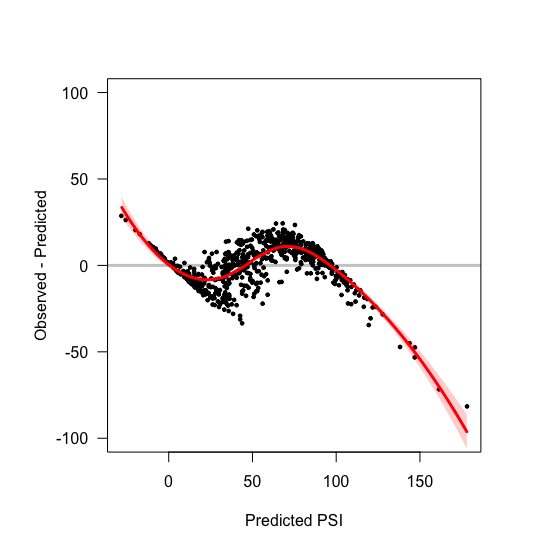
  <br> Figure ???
</p>

With hard-bounds on the predictions:

```r
# set rule that predictions between 0 and 100
Predictions[which(Predictions < 0)] <- 0
Predictions[which(Predictions > 100)] <- 100

# plot
plotObservedVsPredictions(Pred = Predictions, Obs = PSIs.For.New.Data)
residualsPlot(Pred = Predictions, Residuals = PSIs.For.New.Data - Predictions)

# set the seed
set.seed(123)

# calculate 10-fold cross validation
Ten.Fold.CV(Model.Dataframe = Model.DF[Rows.To.Keep,],
            Model.Formula = Model.Formula,
            hardBounds = T)
```
<p align="center">
  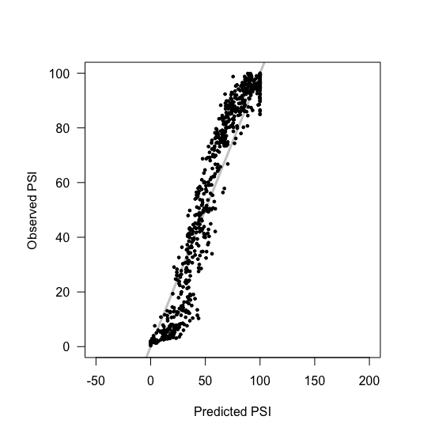
  <br> Figure ???
</p>
<p align="center">
  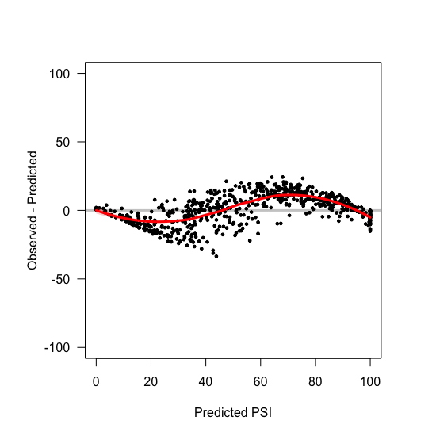
  <br> Figure ???
</p>

And, the same analysis without filtering by the standard deviation:

```r
# remove stuff with PSI above 100
Rows.To.Keep <- which(Whole.Dataset$Mean <= 100)

# build the model
Model <- lm(Y ~  . + C41G:C39T + T49C:G51C + T24C:G26T + T19G:C18G + T19G:C18T + C32T:G35T + C39T:G44A, data = Model.DF[Rows.To.Keep,])


# subset 'Variables.To.Test.Model' so it only includes stuff with PSI < 100
New.Data <- Variables.To.Test.Model[Rows.To.Keep,]
New.Data <- as.data.frame(New.Data)
PSIs.For.New.Data <- Whole.Dataset$Mean[Rows.To.Keep]


# use our model to make predictions
Predictions <- predict(Model, newdata = New.Data)

#plot
plotObservedVsPredictions(Pred = Predictions, Obs = PSIs.For.New.Data)
residualsPlot(Pred = Predictions, Residuals = PSIs.For.New.Data - Predictions)

# set the seed
set.seed(123)
Model.Formula <- Y ~  . + C41G:C39T + T49C:G51C + T24C:G26T + T19G:C18G + T19G:C18T + C32T:G35T + C39T:G44A
# calculate 10-fold cross validation
Ten.Fold.CV(Model.Dataframe = Model.DF[Rows.To.Keep,],
            Model.Formula = Model.Formula)
```
<p align="center">
  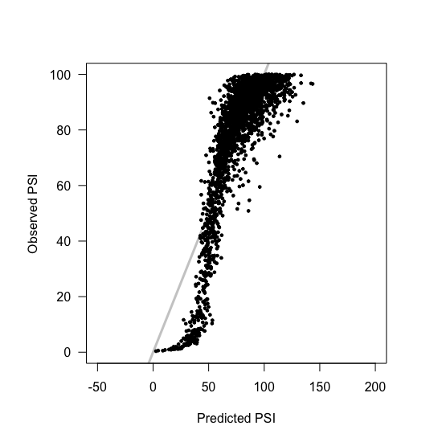
  <br> Figure ???
</p>
<p align="center">
  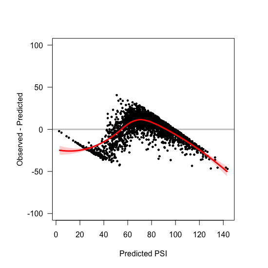
  <br> Figure ???
</p>

And with hard bounds on the predictions:

```r
# set rule that predictions between 0 and 100
Predictions[which(Predictions < 0)] <- 0
Predictions[which(Predictions > 100)] <- 100

# plot
plotObservedVsPredictions(Pred = Predictions, Obs = PSIs.For.New.Data)
residualsPlot(Pred = Predictions, Residuals = PSIs.For.New.Data - Predictions)

# set the seed
set.seed(123)

# calculate 10-fold cross validation
Ten.Fold.CV(Model.Dataframe = Model.DF[Rows.To.Keep,],
            Model.Formula = Model.Formula,
            hardBounds = T)
```
<p align="center">
  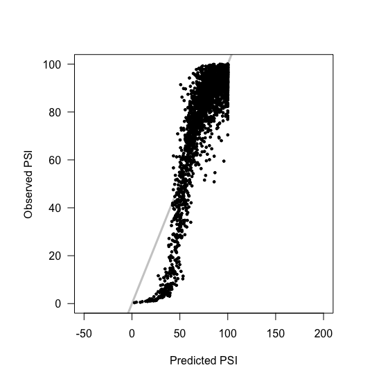
  <br> Figure ???
</p>
<p align="center">
  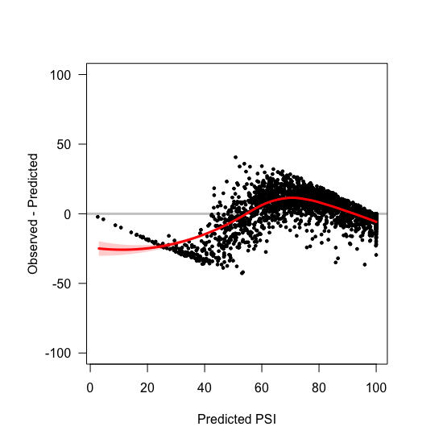
  <br> Figure ???
</p>


## 4. Independent nonlinear effects (global scaling)

The fourth model is very similar to the second model, with the difference that it is not build in PSI space, but rather in the 'A parameter' space (see **equation 2** from the main text). Therefore, I'm assuming mutations have independent effects that behave non-linearly in PSI space, which is where we measure our phenotypes. So first, I created two functions which allows us to (1) estimate the effect A of different genotypes and (2) calculate exon PSI if we already know the exon's A parameter:

```r
# function to calculate mutation effect A (PSIs in 0-1 scale)
CalculateA <- function(New.PSI, Old.PSI = 0.96) {
  log((New.PSI - Old.PSI*New.PSI) / (Old.PSI - Old.PSI*New.PSI))
}

# function to convert parameter A back into PSI (scale 0-1)
ConvertBackToPSI <- function(Parameter, Old.PSI = 0.96) {
  (exp(Parameter)*Old.PSI) / (1 - Old.PSI + exp(Parameter)*Old.PSI)
}
```
Build the model using `CalculateA to convert all the PSI values into A parameters:

```r
# organise the training set in a data frame
Model.DF <- cbind(data.frame(Y = sapply(X = Whole.Dataset$Mean/100,
                                        FUN = CalculateA)),
                  Variables.To.Train.Model)

# change the name of the variable names and remove all hyphens (easier to work with)
colnames(Model.DF)[2:13] <- sapply(as.character(colnames(Model.DF)[2:13]),
                                   function(x){
                                     paste(strsplit(x, "-")[[1]],
                                           sep = "",
                                           collapse = "")
                                   })

# remove stuff with PSI above 100 or sd > 10
Rows.To.Keep <- which(complete.cases(Model.DF) & Whole.Dataset$SD < 10)

# build the model
Model <- lm(Y ~ (.), data = Model.DF[Rows.To.Keep,])
```
And now we can look at how good predictions were by using the `ConvertBackToPSI` function:

```r
# subset 'Variables.To.Test.Model' so it only includes stuff with PSI < 100
New.Data <- Variables.To.Test.Model[Rows.To.Keep,]
New.Data <- as.data.frame(New.Data)
PSIs.For.New.Data <- Whole.Dataset$Mean[Rows.To.Keep]

# use our model to make predictions
Predictions <- predict(Model, newdata = New.Data)
```
Plot the results:

```r
#plot
plotObservedVsPredictions(Pred = 100*ConvertBackToPSI(Predictions),
                          Obs = PSIs.For.New.Data)
residualsPlot(Pred = 100*ConvertBackToPSI(Predictions),
              Residuals = PSIs.For.New.Data - 100*ConvertBackToPSI(Predictions))

# set the seed
set.seed(123)

# model formula for rmse calculation
Model.Formula <- Y ~  . 

# calculate 10-fold cross validation
Ten.Fold.CV(Model.Dataframe = Model.DF[Rows.To.Keep,],
            Model.Formula = Model.Formula,
            A.Space = T)
```
<p align="center">
  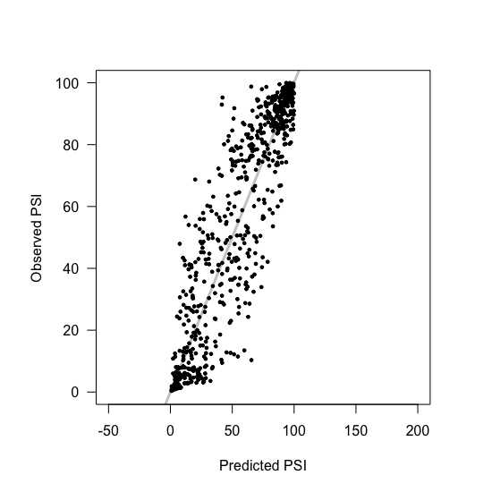
  <br> Figure ???
</p>
<p align="center">
  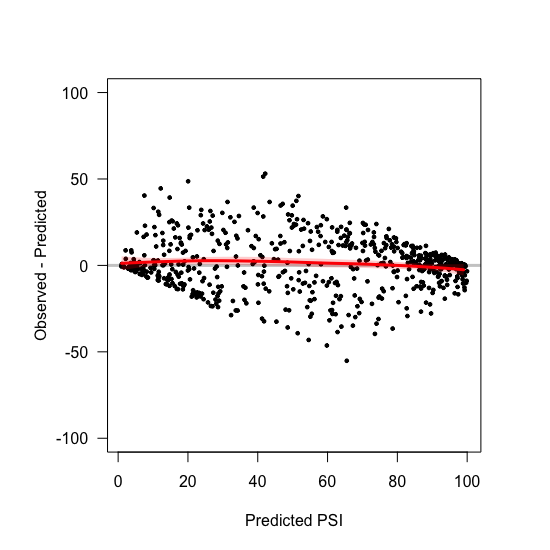
  <br> Figure ???
</p>

As you can see from the plots, this model implicitly forces all predictions to lie between 0 and 100. We can repeat the analysis without filtering by the standard deviation:

```r
# remove stuff with PSI above 100
Rows.To.Keep <- which(Whole.Dataset$Mean <= 100)

# build the model
Model <- lm(Y ~  . , data = Model.DF[Rows.To.Keep,])

# subset 'Variables.To.Test.Model' so it only includes stuff with PSI < 100
New.Data <- Variables.To.Test.Model[Rows.To.Keep,]
New.Data <- as.data.frame(New.Data)
PSIs.For.New.Data <- Whole.Dataset$Mean[Rows.To.Keep]


# use our model to make predictions
Predictions <- predict(Model, newdata = New.Data)

#plot
plotObservedVsPredictions(Pred = 100*ConvertBackToPSI(Predictions),
                          Obs = PSIs.For.New.Data)
residualsPlot(Pred = 100*ConvertBackToPSI(Predictions),
              Residuals = PSIs.For.New.Data - 100*ConvertBackToPSI(Predictions))

# set the seed
set.seed(123)

# model formula
Model.Formula <- Y ~ . 

# calculate 10-fold cross validation rmse
Ten.Fold.CV(Model.Dataframe = Model.DF[Rows.To.Keep,],
            Model.Formula = Model.Formula,
            A.Space = T)
```
<p align="center">
  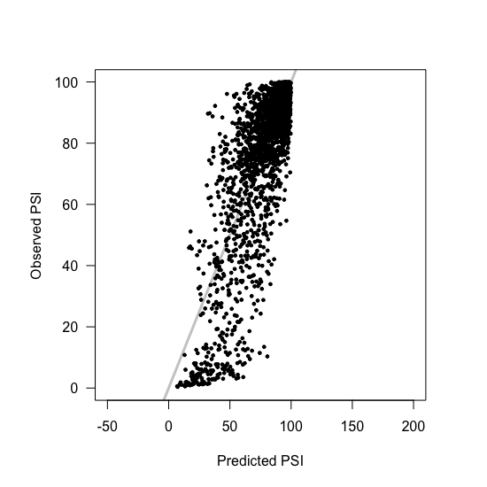
  <br> Figure ???
</p>
<p align="center">
  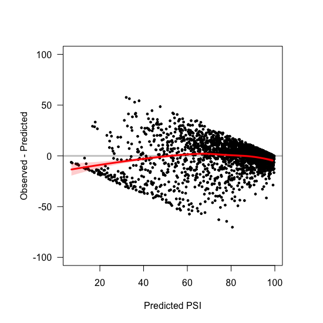
  <br> Figure ???
</p>

## 5. Non-independent non-linear effects (global scaling + interactions)

This model is the same as model 4, but allowing for the 7 pairwise interactions.

```r
# remove stuff with PSI above 100 or sd > 10
Rows.To.Keep <- which(Whole.Dataset$SD < 10 & Whole.Dataset$Mean <= 100)

# build the model
Model <- lm(Y ~  . + C41G:C39T + T49C:G51C + T24C:G26T + T19G:C18G + T19G:C18T + C32T:G35T + C39T:G44A, data = Model.DF[Rows.To.Keep,])

# subset 'Variables.To.Test.Model' so it only includes stuff with PSI < 100
New.Data <- Variables.To.Test.Model[Rows.To.Keep,]
New.Data <- as.data.frame(New.Data)
PSIs.For.New.Data <- Whole.Dataset$Mean[Rows.To.Keep]

# use our model to make predictions
Predictions <- predict(Model, newdata = New.Data)

#plot
plotObservedVsPredictions(Pred = 100*ConvertBackToPSI(Predictions),
                          Obs = PSIs.For.New.Data)
residualsPlot(Pred = 100*ConvertBackToPSI(Predictions),
              Residuals = PSIs.For.New.Data - 100*ConvertBackToPSI(Predictions))

# set the seed
set.seed(123)

# model formula
Model.Formula <- Y ~  . + C41G:C39T + T49C:G51C + T24C:G26T + T19G:C18G + T19G:C18T + C32T:G35T + C39T:G44A

# calculate 10-fold cross validation rmse
Ten.Fold.CV(Model.Dataframe = Model.DF[Rows.To.Keep,],
            Model.Formula = Model.Formula,
            A.Space = T)
```
<p align="center">
  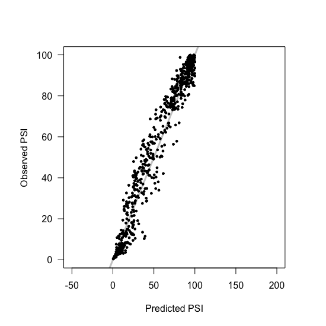
  <br> Figure ???
</p>
<p align="center">
  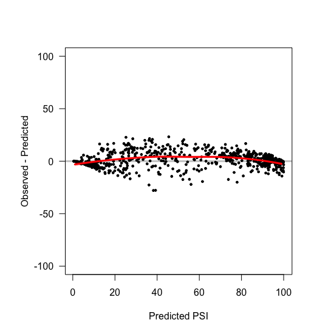
  <br> Figure ???
</p>

And without filtering by standard deviation:

```r
# remove stuff with PSI above 100
Rows.To.Keep <- which(Whole.Dataset$Mean <= 100)

# build the model
Model <- lm(Y ~  . + C41G:C39T + T49C:G51C + T24C:G26T + T19G:C18G + T19G:C18T + C32T:G35T + C39T:G44A, data = Model.DF[Rows.To.Keep,])

# subset 'Variables.To.Test.Model' so it only includes stuff with PSI < 100
New.Data <- Variables.To.Test.Model[Rows.To.Keep,]
New.Data <- as.data.frame(New.Data)
PSIs.For.New.Data <- Whole.Dataset$Mean[Rows.To.Keep]

# use our model to make predictions
Predictions <- predict(Model, newdata = New.Data)

#plot
plotObservedVsPredictions(Pred = 100*ConvertBackToPSI(Predictions),
                          Obs = PSIs.For.New.Data)
residualsPlot(Pred = 100*ConvertBackToPSI(Predictions),
              Residuals = PSIs.For.New.Data - 100*ConvertBackToPSI(Predictions))

# set the seed
set.seed(123)

# model formula
Model.Formula <- Y ~  . + C41G:C39T + T49C:G51C + T24C:G26T + T19G:C18G + T19G:C18T + C32T:G35T + C39T:G44A

# calculate 10-fold cross validation rmse
Ten.Fold.CV(Model.Dataframe = Model.DF[Rows.To.Keep,],
            Model.Formula = Model.Formula,
            A.Space = T)
```
<p align="center">
  
  <br> Figure ???
</p>
<p align="center">
  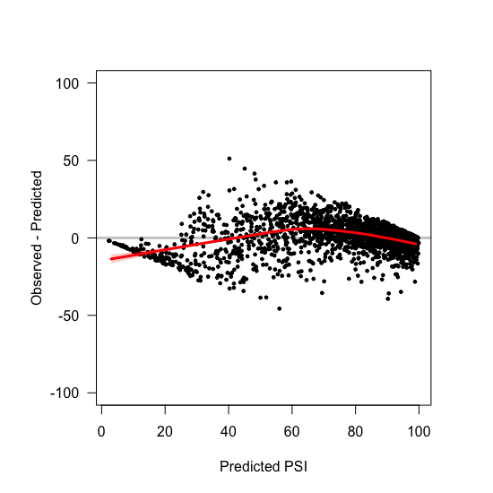
  <br> Figure ???
</p>

## 6. Lasso model


