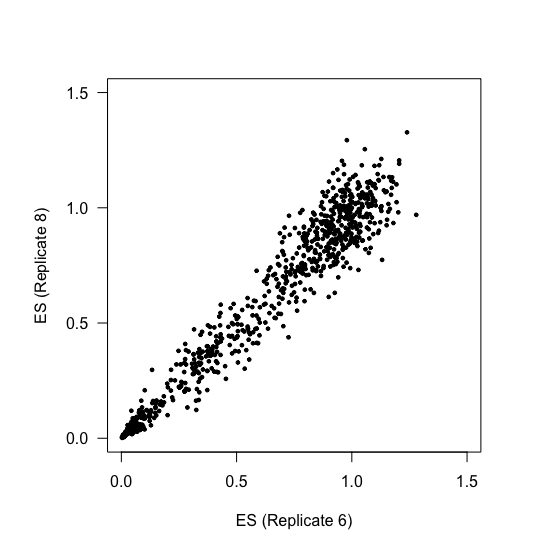
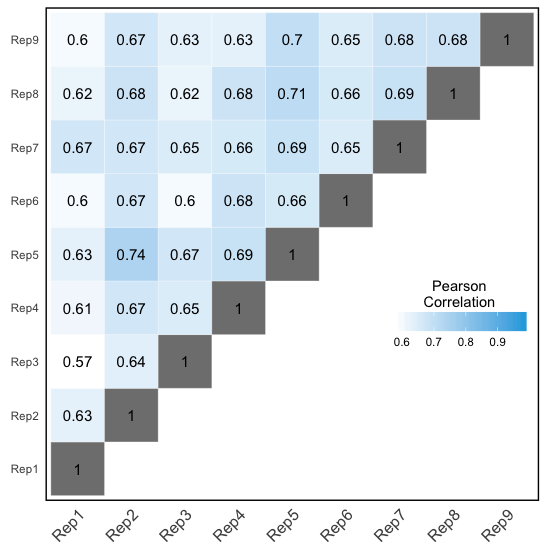
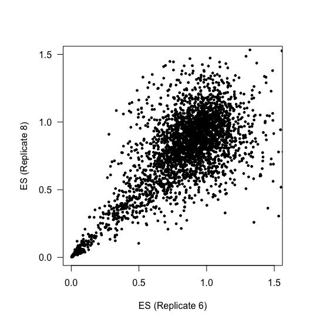

# PSI Scores

In this document I explain the code found in [002\_psi\_scores.R](./002_psi_scores.R), containing the steps I took to estimate PSI values for all the genotypes in the library.

Unless stated otherwise, all the code in this document is written in R.

## 1. Linear relationship between PSI and ES

Before calculating PSI values from our library enrichment scores, we first show the linear relationship between the PSI values of nine genotypes (experimentally determined using RT-PCR assays) and their corresponding enrichment scores. The genotypes are the following:

```r
# sequences we are going to use now
Sequences <- c(N6 = "GATCCAGATCTAACTTGTGGTGGCTTTGTCTTCTTCTTTTGCCAATTCCACTAATTGTTTGGG",
               N6_Minus_T24C = "GATCCAGATCTAACTTGTGGTGGTTTTGTCTTCTTCTTTTGCCAATTCCACTAATTGTTTGGG",
               N1_Plus_C24T_G41C = "GATCCAGATCTAACTTGTGGTGGTTTTGTCTTCTTCTTTTCCCAATTCCACTAATTGTTTGGG",
               N4 = "GATCCAGATCTAACTTGTGGTGGTTTTGTCTTCTTCTTTTCCCAATTCTACTAATTGTTTGGG",
               N3 = "GATCCAGATCTAACTTGCTGTGGTTGTGTCTTCTTCTTCTCCCAATTCTACTAATTGTTTGGG",
               N2 = "GATCCAGATCTAACTTGCTGTGGTTGTGTCTCCTTCTTCTCCCAATTCTACTAATTGTTTGGG",
               N1_Plus_G35T = "GATCCAGATCTAACTTGCTGTGGTTGTGTCTCCTTCTTCTCCCAATTCTAGTAATTGTTTGGG",
               N1 = "GATCCAGATCTAACTTGCTGTGGTTGTGTCTCCTGCTTCTCCCAATTCTAGTAATTGTTTGGG",
               Ancestor = "GATCCAGATCTAACTTGCTGTGGTTGTGTCTCCTGCTTCTCCCGATTCTAGTAATTGTTTGGG")
```
We will load ,`Enrichment.Scores`, the R object generated in the previous step, and subset it so it only includes the 9 genotypes above:

```r
# load enrichment scores data frame
load("001_enrichment_scores.RData")

# subset to keep only the 9 genotypes we're interested in
Enrichment.Scores <- Enrichment.Scores[Sequences,]
```
Calculate enrichment score mean and standard deviation:

```r
# take mean enrichment scores
Enrichment.Scores$Mean <- apply(X = Enrichment.Scores,
                                MARGIN = 1,
                                FUN = mean, na.rm = T)

# calculate standard deviation
Enrichment.Scores$SD <- apply(X = Enrichment.Scores[,1:9],
                              MARGIN = 1,
                              FUN = sd, na.rm = T)
```
Create a vector with the PSI values as determined by RT-PCR:

```r
# experimental validations
Expt.Validations <- c(N6 = 79.3,
                      N6_Minus_T24C = 63.9,
                      N6_Minus_T24C_C41G = 36.8,
                      N4 = 56.3,
                      N3 = 96.1,
                      N2 = 97,
                      N1_Plus_G35T = 52.7,
                      N1 = 86.5,
                      Ancestor = 96)
```
And another vector with the standard deviation of these values:

```r
# sd for experimentally-determined values
Expt.SD <- c(N6 = 1.3,
             N6_Minus_T24C = 2.3,
             N6_Minus_T24C_C41G = 0.4,
             N4 = 2.1,
             N3 = 0.6,
             N2 = 0.2,
             N1_Plus_G35T = 1.8,
             N1 = 1.1,
             Ancestor = 0.2)
```

Use all this information to plot PSI versus enrichment score:

```r
# a square plot
par(pty="s")

# open an empty canvas
plot(NULL,
     xlim = c(0,1.5),
     ylim = c(0,100),
     xlab = "",
     ylab = "",
     main = "",
     axes = FALSE)

# standard deviation error bars for experimental PSIs
arrows(x0 = Enrichment.Scores$Mean,
       x1 = Enrichment.Scores$Mean,
       y0 = Expt.Validations - Expt.SD,
       y1 = Expt.Validations + Expt.SD,
       length = 0.05,
       angle = 90,
       code = 3,
       col = "gray80)

# standard deviation error bars for enrichment scores
arrows(x0 = Enrichment.Scores$Mean - Enrichment.Scores$SD,
       x1 = Enrichment.Scores$Mean + Enrichment.Scores$SD,
       y0 = Expt.Validations,
       y1 = Expt.Validations,
       length = 0.05,
       angle = 90,
       code = 3,
       col = "gray80)

# draw points
par(new=T)
plot(Enrichment.Scores$Mean,
     Expt.Validations,
     pch = 19,
     col = rgb(39/255,170/255,225/255),
     cex = 1.5,
     ylab = "PSI",
     xlab = "ES",
     xlim = c(0, 1.5),
     ylim = c(0,100),
     main = "RT-PCR assay vs ES",
     las = 1)

# draw a straight line
abline(lm(Expt.Validations ~ Enrichment.Scores$Mean + 0), col = "orange")
```
<p align="center">
  
  <br>Figure S1E
</p>

## 2. Calculate PSI values for all genotypes

If we know the ancestral genotype PSI (96%) and we know its enrichment score, we can calculate the PSI of every other genotype in the library. For a genotype X whose enrichment score we know:

<p align="center">
  
</p>

```r
# load enrichment scores data frame
load("001_enrichment_scores.RData")

# what is the ancestral sequence?
Ancestor.Sequence <- "GATCCAGATCTAACTTGCTGTGGTTGTGTCTCCTGCTTCTCCCGATTCTAGTAATTGTTTGGG"

# calculate PSI values for all genotypes in all replicates
Whole.Dataset <- data.frame(Rep1 = 96*Enrichment.Scores[,1]/(Enrichment.Scores[Ancestor.Sequence,1]), 
                            Rep2 = 96*Enrichment.Scores[,2]/(Enrichment.Scores[Ancestor.Sequence,2]), 
                            Rep3 = 96*Enrichment.Scores[,3]/(Enrichment.Scores[Ancestor.Sequence,3]), 
                            
                            Rep4 = 96*Enrichment.Scores[,4]/(Enrichment.Scores[Ancestor.Sequence,4]), 
                            Rep5 = 96*Enrichment.Scores[,5]/(Enrichment.Scores[Ancestor.Sequence,5]), 
                            Rep6 = 96*Enrichment.Scores[,6]/(Enrichment.Scores[Ancestor.Sequence,6]), 
                            
                            Rep7 = 96*Enrichment.Scores[,7]/(Enrichment.Scores[Ancestor.Sequence,7]), 
                            Rep8 = 96*Enrichment.Scores[,8]/(Enrichment.Scores[Ancestor.Sequence,8]), 
                            Rep9 = 96*Enrichment.Scores[,9]/(Enrichment.Scores[Ancestor.Sequence,9]))

# add a 'Sequence' column
Whole.Dataset$Sequence <- as.character(rownames(Enrichment.Scores))
Whole.Dataset$Sequence <- as.character(Whole.Dataset$Sequence) # was a factor

# add row names
rownames(Whole.Dataset) <- as.character(rownames(Enrichment.Scores))
```
Now extract some summary statistics like the PSI mean and standard deviation for every genotype:

```r
# mean PSI across replicates
Whole.Dataset$Mean <- apply(X = Whole.Dataset[,1:9],
                            MARGIN = 1,
                            FUN = mean, na.rm = TRUE)

# standard deviation in PSI units
Whole.Dataset$SD <- apply(X = Whole.Dataset[,1:9],
                          MARGIN = 1,
                          FUN = sd, na.rm = TRUE)

# mean PSI plus or minus one SD
Whole.Dataset$Low.PSI <- Whole.Dataset$Mean - Whole.Dataset$SD
Whole.Dataset$High.PSI <- Whole.Dataset$Mean + Whole.Dataset$SD
```
### Some figures...

In the paper we decided to split the dataset into high- and low-confidence data points, depending on the standard deviation across 9 biological replicates. High-confidence data points were those with a standard deviation below 10 PSI units, and display a much better correlation than the low-confidence data points. To visualise this, let's first generate a high-confidence subset of the enrichment score data:

```r
# Build the high-confidence subset of the data
Low.Noise.Indices <- which(Whole.Dataset$SD < 10)
Low.Noise.Enrichment.Scores <- Enrichment.Scores[Low.Noise.Indices,]
```
As well as a correlation matrix:

```r
# Build a matrix with correlations between the 9 replicates
Correlation.Matrix <- round(x = cor(Low.Noise.Enrichment.Scores,
                                    method = "pearson",
                                    use = "complete.obs"),
                            digits = 2)
```
For the plot in Figure S1F, we only need one triangle of the correlation  matrix:

```r
# Function to get upper triangle of the correlation matrix
get_upper_tri <- function(cormat){
  cormat[lower.tri(cormat)]<- NA
  return(cormat)
}

# get it
Upper.Triangle <- get_upper_tri(Correlation.Matrix)
```
Because we'll plot the correlation heatmap using ggplot2, we have to re-format the correlation matrix:

```r
# load library
library(reshape2)

# melt the correlation matrix
Melted.Correlation.Matrix <- melt(Upper.Triangle, na.rm = TRUE)
```
Now we'll build a ggplot object containing the information necessary to draw the heatmap:

```r
# load library
library(ggplot2)

# build ggplot2 object
ggheatmap <- ggplot(data = Melted.Correlation.Matrix,
                    aes(Var2, Var1, fill = value)) +
  geom_tile(color = "white") +
  scale_fill_gradient2(low = "white",
                       high = rgb(39/255,170/255, 225/255), 
                       midpoint = 0.58, limit = c(0.57,0.98),
                       space = "Lab", 
                       name="Pearson\nCorrelation") +
  theme_minimal() + 
  theme(axis.text.x = element_text(angle = 45,
                                   vjust = 1, 
                                   size = 12,
                                   hjust = 1)) +
  coord_fixed()
```
Plot the heatmap:

```r
# plot
ggheatmap + 
  geom_text(aes(Var2, Var1, label = value), color = "black", size = 4) +
  theme(
    axis.title.x = element_blank(),
    axis.title.y = element_blank(),
    panel.grid.major = element_blank(),
    # panel.border = element_blank(),
    panel.background = element_blank(),
    axis.ticks = element_blank(),
    legend.justification = c(1, 0),
    legend.position = c(0.6, 0.7),
    legend.direction = "horizontal",
    panel.border = element_rect(colour = "black",
                                fill = NA,
                                size = 1)) +
  guides(fill = guide_colorbar(barwidth = 7,
                               barheight = 1,
                               title.position = "top",
                               title.hjust = 0.5))
```

<p align="center">
  
  <br>Figure S1F
</p>


We can also plot the correlation between two replicates (for example, 8 and 6):

```r
par(pty="s")
plot(Low.Noise.Enrichment.Scores$BR6,
     Low.Noise.Enrichment.Scores$BR8,
     xlim = c(0,1.5),
     ylim = c(0,1.5),
     xlab = "ES (Replicate 6)",
     ylab = "ES (Replicate 8)",
     las = 1,
     pch = 19,
     cex = 0.5)
```

<p align="center">
  
  <br>Figure S1F
</p>

As a comparison, we can generate the same plots without filtering the data set by standard deviation:

```r
# Build a matrix with correlations between the 9 replicates
Correlation.Matrix <- round(x = cor(Enrichment.Scores,
                                    method = "pearson",
                                    use = "complete.obs"),
                            digits = 2)

# get the upper triangle
Upper.Triangle <- get_upper_tri(Correlation.Matrix)

# melt the correlation matrix
Melted.Correlation.Matrix <- melt(Upper.Triangle, na.rm = TRUE)

# build ggplot2 object
ggheatmap <- ggplot(data = Melted.Correlation.Matrix,
                    aes(Var1, Var2, fill = value)) +
  geom_tile(color = "white") +
  scale_fill_gradient2(low = "white",
                       high = rgb(39/255,170/255, 225/255), 
                       midpoint = 0.58, limit = c(0.57,0.98),
                       space = "Lab", 
                       name="Pearson\nCorrelation") +
  theme_minimal() + 
  theme(axis.text.x = element_text(angle = 45,
                                   vjust = 1, 
                                   size = 12,
                                   hjust = 1)) +
  coord_fixed()


# plot
ggheatmap + 
  geom_text(aes(Var1, Var2, label = value), color = "black", size = 4) +
  theme(
    axis.title.x = element_blank(),
    axis.title.y = element_blank(),
    panel.grid.major = element_blank(),
    # panel.border = element_blank(),
    panel.background = element_blank(),
    axis.ticks = element_blank(),
    legend.justification = c(1, 0),
    legend.position = c(0.99, 0.3),
    legend.direction = "horizontal",
    panel.border = element_rect(colour = "black",
                                fill = NA,
                                size = 1)) +
  guides(fill = guide_colorbar(barwidth = 7,
                               barheight = 1,
                               title.position = "top",
                               title.hjust = 0.5))


```
<p align="center">
  
  <br>Figure S1F
</p>

And:
 
```r
par(pty="s")
plot(Enrichment.Scores$BR6,
     Enrichment.Scores$BR8,
     xlim = c(0,1.5),
     ylim = c(0,1.5),
     xlab = "ES (Replicate 6)",
     ylab = "ES (Replicate 8)",
     las = 1,
     pch = 19,
     cex = 0.5)
```

<p align="center">
  
  <br>Figure S1F
</p>

We can plot the distribution of PSI values across the high-confidence subset of the library (standard deviation < 10 PSI units):

```r
par(pty="s")
hist(Whole.Dataset$Mean[which(Whole.Dataset$SD < 10)],
     probability = T,
     col = "gray90",
     border = NA,
     xlim = c(0,100),
     breaks = 10,
     las = 1,
     main = "PSI values (SD < 10)",
     xlab = "PSI")
box()
```

<p align="center">
  
  <br>Figure 1D
</p>

## 3. Assign genotype IDs

To finish this document, we'll find out what the ID of each genotype is and add this information as a column to the `Whole.Dataset` data frame. First we'll define two functions:

```r
####################
## some functions ##
####################

# calculate Hamming distance between two sequences
HammingDistance <- function(sequence1, sequence2){
  sequence1.vector <- strsplit(sequence1,"")[[1]]
  sequence2.vector <- strsplit(sequence2,"")[[1]]
  return(length(which(sequence1.vector != sequence2.vector)))
}

# sequence ID relative to an arbitrary wildtype sequence
Mutations.Relative.To.WT <- function(sequence, WT.Sequence){
  WT.Vector <- strsplit(WT.Sequence, "")[[1]]
  Sequence.Vector <- strsplit(sequence, "")[[1]]
  Positions <- which(WT.Vector != Sequence.Vector)
  WT.Bases <- WT.Vector[Positions]
  Mutant.Bases <- Sequence.Vector[Positions]
  Positions <- as.character(Positions)
  return(paste(WT.Bases, Positions, Mutant.Bases, sep = "-", collapse = ";"))
}
```
Now we can use those functions to extract the genotype IDs and figure out how many mutations they have relative to the ancestral sequence. First build a dataframe containing empty columns for these two pieces of information:

```r
# create dataframe with empty 'Mutation.IDs' and No.Mutations columns
Genotype.IDs <- data.frame(Sequence = as.character(rownames(Whole.Dataset)),
                           Mutation.IDs = NA,
                           No.Mutations = NA)
                           
# Sequence column was a factor; convert to character
Genotype.IDs$Sequence <- as.character(Genotype.IDs$Sequence)
```
Now we will use the two functions defined above to fill in the two empty columns in `Genotype.IDs`:

```r
# fill the empty columns
for (i in 1:nrow(Genotype.IDs)){
  Genotype.IDs$Mutation.IDs[i] <- Mutations.Relative.To.WT(sequence = Genotype.IDs$Sequence[i],
                                                           WT.Sequence = Ancestor.Sequence)
  Genotype.IDs$No.Mutations[i] <- HammingDistance(sequence1 = Genotype.IDs$Sequence[i],
                                                  sequence2 = Ancestor.Sequence)
}
```
Finally, combine `Genotype.IDs` with `Whole.Dataset`:

```r
# merge Genotype.IDs with Whole.Dataset
Whole.Dataset <- merge(x = Whole.Dataset,
                       y = Genotype.IDs,
                       by = "Sequence")
rownames(Whole.Dataset) <- as.character(Whole.Dataset$Sequence)
```
And save:

```r
save(Whole.Dataset, file = "002_whole_dataset.RData")
```
The `Whole.Dataset` R object which was used for downstream analyses is available for download [here](./002_whole_dataset.RData).