# Mathematical model of exon competition


## 1. Sigmoidal relationship between PSI and log k6

Equation 1 of our model relates exon 6's levels of inclusion with splicing efficiency parameters k6 and k6, as well as with a time delay parameter tau:

<p align="center">
  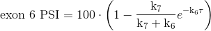
</p>

The relationship between exon 6 PSI and fold-changes in k6 is sigmoidal. To show this, we'll plot PSI vs k6 while fixing k7 to 1 and tau to 0:

```r
# little function to represent equation 1 from the main text
Calculate.PSI <- function(k6, k7, tau){
  1 - exp(-1*k6*tau)*(k7/(k7+k6))
}

# fix tau and k7:
Fixed.Tau <- 0
Fixed.k7 <- 1

# a bunch of k6 values we'll test
Range.k6.To.Test <- 10^(seq(-3,3,0.005))

# the corresponding PSI values
Calculated.PSIs <- Calculate.PSI(k6 = Range.k6.To.Test,
                                 k7 = Fixed.k7,
                                 tau = Fixed.Tau)

# plot
plot(log2(Range.k6.To.Test),
     Calculated.PSIs*100,
     type = "l",
     col = "gray90",
     lwd = 3,
     xlab = "log2 k6",
     ylab = "PSI",
     las = 1)
```
<p align="center">
  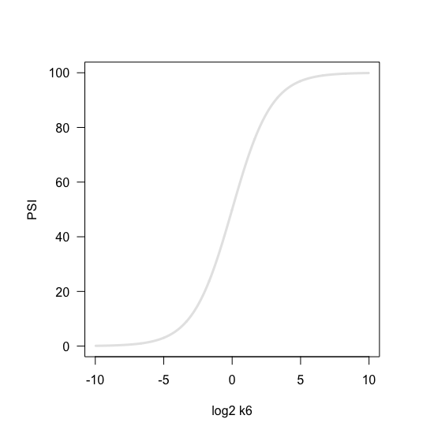
  <br> Figure 4C
</p>


## 2. Final vs starting PSI

To visualise the relationship between final and starting PSIs, I used this equation:


<p align="center">
  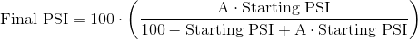
</p>

to draw Final vs Starting PSI lines, each corresponding to a different value of A. To plot this, use the following code:

```r
# start an empty plot
par(pty = "s")
plot(NULL,
     xlim = c(0,100),
     ylim = c(0,100),
     xlab = "Starting PSI",
     ylab = "Final PSI",
     main = "Final vs Starting PSI",
     las = 1)

# draw lines
for (i in seq(-6,6,1)) {
  x.vector <- seq(0,1,0.001)
  y.vector <- (exp(i)*x.vector) / (1 + exp(i)*x.vector - x.vector)
  lines(100*x.vector,
        100*y.vector,
        col = "gray90",
        lwd = 3)
}
```

<p align="center">
  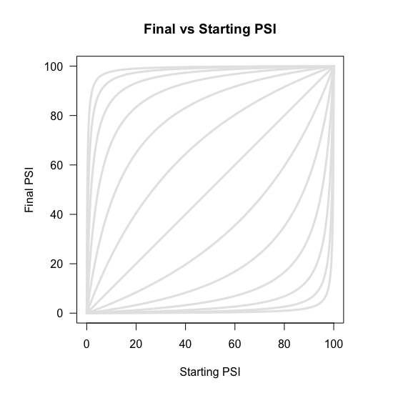
  <br> Figure 4D
</p>

## 3. Delta PSI vs starting PSI

This is very similar to what I did above. I now use the following equation instead:

<p align="center">
  
</p>

And the code to draw the graph is:

```r
# start an empty plot
par(pty = "s")
plot(NULL,
     xlim = c(0,100),
     ylim = c(-100,100),
     xlab = "Starting PSI",
     ylab = "Delta PSI",
     main = "Delta PSI and Starting PSI",
     las = 1)

# draw lines
for (i in seq(-6,6,1)) {
  x.vector <- seq(0,1,0.001)
  y.vector <- (exp(i)*x.vector) / (1 + exp(i)*x.vector - x.vector)
  y.vector <- y.vector - x.vector
  lines(100*x.vector,
        100*y.vector,
        col = "gray90",
        lwd = 3)}

```

<p align="center">
  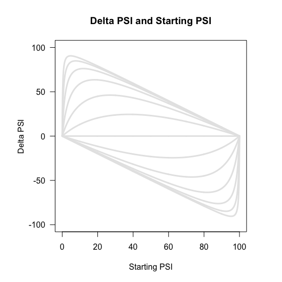
  <br> Figure 4D
</p>


## 4. Starting PSI at which maximum effect occurs

The relationship between the maximum effect size of a mutation and the starting PSI at which that effect is observed was derived to be:

<p align="center">
  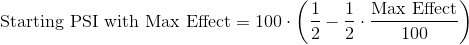
</p>

We can use this equation to visualise what this relationship looks like:

```r
# a bunch of maximum effect sizes
Max.Delta.PSIs <- seq(-100, 100, 20)

# the corresponding starting PSIs
Starting.PSIs <- 100 *(0.5 - 0.5 * Max.Delta.PSIs)

# plot
plot(NULL,
     ylim = c(0,100),
     xlim = c(-100,100),
     ylab = "Starting PSI",
     xlab = "Max Delta PSI")
par(new=T)
plot(y = Starting.PSIs,
     x = Max.Delta.PSIs,
     pch = 19,
     col = "gray80",
     axes = F,
     xlab = "",
     ylab = "",
     ylim = c(0,100),
     xlim = c(-100,100),
     cex = 1.5)
```

<p align="center">
  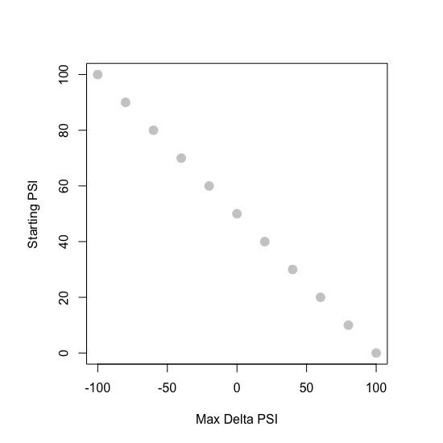
  <br> Figure 4F
</p>


To see whether we observe this same relationship in our data set, we fitted non-parametric curves (principal curves) to the Final vs Starting PSI plots from Figure S3. We took the maximum effect size predicted by the non-parametric fit as an estimate of the mutation's maximum effect size and plotted the starting PSI where this effect is observed versus the effect itself. To do this, we first load the library needed for the fit, as well as the relevant datasets:

```r
# principal curves library
library(analogue)

# load datasets
load("../004_HEK293_Phylogeny_Library_Analysis/002_whole_dataset.RData")
load("../004_HEK293_Phylogeny_Library_Analysis/004_final_vs_starting_psi_list.RData")
```
A vector with the 12 mutations that occur in our library:

```r
# vector containing the identity of the 12 point mutations found in the library
Single.Mutations <- c("C-41-G",
                      "T-49-C",
                      "T-24-C",
                      "T-19-G",
                      "G-51-C",
                      "C-18-G",
                      "C-32-T",
                      "C-18-T",
                      "C-39-T",
                      "G-26-T",
                      "G-35-T",
                      "G-44-A")
```
Also make a note of which mutations have two clearly distinct behaviours. This is because we will fit a different curve to each of these behaviours:

```r
# mutations with two clearly distinct behaviours
Singles.With.Multiple.Paths <- c("C-18-G",
                                 "T-19-G",
                                 "C-32-T",
                                 "T-49-C",
                                 "G-51-C")

# epistatic partners of the above
Epistasis.Table <- data.frame(Main = Singles.With.Multiple.Paths,
                              Epistatic = c("T-19-G",
                                            "C-18-G",
                                            "G-35-T",
                                            "G-51-C",
                                            "T-49-C"))
```
Build a vector with the low-variance genotypes:

```r
# build a vector with low SD genotypes
Low.Noise.Dataset <- Whole.Dataset[which(Whole.Dataset$SD < 10),]
Low.SD.Variants <- as.character(Low.Noise.Dataset$Mutation.IDs)
```
Create an empty list called `Principal.Curves`, where we will store the non-parametric curves generated:

```r
Principal.Curves <- vector(mode = "list")
```
Now we are ready to generate the principal curves for all our mutations. This will be done inside a loop:

```r
for (Each.Mutation in as.character(Single.Mutations)) {
    # some code here
}
```
I'll go through the code inside the loop next. We first extract the Final PSI vs Starting PSI dataframe from `Final.Vs.Starting.PSI.List` and filter it so it only includes low-variance genotypes as well as genotypes whose inclusion is predicted to be less than or equal to 100%:

```r
# Extract the DF with effects from this mutation
Mutant.DF <- Final.Vs.Starting.PSI.List[[Each.Mutation]]

# Use low-variance genotypes for curve fitting
Low.Noise.Rows <- which(as.character(Mutant.DF$Genotype.Final) %in% Low.SD.Variants & as.character(Mutant.DF$Genotype.Starting) %in% Low.SD.Variants)
Mutant.DF <- Mutant.DF[Low.Noise.Rows,]

# and discard genotypes with predicted PSI > 100%
Impossible.Rows <- which(Mutant.DF$Final.PSI > 100 | Mutant.DF$Starting.PSI > 100)
Mutant.DF <- Mutant.DF[-Impossible.Rows,]
```
If the mutation only has one behaviour, then we generate its principal curve:

```r
# Principal curve for this mutation's dataset
PR.Curve <- prcurve(X = data.frame(X = Mutant.DF$Starting.PSI,
                                   Y = Mutant.DF$Final.PSI),
                    complexity = 4,
                    method = "pca")
```
And save it in the `Principal.Curves` list from before:

```r
# save principal curve
Principal.Curves[[Each.Mutation]] <- PR.Curve
```

But if the mutation has two behaviours, we first split `Mutant.DF` in two, depending on whether or not the epistatic mutation is present in the background:

```r
# which is the epistatic mutation?
Epistatic.Mutation <- as.character(Epistasis.Table$Epistatic)[which(as.character(Epistasis.Table$Main) == Each.Mutation)]

# rows with epistatic mutation
Epistatic.Rows <- which(sapply(as.character(Mutant.DF$Genotype.Starting),
                               function(x){
                                 Epistatic.Mutation %in% strsplit(x,";")[[1]]
                               }))

# subset of Mutant.DF only with rows containing epistatic mutation
Mutant.DF.1 <- Mutant.DF[Epistatic.Rows,]

# subset of Mutant.DF without rows containing epistatic mutation
Mutant.DF.2 <- Mutant.DF[-Epistatic.Rows,]
```
A principal curve is generated for each of these two data frames:

```r
# Principal curve for 1st behaviour
PR.Curve.1 <- prcurve(X = data.frame(X = Mutant.DF.1$Starting.PSI,
                                     Y = Mutant.DF.1$Final.PSI),
                      complexity = 4,
                      method = "pca")
                      
# Principal curve for 2nd behaviour
PR.Curve.2 <- prcurve(X = data.frame(X = Mutant.DF.2$Starting.PSI,
                                     Y = Mutant.DF.2$Final.PSI),
                      complexity = 4,
                      method = "pca")
```
The two principal curves are then saved in the `Principal.Curves` list:

```r
# save principal curve 1
This.Mutation.Name <- paste(Each.Mutation,
                            ".1",
                            sep = "",
                            collapse = "")
Principal.Curves[[This.Mutation.Name]] <- PR.Curve.1

# save principal curve 2
This.Mutation.Name <- paste(Each.Mutation,
                            ".2",
                            sep = "",
                            collapse = "")
Principal.Curves[[This.Mutation.Name]] <- PR.Curve.2
```
After all the principal curves have been generated, we will use them to estimate each mutation's maximum effect size and the starting PSI at which that effect size is observed:

```r
Max.Starting <- c()
Max.Deltas <- c()

for (each.prcurve in Principal.Curves){
  Index <- which(abs(each.prcurve$s[each.prcurve$tag,][,2] - each.prcurve$s[each.prcurve$tag,][,1]) == max(abs(each.prcurve$s[each.prcurve$tag,][,2] - each.prcurve$s[each.prcurve$tag,][,1])))[1]
  Max.Starting <- c(Max.Starting, each.prcurve$s[each.prcurve$tag,][Index,1])
  Max.Deltas <- c(Max.Deltas, each.prcurve$s[each.prcurve$tag,][Index,2] - each.prcurve$s[each.prcurve$tag,][Index,1])
}
```
We can plot the results:

```r
plot(NULL,
     xlim = c(-100,100),
     ylim = c(0,100),
     xlab = "",
     ylab = "",
     axes = F)
abline(50,-0.5,
       lwd = 2,
       lty = 2,
       col = "gray80")
par(new=T)
plot(y=Max.Starting,
     x=Max.Deltas,
     ylim = c(0,100),
     xlim = c(-100,100),
     pch = 19,
     col =  rgb(0,0,0,0.7),
     cex = 1.5,
     las = 1,
     xlab = "Max effect (Delta PSI)",
     ylab = "Starting PSI")
```
<p align="center">
  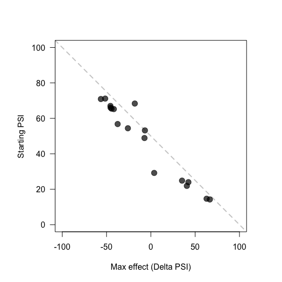
  <br> Figure 4F
</p>

## 5. Effect of tau

In Figure S5 we show the effect that tau has on the exon competition model.

### Sigmoidal shape

Changing tau distorts the sigmoidal relationship between exon 6 PSI and fold-changes in k6. First create a vector with the values of tau to be tested:

```r
# Try different values of tau
tau.Values.To.Try <- seq(0,0.4,0.1)
```
Choose the colours for each line in the plot:

```r
# load library
library(RColorBrewer)

# colours for plot
My.Palette <- colorRampPalette(colors = c("gray20", "gray80"))
All.Colours <- My.Palette(5)
```
Visualise the effect tau has on the relationship between exon 6 PSI and fold-changes in k6:

```r
# empty plot
plot(NULL,
     xlab = "log2 k6",
     ylab = "Exon 6 PSI",
     xlim = c(-10,10),
     ylim = c(0,100),
     las = 1,
     bty = "n")

# add lines
for (i in 1:length(tau.Values.To.Try)){
  # what tau are we testing now?
  each.tau <- tau.Values.To.Try[i]
  Modelled.PSIs <- Calculate.PSI(k6 = Range.k6.To.Test,
                                 k7 = Fixed.k7,  # k7 = 1
                                 tau = each.tau) # Time delay = 0
  
  # draw the line
  lines(x = log2(Range.k6.To.Test),
        y = Modelled.PSIs*100,
        col = All.Colours[i],
        lwd = 3)
  
  # legend
  points(x = -8,
         y = 100 - 10*i,
         pch = 19,
         col = All.Colours[i],
         cex = 2)
  text(x = -7.5,
       y = 100 - 10*i,
       labels = each.tau,
       cex = 1.5, pos = 4)
}

# surround with a box
box()
```
<p align="center">
  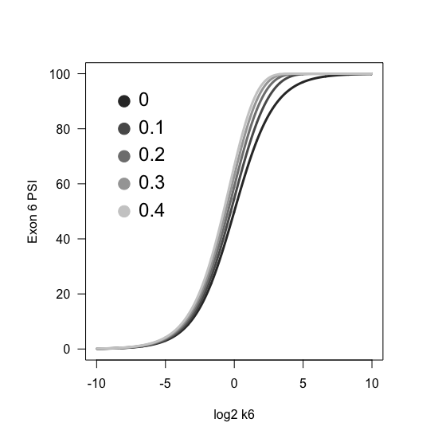
  <br> Figure S5A
</p>


### Final PSI vs starting PSI

If we are not assuming tau = 0, the relationship between final and starting PSI is given by equation S3 from the supplementary text:

<p align="center">
  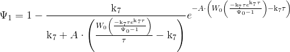
</p>

Define the equations we will use to test the effect of changing tau:

```r
# Load library with Lambert W function
library(lamW)

# Functions to calculate final PSI curves

# tau = 0 and k7 = 1
Function.When.Tau.Zero <- function(A){
  Starting.PSIs <- seq(0,1,0.01)
  (A*Starting.PSIs)/(1-Starting.PSIs+A*Starting.PSIs)
}

# tau = anything but k7 = 1
Function.When.Tau.Not.Zero <- function(A,Tau){
  Starting.PSIs <- seq(0,1,0.01)
  k6 <- (lambertW0((-1*Tau*exp(Tau))/(Starting.PSIs-1))/Tau)-1
  1 - ( 1/(1+A*k6) )*exp(-1*A*k6*Tau)
}
```
And we can plot the relationship between final and starting PSIs at different taus to see how it changes:

```r
# empty plot
par(pty="s")
plot(NULL,
     xlim = c(0,100),
     ylim = c(0,100),
     xlab = "Starting PSI",
     ylab = "Final PSI",
     las=1)
abline(0,1,col="gray90",lwd=2)

# draw lines
for (i in 1:length(tau.Values.To.Try)) {
  
  # what is this tau?
  Each.Tau <-tau.Values.To.Try[i]
  
  # all the starting PSIs
  Line.X <- seq(0,1,0.01)
  
  # all the final PSIs
  if (Each.Tau == 0) {
    Line.Y <- Function.When.Tau.Zero(A = 5)
  } else {
    Line.Y <- Function.When.Tau.Not.Zero(A = 5, Tau = Each.Tau)
  }
  
  # draw the line
  This.Colour <- All.Colours[i]
  lines(Line.X*100,
        Line.Y*100,
        lwd = 2,
        col = This.Colour)
  
  # legend
  points(x = 80,
         y = 70 - 10*i,
         pch = 19,
         col = All.Colours[i],
         cex = 2)
  text(x = 85,
       y = 70 - 10*i,
       labels = Each.Tau,
       cex = 1.5,
       pos = 4)
}
```

<p align="center">
  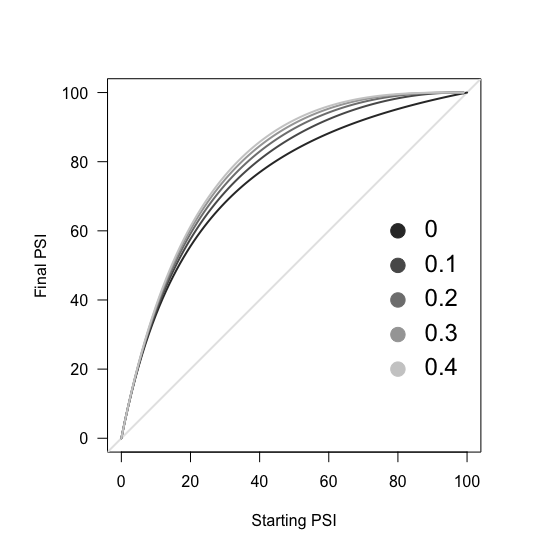
  <br> Figure S5C
</p>


### Delta PSI vs starting PSI

We can also plot the relationship between change in PSI and starting PSI at different values of tau:

```r
# empty plot
plot(NULL,
     xlim = c(0,100),
     ylim = c(-100,100),
     xlab = "Starting PSI",
     ylab = "Delta PSI",
     las=1)
abline(h=0,
       col="gray90",
       lwd=2)

# draw lines
for (i in 1:length(tau.Values.To.Try)) {
  
  # what is this tau?
  Each.Tau <-tau.Values.To.Try[i]
  
  # all the starting PSIs
  Line.X <- seq(0,1,0.01)
  
  # all the final PSIs
  if (Each.Tau == 0) {
    Line.Y <- Function.When.Tau.Zero(A = 5)
  } else {
    Line.Y <- Function.When.Tau.Not.Zero(A = 5, Tau = Each.Tau)
  }
  
  # draw the line
  This.Colour <- All.Colours[i]
  lines(Line.X*100,
        Line.Y*100 - Line.X*100,
        lwd = 2,
        col = This.Colour)
  
  # legend
  points(x = 80,
         y = 5 - 20*i,
         pch = 19,
         col = All.Colours[i],
         cex = 2)
  text(x = 85,
       y = 5 - 20*i,
       labels = Each.Tau,
       cex = 1.5,
       pos = 4)
}
```
<p align="center">
  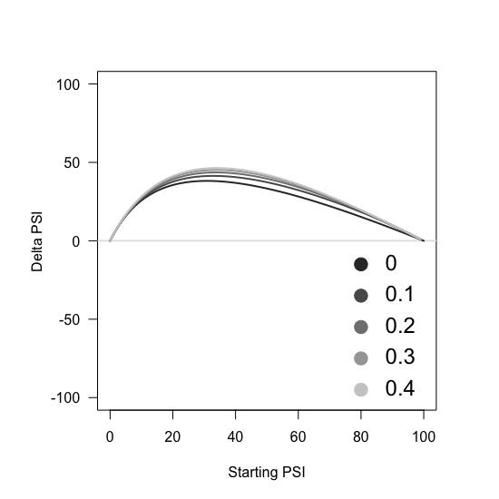
  <br> Figure S5C
</p>


## 6. Effect of k7

In the supplementary figures we explore the effect that k7 has in our exon competition model.

### Effect of k7 on relationship between exon 6 PSI and k6 fold-changes

First, we'll create a vector containing the different values of k7 we wish to test:

```r
# try different values of k7
k7.Values.To.try <- 10^(-2:2)
```
And then we'll plot exon 6 PSI vs fold-changes in k6 different times, each time fixing k7 to a different number:

```r
# empty plot
plot(NULL,
     xlim = c(-10,10),
     ylim = c(0,100),
     xlab = "log2 k6",
     ylab = "PSI",
     las = 1)

# draw the lines
for (i in 1:length(k7.Values.To.try)) {
  
  # calculate PSI values with this k7
  Calculated.PSIs <- Calculate.PSI(k6 = Range.k6.To.Test,
                                   k7 = k7.Values.To.try[i],
                                   tau = Fixed.Tau)
  
  # draw line
  lines(x = log2(Range.k6.To.Test),
        y = Calculated.PSIs*100,
        lwd = 3,
        col = All.Colours[i])
  
  # legend
  points(x = -9.5,
         y = 105 - 8*i,
         pch = 19,
         col = All.Colours[i],
         cex = 2)
  text(x = -9.2,
       y = 105 - 8*i,
       labels = k7.Values.To.try[i],
       cex = 1.5,
       pos = 4)
}
```
<p align="center">
  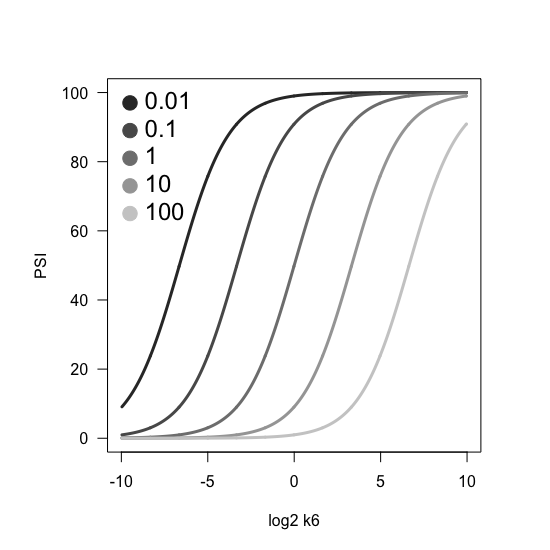
  <br> Figure S5A
</p>


### Relationship between exon 6 PSI and k7 fold-changes

Tau and k6 are fixed:

```r
# fix tau and k6:
Fixed.Tau <- 0
Fixed.k6 <- 1
```
A vector with the k7 values that we will test (the same values as those tested above for k6):

```r
# a bunch of k7 values we'll test
Range.k7.To.Test <- 10^(seq(-3,3,0.005))
```
Calculate the PSI for each value of k7, fixing k6 to 1 and tau to 0:

```r
# the corresponding PSI values
Calculated.PSIs <- Calculate.PSI(k6 = Fixed.k6,
                                 k7 = Range.k7.To.Test,
                                 tau = Fixed.Tau)
```
And plot the graph:

```r
# plot
par(pty="s")
plot(log2(Range.k7.To.Test),
     Calculated.PSIs*100,
     type = "l",
     col = "gray90",
     lwd = 3,
     xlab = "log2 k7",
     ylab = "PSI",
     las = 1)
```
<p align="center">
  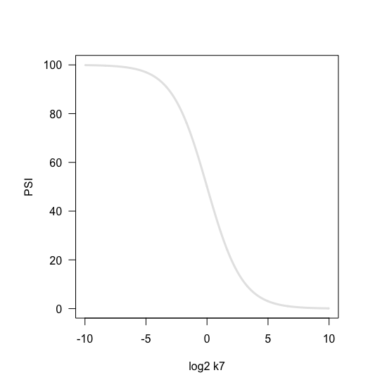
  <br> Figure S5B
</p>


### Effect of k6 on relationship between exon 6 PSI and k7 fold-changes

To do this, we will generate the same graph as above, but we'll draw several lines, each one corresponding to a (different) fixed value of k6. The values of k6 to try are the following:

```r
# try different values of k6
k6.Values.To.try <- 10^(-2:2)
```
And then we'll plot exon 6 PSI vs fold-changes in k7 different times, each time fixing k6 to a different number:

```r
# empty plot
plot(NULL,
     xlim = c(-10,10),
     ylim = c(0,100),
     xlab = "log2 k7",
     ylab = "PSI",
     las = 1)

# draw the lines
for (i in 1:length(k6.Values.To.try)) {
  
  # calculate PSI values with this k6
  Calculated.PSIs <- Calculate.PSI(k6 = k6.Values.To.try[i],
                                   k7 = Range.k7.To.Test,
                                   tau = Fixed.Tau)
  
  # draw line
  lines(x = log2(Range.k7.To.Test),
        y = Calculated.PSIs*100,
        lwd = 3,
        col = All.Colours[i])
  
  # legend
  points(x = 7,
         y = 105 - 8*i,
         pch = 19,
         col = All.Colours[i],
         cex = 2)
  text(x = 7.3,
       y = 105 - 8*i,
       labels = k6.Values.To.try[i],
       cex = 1.5,
       pos = 4)
}
```
<p align="center">
  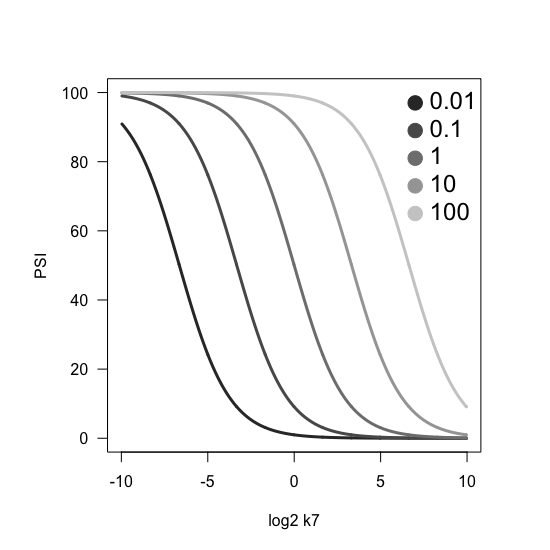
  <br> Figure S5B
</p>

### Effect of tau on relationship between exon 6 PSI and k7 fold-changes

Finally, we can also show how the relationship between exon 6 PSI and fold-changes in k7 depends on the time delay parameter tau:

```r
# empty plot
plot(NULL,
     xlab = "log2 k7",
     ylab = "Exon 6 PSI",
     xlim = c(-10,10),
     ylim = c(0,100),
     las = 1,
     bty = "n")

# add lines
for (i in 1:length(tau.Values.To.Try)){
  # what tau are we testing now?
  each.tau <- tau.Values.To.Try[i]
  Modelled.PSIs <- Calculate.PSI(k6 = 1,
                                 k7 = Range.k7.To.Test, 
                                 tau = each.tau) # Time delay = 0
  
  # draw the line
  lines(x = log2(Range.k7.To.Test),
        y = Modelled.PSIs*100,
        col = All.Colours[i],
        lwd = 3)
  
  # legend
  points(x = -8,
         y = 70 - 10*i,
         pch = 19,
         col = All.Colours[i],
         cex = 2)
  text(x = -7.5,
       y = 70 - 10*i,
       labels = each.tau,
       cex = 1.5, pos = 4)
}

# surround with a box
box()
```
<p align="center">
  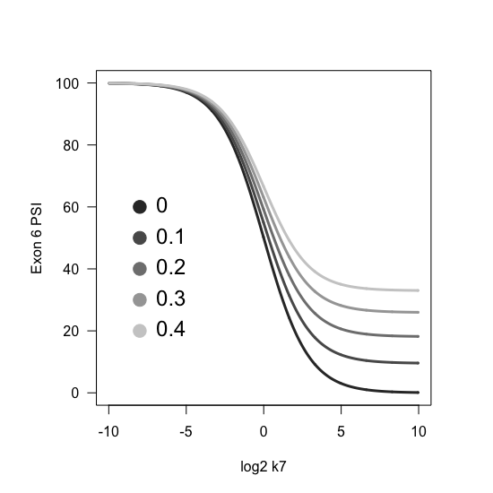
  <br> Figure S5B
</p>


## 7. Assuming tau = 0

In our paper we make the assumption that, for the model system we use, tau = 0. This is because optimal taus are always many orders of magnitude than minimal k6's. Let's see how to calculate this. First, we'll create some functions we'll be using later on:

```r
# function to calculate K6 given Tau and Old PSI
K6.From.Tau.OldPSI <- function(Old.PSI, TAU) {
  K6 <- (lambertW0(-1* ( (TAU*exp(TAU))/(Old.PSI-1)  ) ) / TAU ) - 1
}

# function to calculate New PSI given Tau, Old PSI and parameter A
NewPSI.From.OldPSI.A.Tau <- function(Old.PSI, A, TAU){
  K6 <- K6.From.Tau.OldPSI(Old.PSI, TAU)
  1 - (1/(1+A*K6)) * exp(-1*A*K6*TAU)
}
```

For each of the Final PSI - Starting PSI curves, we will try to find the optimal values of A and tau (i.e. the values of A and tau that minimise the error in our predictions). So we are going to create a "dummy function" that calculates the error in our predictions given a pair of parameters A and tau:

```r
# the function we want to optimise is the error between the PSI values
# estimated with our model and the observed PSI values
Function.To.Optimise <- function(parameters, DATA){
  
  # what are the starting parameters?
  TAU <- parameters[1]
  A <- parameters[2]
  
  # calculate new PSI using our mathematical model
  Calculated.New.PSIs <- NewPSI.From.OldPSI.A.Tau(Old.PSI = DATA$Starting.PSI/100,
                                                  A = A,
                                                  TAU = TAU)
  Calculated.New.PSIs <- Calculated.New.PSIs*100
  
  # what is the error between the calculations and the observations?
  Error <- mean(abs(Calculated.New.PSIs - DATA$Final.PSI),
                na.rm = T)
  
  # return the error
  Error
}
```

I created another function that takes a pair of parameters A and tau (among other things) and returns the pair of parameters that minimises the error in the function above:

```r
# wrapper for a set of commands I'll use several times in the loop below
Extract.Optimised.Parameters <- function(Data.Frame, Starting.Tau, Starting.A, This.Mutation, Epistatic = NA){
  
  # optimise the 'Function.To.Optimise' with a given set of starting parameters
  Optimisation.Object <- optim(par = c(Starting.Tau,Starting.A),
                               fn = Function.To.Optimise,
                               DATA = Data.Frame,
                               lower = c( 10^-10,-30),
                               upper = c(5, 50),
                               method = "L-BFGS-B")
  
  # the minimised error
  Error <- Optimisation.Object$value
  
  # return a vector with: optimisedParameter1, optimisedParameter2, This.Mutation, Epistatic, Error
  c(Optimisation.Object$par, This.Mutation, Epistatic, Error)
}
```

Since the optimal parameters found by the algorithm depends on the starting parameters used, we estimated these optimal parameters 5000 times in a loop as follows:

```r
# 5000 times to see how much the estimated time delay depends on the starting parameters

# set the seed
set.seed(123)

# list where I'll store the results for each iteration of the loop
List.of.Simulation.Results <- vector(mode = "list", length = 5000)

# iterate 5000 times
for (Each.Simulation.Round in 1:5000) {
  print(Each.Simulation.Round)
  
  # sample a starting A
  Starting.A <- exp(sample(x = seq(from = -5,
                                   to = 5,
                                   by = 0.001),
                           size = 1))
  
  # sample a starting tau
  Starting.Tau <- sample(x = seq(from = 0.001,
                                 to =  5,
                                 by =  0.001),
                         size = 1)
  
  Parameters <- matrix(nrow = 0, ncol = 5)
  
  # loop through the mutations and estimate optimal parameters
  for (i in 1:12) {
    
    # what is this mutation?
    This.Mutation <- Each.MutaSingle.Mutationstion[i]
    
    # get final-starting PSI data frame
    This.DF <- Final.Vs.Starting.PSI.List[[This.Mutation]]
    
    # filter out high-variance genotypes
    This.DF <- This.DF[which(as.character(This.DF$Genotype.Final) %in% Low.SD.Variants & as.character(This.DF$Genotype.Starting) %in% Low.SD.Variants),]
    
    # if two behaviours, calculate parameters for each of the two behaviours
    if (This.Mutation %in% as.character(Epistasis.Table$Main)) {
      Epistatic.Pair <- as.character(Epistasis.Table$Epistatic)[which(as.character(Epistasis.Table$Main) == This.Mutation)]
      
      Rows.With.Epistatic.Partner <- which(sapply(as.character(This.DF$Genotype.Final),
                                                  function(x){
                                                    Epistatic.Pair %in% strsplit(x, ";")[[1]]
                                                  }))
      
      #first curve
      This.DF.1 <- This.DF[Rows.With.Epistatic.Partner,]
      Parameters <- rbind(Parameters, 
                          Extract.Optimised.Parameters(Data.Frame = This.DF.1,
                                                       Starting.Tau = Starting.Tau,
                                                       Starting.A = Starting.A,
                                                       This.Mutation = This.Mutation,
                                                       Epistatic = "YES" ))
      
      #2nd curve
      This.DF.2 <- This.DF[-Rows.With.Epistatic.Partner,]
      Parameters <- rbind(Parameters, 
                          Extract.Optimised.Parameters(Data.Frame = This.DF.2,
                                                       Starting.Tau = Starting.Tau,
                                                       Starting.A = Starting.A,
                                                       This.Mutation = This.Mutation,
                                                       Epistatic = "NO" ))
      
    } else { # if one behaviour, calculate paramters for that behaviour
      Parameters <- rbind(Parameters, 
                          Extract.Optimised.Parameters(Data.Frame = This.DF,
                                                       Starting.Tau = Starting.Tau,
                                                       Starting.A = Starting.A,
                                                       This.Mutation = This.Mutation ))
    }
    
  }
  
  # make sure everything is in the correct format
  Parameters <- as.data.frame(Parameters)
  names(Parameters) <- c("Tau", "A", "Mutation", "Epistatic Bg", "Error")
  Parameters$Tau <- as.numeric(as.character(Parameters$Tau))
  Parameters$A <- as.numeric(as.character(Parameters$A))
  Parameters$Error <- as.numeric(as.character(Parameters$Error))
  
  # save in list
  List.of.Simulation.Results[[Each.Simulation.Round]] <- Parameters
}
```
Now, for each mutation, extract the minimum tau obtained in the 5000 iterations:

```r
# empty matrix
Matrix.Taus <- matrix(nrow = nrow(Parameters),
                      ncol = 0)

# fill in empty matrix with all tau values
invisible(lapply(List.of.Simulation.Results,
                 function(x){
                   Matrix.Taus <<- cbind(Matrix.Taus, x$Tau)
                 }))

# extract minimum tau values across all iterations
Minimum.Taus <- apply(X = Matrix.Taus,
                      MARGIN =  1,
                      FUN =  min)
```

The final step will be to take this vector of minimal taus, and back-calculate the corresponding k6 values. First, build a function to calculate k6 given tau and starting PSI:

```r
# function to calculate K6 given Tau and Starting PSI
K6.From.Tau.OldPSI <- function(Old.PSI, TAU) {
  K6 <- (lambertW0(-1* ( (TAU*exp(TAU))/(Old.PSI-1)  ) ) / TAU ) - 1
}
```
And now calculate all the k6 values:

```r
count <- 1

Vector.Of.K6s <- c()

for (i in 1:12) {
  
  # what is this mutation?
  This.Mutation <- Each.MutaSingle.Mutationstion[i]
  
  # extract final-starting psi data frame
  This.DF <- Final.Vs.Starting.PSI.List[[This.Mutation]]
  This.DF <- This.DF[which(as.character(This.DF$Genotype.Final) %in% Low.SD.Variants & as.character(This.DF$Genotype.Starting) %in% Low.SD.Variants),]
  
  # if this mutation has 2 different behaviours
  if (This.Mutation %in% as.character(Epistasis.Table$Main)) {
    
    # which is the epistatic mutation?
    Epistatic.Pair <- as.character(Epistasis.Table$Epistatic)[which(as.character(Epistasis.Table$Main) == This.Mutation)]
    
    # which rows in 'This.DF' contain the epistatic mutation?
    Rows.With.Epistatic.Partner <- which(sapply(as.character(This.DF$Genotype.Final),
                                                function(x){
                                                  Epistatic.Pair %in% strsplit(x, ";")[[1]]
                                                }))
    
    # subset 1
    This.DF.1 <- This.DF[Rows.With.Epistatic.Partner,]
    
    # calculate k6 values for all these rows, with the tau selected earlier
    Estimated.K6s <- sapply(X = This.DF.1$Starting.PSI/100,
                            FUN = K6.From.Tau.OldPSI,
                            TAU = Minimum.Taus[count])
    
    # median k6 with this tau?
    Median.K6 <- median(Estimated.K6s,
                        na.rm = T)
    
    # add to 'Vector.Of.K6s'
    Vector.Of.K6s <- c(Vector.Of.K6s, Median.K6)
    count <- count + 1
    
    # subset 2
    This.DF.2 <- This.DF[-Rows.With.Epistatic.Partner,]
    
    # calculate k6 values for all these rows, with the tau selected earlier
    Estimated.K6s <- sapply(X = This.DF.2$Starting.PSI/100,
                            FUN = K6.From.Tau.OldPSI,
                            TAU = Minimum.Taus[count])
    
    # median k6 with this tau?
    Median.K6 <- median(Estimated.K6s,
                        na.rm = T)
    
    # add to 'Vector.Of.K6s'
    Vector.Of.K6s <- c(Vector.Of.K6s, Median.K6)
    count <- count + 1
    
  } else {  # if there is just one behaviour
    # calculate k6 values for all these rows, with the tau selected earlier
    Estimated.K6s <- sapply(X = This.DF$Starting.PSI/100,
                            FUN = K6.From.Tau.OldPSI,
                            TAU = Minimum.Taus[count])
    
    # median k6 with this tau?
    Median.K6 <- min(Estimated.K6s,
                     na.rm = T)
    
    # add to 'Vector.Of.K6s'
    Vector.Of.K6s <- c(Vector.Of.K6s, Median.K6)
    count <- count + 1
  } 
}
```

These k6 values are many orders of magnitude greater than the tau values from which they were derived.