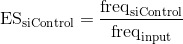
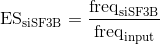

# Enrichment scores

In this document I explain the cound found in [001\_enrichment\_scores.R](001_enrichment_scores.R). In this experiment, we calculated two sets of enrichment scores:

1. In the presence of a control siRNA
2. In the presence of an siRNA against SF3B1

In both cases, the files generated in the raw sequencing file processing [pipeline](../003_Processing_sequencing_data/002_Doped_library_with_siRNA) was the output, whereas the input was the same as the one from [Julien et al, 2015](https://www.nature.com/articles/ncomms11558) (for your convenience, the relevant files from that study have been provided here inside the `Data/` folder, compressed in a zip file).

All the code in this document is written in R.


## 1. Load data

We first load the sequencing read counts files for the control siRNA experiment:

```r
# load siControl replicates
for (i in 1:3) {
  # the name of the file I need to read
  This.File.Name <- paste("Control_RNAi_Rep_", i, ".counts", sep = "")
  # load it in R with a generic variable name
  This.Data.Frame <- read.table(This.File.Name)
  # set column names
  colnames(This.Data.Frame) <- c("Sequence", "Counts", "Mutations")
  # set row names
  rownames(This.Data.Frame) <- as.character(This.Data.Frame$Sequence)
  # variable name I want to assign it to
  This.Variable.Name <- paste("siControl", i, sep = "")
  # give it the new variable name
  assign(x = This.Variable.Name, value = This.Data.Frame)
}
```
For the siRNA against SF3B1 experiment:

```r
# load siSF3B replicates
for (i in 1:3) {
  # the name of the file I need to read
  This.File.Name <- paste("SF3B_RNAi_Rep_", i, ".counts", sep = "")
  # load it in R with a generic variable name
  This.Data.Frame <- read.table(This.File.Name)
  # set column names
  colnames(This.Data.Frame) <- c("Sequence", "Counts", "Mutations")
  # set row names
  rownames(This.Data.Frame) <- as.character(This.Data.Frame$Sequence)
  # variable name I want to assign it to
  This.Variable.Name <- paste("siSF3B", i, sep = "")
  # give it the new variable name
  assign(x = This.Variable.Name, value = This.Data.Frame)
}
```
And the input (before loading this into R, you'll need to extract the three files inside `Data/Doped_Library_Input.zip`): 

```r
# load input
for (i in 1:3) {
  # the name of the file I need to read
  This.File.Name <- paste("Doped_Library_Input_Rep_", i, ".counts", sep = "")
  # load it in R with a generic variable name
  This.Data.Frame <- read.table(This.File.Name)
  # set column names
  colnames(This.Data.Frame) <- c("Sequence", "Counts", "Mutations")
  # set row names
  rownames(This.Data.Frame) <- as.character(This.Data.Frame$Sequence)
  # variable name I want to assign it to
  This.Variable.Name <- paste("Input", i, sep = "")
  # give it the new variable name
  assign(x = This.Variable.Name, value = This.Data.Frame)
}
```
Before moving on, we need to find out which genotypes are common to all the different experiments (otherwise we cannot compare them):

```r
# find sequences common to all experiments
Common.Genotypes <- Reduce(f = intersect,
                           x = list(  as.character(siControl1$Sequence),
                                      as.character(siControl2$Sequence),
                                      as.character(siControl3$Sequence),
                                      as.character(siSF3B1$Sequence),
                                      as.character(siSF3B2$Sequence),
                                      as.character(siSF3B3$Sequence),
                                      as.character(Input1$Sequence),
                                      as.character(Input2$Sequence),
                                      as.character(Input3$Sequence)
                                      ))
```
And filter the datasets to remove variants that are not common to all:

```r
# take only variants common to all datasets
siControl1 <- siControl1[Common.Genotypes,]
siControl2 <- siControl2[Common.Genotypes,]
siControl3 <- siControl3[Common.Genotypes,]

siSF3B1 <- siSF3B1[Common.Genotypes,]
siSF3B2 <- siSF3B2[Common.Genotypes,]
siSF3B3 <- siSF3B3[Common.Genotypes,]

Input1 <- Input1[Common.Genotypes,]
Input2 <- Input2[Common.Genotypes,]
Input3 <- Input3[Common.Genotypes,]
```
Clean up the environment:

```r
# cleanup
rm(This.Data.Frame,
   This.Variable.Name,
   This.File.Name,
   i)
```


## 2. Calculate enrichment scores

Combine all the loaded data into one data frame:

```r
All.Expts <- data.frame(Input1 = Input1[rownames(Input1), "Counts"],
                        Input2 = Input2[rownames(Input1), "Counts"],
                        Input3 = Input3[rownames(Input1), "Counts"],
                        siControl1 = siControl1[rownames(Input1), "Counts"],
                        siControl2 = siControl2[rownames(Input1), "Counts"],
                        siControl3 = siControl3[rownames(Input1), "Counts"],
                        siSF3B1 = siSF3B1[rownames(Input1), "Counts"],
                        siSF3B2 = siSF3B2[rownames(Input1), "Counts"],
                        siSF3B3 = siSF3B3[rownames(Input1), "Counts"],
                        Sequence = as.character(Input1[rownames(Input1), "Sequence"]),
                        Mutations = Input1[rownames(Input1), "Mutations"])
All.Expts$Sequence <- as.character(All.Expts$Sequence)
rownames(All.Expts) <- rownames(Input1)
```
Next, we will calculate the frequency of each genotype in each input and output replicate:

```r
# Frequency of each sequence in the input
Input.Frequency <- apply(X = All.Expts[,1:3],
                         MARGIN = 2,
                         FUN = function(x){
                           return(x/sum(x, na.rm = T))
                         })

# Frequency of each sequence in the siControl
siControl.Frequency <- apply(X = All.Expts[,4:6],
                             MARGIN = 2,
                             FUN = function(x){
                               return(x/sum(x, na.rm = T))
                             })


# Frequency of each sequence in the siSF3B
siSF3B.Frequency <- apply(X = All.Expts[,7:9],
                          MARGIN = 2,
                          FUN = function(x){
                            return(x/sum(x, na.rm = T))
                          })
```
Calculate the median input frequency for every genotype:

```r
# Median frequency in the input
Input.Median.Frequency <- apply(X = Input.Frequency,
                                MARGIN = 1,
                                FUN = median, na.rm = T)
```
Finally, calculate enrichment scores using the formulae:

<p align="center">
  
</p>

<p align="center">
  
</p>


```r
# calculate enrichment scores for siControl
Enrichment.Scores.siControl <- siControl.Frequency / Input.Median.Frequency
Enrichment.Scores.siControl <- as.data.frame(Enrichment.Scores.siControl)

# calculate enrichment scores for siSF3B
Enrichment.Scores.siSF3B <- siSF3B.Frequency / Input.Median.Frequency
Enrichment.Scores.siSF3B <- as.data.frame(Enrichment.Scores.siSF3B)
```
Save the R objects for later use:

```r
# save data frame
save(Enrichment.Scores.siControl,
     Enrichment.Scores.siSF3B,
     file = "001_enrichment_scores.RData")
```