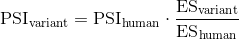
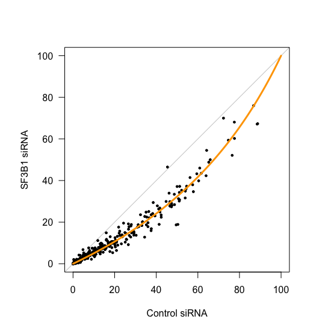

# Effect of knocking down SF3B1


## 1. Load libraries and data

We load the caret library which we'll use towards the end of this document to calculate an aggregated RMSE value.

```r
# caret library
library(caret)
```
Define the human WT sequence:

```r
# the sequence corresponding to human FAS exon 6
WT.Sequence <- "GATCCAGATCTAACTTGGGGTGGCTTTGTCTTCTTCTTTTGCCAATTCCACTAATTGTTTGGG"
```

Also define a few custom functions that I'll use further down:

```r
# Functions
HammingDistance <- function(sequence1, sequence2){
  sequence1.vector <- strsplit(sequence1,"")[[1]]
  sequence2.vector <- strsplit(sequence2,"")[[1]]
  
  return(length(which(sequence1.vector != sequence2.vector)))
}

# Hamming distance from the human WT
Distance.To.WT <- function(sequence, WT = WT.Sequence){
  WT = WT.Sequence
  HammingDistance(WT, sequence)
}

# Function that returns Root Mean Squared Error
rmse <- function(error){
  sqrt(mean(error^2))
}
```

Load enrichment scores (generated in [001\_enrichment\_scores.R](001_enrichment_scores.R):

```r
# load ES
load("001_enrichment_scores.RData")
```
And the files with the input read counts (will need this later on for filtering):

```r

# load input counts
for (i in 1:3) {
  # the name of the file I need to read
  This.File.Name <- paste("Doped_Library_Input_Rep_", i, ".counts", sep = "")
  # load it in R with a generic variable name
  This.Data.Frame <- read.table(This.File.Name, header = T)
  # set column names
  colnames(This.Data.Frame) <- c("Sequence", "Counts", "Mutations")
  # set row names
  rownames(This.Data.Frame) <- as.character(This.Data.Frame$Sequence)
  # variable name I want to assign it to
  This.Variable.Name <- paste("Input", i, sep = "")
  # give it the new variable name
  assign(x = This.Variable.Name, value = This.Data.Frame)
}
```


## 2. Calculate PSI values

The first thing we need to do is to take the median enrichment score across different replicates in each of siControl and siSF3B:

```r
# median enrichment scores
Enrichment.Scores.siControl$Median <- apply(X = Enrichment.Scores.siControl,
                                            MARGIN = 1,
                                            FUN = median)

Enrichment.Scores.siSF3B$Median <- apply(X = Enrichment.Scores.siSF3B,
                                         MARGIN = 1,
                                         FUN = median)
```
We'll also calculate the enrichment score standard deviation across the different replicates. We won't be using this information until further downstream though.

```r
# enrichment score standard deviation
Enrichment.Scores.siControl$SD <- apply(X = Enrichment.Scores.siControl[,1:3],
                                        MARGIN = 1,
                                        FUN = sd)

Enrichment.Scores.siSF3B$SD <- apply(X = Enrichment.Scores.siSF3B[,1:3],
                                     MARGIN = 1,
                                     FUN = sd)
```

Count the number of mutations in every genotype:

```r
# siControl: Number of mutations in each genotype
Enrichment.Scores.siControl$No.Mutations <- sapply(X = as.character(rownames(Enrichment.Scores.siControl)),
                                                   FUN = Distance.To.WT)

# siSF3B: Number of mutations in each genotype
Enrichment.Scores.siSF3B$No.Mutations <- sapply(X = as.character(rownames(Enrichment.Scores.siSF3B)),
                                                FUN =  Distance.To.WT)
```
We'll now calculate the PSI of all genotypes. This will be split into 4 steps:

1. Calculate the density distribution of all single mutant enrichment scores.
2. Take the mode of this density distribution as an estimate of the human WT enrichment score.
3. Experimentally determine the PSI of the human WT sequence.
4. Use the information gathered in steps 2 and 3 to estimate PSI values according to the following formula:

<p align="center">
  
</p>

```r
# [1] Density of all single mutants
Density.Object.siControl <- density(Enrichment.Scores.siControl$Median[which(Enrichment.Scores.siControl$No.Mutations == 1)])
Density.Object.siSF3B <- density(Enrichment.Scores.siSF3B$Median[which(Enrichment.Scores.siSF3B$No.Mutations == 1)])

# [2] WT = mode of density plot
WT.ES.Estimate.siControl <- Density.Object.siControl$x[which(Density.Object.siControl$y == max(Density.Object.siControl$y))]
WT.ES.Estimate.siSF3B <- Density.Object.siSF3B$x[which(Density.Object.siSF3B$y == max(Density.Object.siSF3B$y))]

# [3] WT PSI (from rt-pcr assays)
WT.PSI.siControl <- 0.534
WT.PSI.siSF3B <- 0.356

# [4] PSI = WT.PSI * ES/WT_ES
Enrichment.Scores.siControl$Median.PSI <- WT.PSI.siControl * (Enrichment.Scores.siControl$Median/WT.ES.Estimate.siControl)
Enrichment.Scores.siSF3B$Median.PSI <- WT.PSI.siSF3B * (Enrichment.Scores.siSF3B$Median/WT.ES.Estimate.siSF3B)
```


## 3. Filter data by input reads and SD

Before we plot the results, we will remove

1. data points with less than 3000 reads in the input (~ to the mean input read count in the phylogeny library)
2. data points with an enrichment score standard deviation > 0.1 (also ~ to the threshold from the phylogeny library)
3. genotypes with more than 2 mutations relative to the human sequence

### 3.1. Filter by input reads

First, we'll filter the input read count to remove any genotypes that are not found in all the datasets (as we did previously when calculating enrichment scores):

```r
# filter input counts themselves so they contain the
# same genotypes as the datasets we're working with
Input1 <- Input1[as.character(rownames(Enrichment.Scores.siControl)),]
Input2 <- Input2[as.character(rownames(Enrichment.Scores.siControl)),]
Input3 <- Input3[as.character(rownames(Enrichment.Scores.siControl)),]
```
Sum up the read count data:

```r
# sum up input read counts
Input.Counts <- Input1$Counts + Input2$Counts + Input3$Counts
```
Which genotypes have 3000 or more total reads?

```r
# filter will be 3k input read counts
Indices.High.Counts <- which(Input.Counts >= 3000)
```
Remove data points with fewer than 3000 input reads:

```r
# filter enrichment scores data frames
Enrichment.Scores.siControl <- Enrichment.Scores.siControl[Indices.High.Counts,]
Enrichment.Scores.siSF3B <- Enrichment.Scores.siSF3B[Indices.High.Counts,]
```


### 3.2. Filter by enrichment score SD

Which genotypes have a low standard deviation?

```r
#which variants have low standard deviation?
Indices.Low.SD <- which(Enrichment.Scores.siControl$SD < 0.1 & Enrichment.Scores.siSF3B$SD < 0.1)
```
Keep only those:

```r
# remove variants with high standard deviation
Enrichment.Scores.siControl <- Enrichment.Scores.siControl[Indices.Low.SD,]
Enrichment.Scores.siSF3B <- Enrichment.Scores.siSF3B[Indices.Low.SD,]
```

### 3.3. Only look at single & double mutants

Remove genotypes with more than two mutations relative to the human wild-type sequence:

```r
# single+ double mutants only
Enrichment.Scores.siControl <- Enrichment.Scores.siControl[which(Enrichment.Scores.siControl$No.Mutations < 3),]
Enrichment.Scores.siSF3B <- Enrichment.Scores.siSF3B[which(Enrichment.Scores.siSF3B$No.Mutations < 3),]
```


## 4. Plot starting vs final PSI


```r
# plot
par(pty="s")
plot(NULL,
     axes = F,
     xlab = "",
     ylab = "",
     xlim = c(0,1),
     ylim = c(0,1))
abline(0,1,col="gray80",lwd=1)
par(new=T)
plot(Enrichment.Scores.siControl$Median.PSI*100,
     Enrichment.Scores.siSF3B$Median.PSI*100,
     pch = 19,
     cex = 0.5,
     xlim = c(0,100),
     ylim = c(0,100),
     xlab = "Control siRNA",
     ylab = "SF3B1 siRNA",
     main = "", las = 1)

# add scaling curve
New.X <- Enrichment.Scores.siControl$Median.PSI
New.Y <- Enrichment.Scores.siSF3B$Median.PSI
Dots.To.Consider <- which(New.X <= 1 & New.Y <= 1)
New.X <- New.X[Dots.To.Consider]
New.Y <- New.Y[Dots.To.Consider]
NLS.Model <- nls(New.Y ~ (exp(K)*New.X) / (1 - New.X + exp(K)*New.X), start = list(K = 1) )
Line.X <- seq(0,1,0.01)
Line.Y <- predict(object = NLS.Model, newdata = data.frame(New.X = Line.X))
lines(Line.X*100, Line.Y*100, lwd = 3, col = "orange")
```
<p align="center">
  
  <br> Figure 4G
</p>

## 5. Calculate RMSE

Use the same method as [007\_genetic\_prediction.md](../004_HEK293_Phylogeny_Library_Analysis/007_genetic_prediction.md) in the phylogeny library analysis:

```r
# set seed
set.seed(123)

# Create 10 folds with caret package
Testing.Sets <- createFolds(y = New.Y,
                            k = 10,
                            returnTrain = F)

# calculate model RMSE for each of the 10 folds
Vector.of.RMSEs <- c()
for (i in 1:10){
  
  # training set
  X <- New.X[ -Testing.Sets[[i]] ]
  Y <- New.Y[ -Testing.Sets[[i]] ]
  
  # testing set
  Test.X <- New.X[ Testing.Sets[[i]] ]
  Test.Y <- New.Y[ Testing.Sets[[i]] ]
  
  Trained.Model <- nls(Y ~ (exp(K)*X) / (1 - X + exp(K)*X), start = list(K = 1) )
  
  Predictions.on.Testing.Set <- predict(object = Trained.Model, newdata = data.frame(X = Test.X))
  
  Errors <- 100*Test.Y - 100*Predictions.on.Testing.Set
  
  RMSE <- rmse(Errors)
  
  Vector.of.RMSEs <- c(Vector.of.RMSEs, RMSE)
  
}

# combine RMSEs to obtain the cross-validation RMSE
Overall.RMSE <- sqrt((sum(Vector.of.RMSEs^2))/10)
print(Overall.RMSE)
```