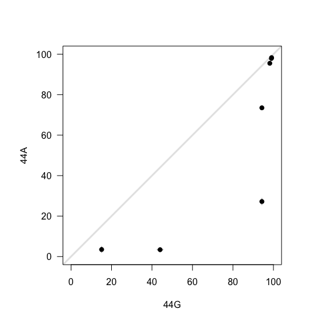
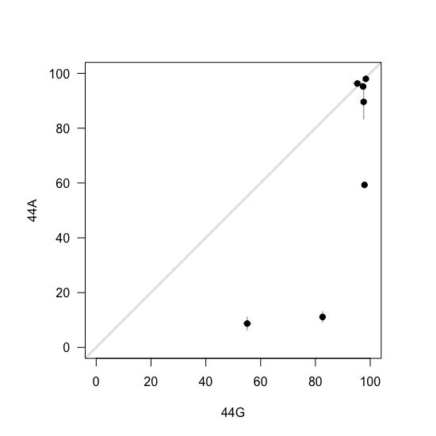
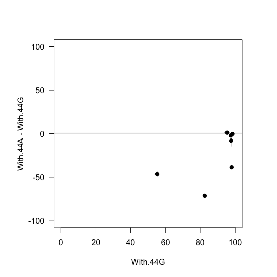
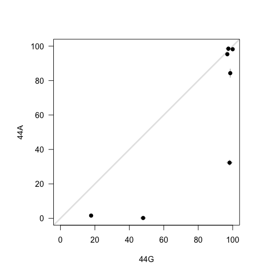
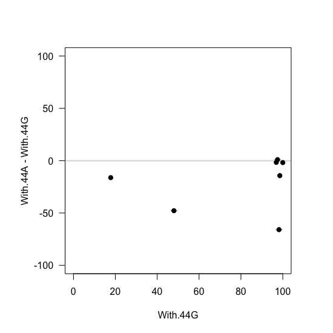

# Scaling of G44A effects in 3 cell lines


We performed small-scale RT-PCR experiments to validate some of the patterns observed in the mutant library. We tested the scaling of G44A in 3 different cell lines: HEK293, HeLa and COS-7. In this document I describe how I visualised the data in R.


## 1. HEK293

First, manually get the gel electrophoresis data into R:

```r
# gel electrophoresis
With.44G <- c(99.1,
              99,
              98.2,
              94.3,
              94.3,
              15.1,
              44)

With.44A <- c(98.3,
              97.9,
              95.5,
              73.5,
              27.2,
              3.5,
              3.4)

With.44G.SD <- c(0.7,
                 0.2,
                 0.2,
                 0.5,
                 0.5,
                 0.9,
                 1.5)

With.44A.SD <- c(0.2,
                 0.8,
                 0.3,
                 0.7,
                 1.6,
                 1.5,
                 1)

Combined.SD <- sqrt(With.44G.SD^2 + With.44A.SD^2)
```
Then use this information to plot the final vs starting PSI plot:

```r
par(pty="s")
plot(NULL,
     xlim = c(0,100),
     ylim = c(0,100),
     xlab = "",
     ylab = "",
     axes = F)
abline(0,1, lwd = 3, col = "gray90")
segments(x0 = With.44G,
         x1 = With.44G,
         y0 = With.44A+With.44A.SD,
         y1 = With.44A-With.44A.SD,
         col = "gray70",
         lwd = 1.5)
segments(x0 = With.44G+With.44G.SD,
         x1 = With.44G-With.44G.SD,
         y0 = With.44A,
         y1 = With.44A,
         col = "gray70",
         lwd = 1.5)
par(new=T)
plot(With.44G,
     With.44A,
     xlim = c(0,100),
     ylim = c(0,100),
     pch = 19,
     las = 1,
     xlab = "44G",
     ylab = "44A")
```
<p align="center">
  
  <br> Figure 3E
</p>

And delta PSI vs starting PSI plot:

```r
par(pty="s")
plot(NULL,
     xlim = c(0,100),
     ylim = c(-100,100),
     xlab = "",
     ylab = "",
     axes = F)
abline(h=0, lwd = 3, col = "gray90")
segments(x0 = With.44G,
         x1 = With.44G,
         y0 = With.44A-With.44G+Combined.SD,
         y1 = With.44A-With.44G-Combined.SD,
         col = "gray70",
         lwd = 1.5)
segments(x0 = With.44G+With.44G.SD,
         x1 = With.44G-With.44G.SD,
         y0 = With.44A-With.44G,
         y1 = With.44A-With.44G,
         col = "gray70",
         lwd = 1.5)
par(new=T)
plot(With.44G,With.44A-With.44G,
     xlim = c(0,100),
     ylim = c(-100,100),
     pch = 19,
     las = 1,
     xlab = "With.44G",
     ylab = "With.44A - With.44G")
```
<p align="center">
  
  <br> Figure 3E
</p>

## 2. HeLa

Again, manually get the gel electrophoresis data into R:

```r
# gel electrophoresis
With.44G <- c(98.4,
              95.3,
              97.4,
              97.6,
              97.9,
              55.1,
              82.6)

With.44A <- c(98,
              96.3,
              95.2,
              89.6,
              59.3,
              8.7,
              11.1)

With.44G.SD <- c(0.5,
                 1.6,
                 0.4,
                 0.4,
                 0.4,
                 1.4,
                 0.8)

With.44A.SD <- c(0.5,
                 0.4,
                 0.7,
                 6.3,
                 0.9,
                 2.4,
                 1.9)

Combined.SD <- sqrt(With.44G.SD^2 + With.44A.SD^2)
```

Plot final vs starting PSI:

```r
par(pty="s")
plot(NULL,
     xlim = c(0,100),
     ylim = c(0,100),
     xlab = "",
     ylab = "",
     axes = F)
abline(0,1, lwd = 3, col = "gray90")
segments(x0 = With.44G,
         x1 = With.44G,
         y0 = With.44A+With.44A.SD,
         y1 = With.44A-With.44A.SD,
         col = "gray70",
         lwd = 1.5)
segments(x0 = With.44G+With.44G.SD,
         x1 = With.44G-With.44G.SD,
         y0 = With.44A,
         y1 = With.44A,
         col = "gray70",
         lwd = 1.5)
par(new=T)
plot(With.44G,
     With.44A,
     xlim = c(0,100),
     ylim = c(0,100),
     pch = 19,
     las = 1,
     xlab = "44G",
     ylab = "44A")
```
<p align="center">
  
  <br> Figure 3E
</p>

And delta vs starting PSI:

```r
par(pty="s")
plot(NULL,
     xlim = c(0,100),
     ylim = c(-100,100),
     xlab = "",
     ylab = "",
     axes = F)
abline(h=0, lwd = 3, col = "gray90")
segments(x0 = With.44G,
         x1 = With.44G,
         y0 = With.44A-With.44G+Combined.SD,
         y1 = With.44A-With.44G-Combined.SD,
         col = "gray70",
         lwd = 1.5)
segments(x0 = With.44G+With.44G.SD,
         x1 = With.44G-With.44G.SD,
         y0 = With.44A-With.44G,
         y1 = With.44A-With.44G,
         col = "gray70",
         lwd = 1.5)
par(new=T)
plot(With.44G,With.44A-With.44G,
     xlim = c(0,100),
     ylim = c(-100,100),
     pch = 19,
     las = 1,
     xlab = "With.44G",
     ylab = "With.44A - With.44G")
```
<p align="center">
  
  <br> Figure 3E
</p>

## 3. COS-7

Finally, repeat for COS-7:

```r
# gel electrophoresis
With.44G <- c(97.5,
              96.9,
              100,
              98.6,
              98.2,
              17.8,
              48)

With.44A <- c(98.5,
              95.3,
              98.2,
              84.3,
              32.3,
              1.6,
              0.2)

With.44G.SD <- c(1.4,
                 1,
                 0.1,
                 0.6,
                 1.6,
                 0.7,
                 1.5)

With.44A.SD <- c(1.3,
                 0.4,
                 1.1,
                 2.4,
                 1.5,
                 0.2,
                 0.6)

Combined.SD <- sqrt(With.44G.SD^2 + With.44A.SD^2)
```

Final vs starting PSI:

```r
par(pty="s")
plot(NULL,
     xlim = c(0,100),
     ylim = c(0,100),
     xlab = "",
     ylab = "",
     axes = F)
abline(0,1, lwd = 3, col = "gray90")
segments(x0 = With.44G,
         x1 = With.44G,
         y0 = With.44A+With.44A.SD,
         y1 = With.44A-With.44A.SD,
         col = "gray70",
         lwd = 1.5)
segments(x0 = With.44G+With.44G.SD,
         x1 = With.44G-With.44G.SD,
         y0 = With.44A,
         y1 = With.44A,
         col = "gray70",
         lwd = 1.5)
par(new=T)
plot(With.44G,
     With.44A,
     xlim = c(0,100),
     ylim = c(0,100),
     pch = 19,
     las = 1,
     xlab = "44G",
     ylab = "44A")
```
<p align="center">
  
  <br> Figure 3E
</p>

Delta vs starting PSI:

```r
par(pty="s")
plot(NULL,
     xlim = c(0,100),
     ylim = c(-100,100),
     xlab = "",
     ylab = "",
     axes = F)
abline(h=0, lwd = 3, col = "gray90")
segments(x0 = With.44G,
         x1 = With.44G,
         y0 = With.44A-With.44G+Combined.SD,
         y1 = With.44A-With.44G-Combined.SD,
         col = "gray70",
         lwd = 1.5)
segments(x0 = With.44G+With.44G.SD,
         x1 = With.44G-With.44G.SD,
         y0 = With.44A-With.44G,
         y1 = With.44A-With.44G,
         col = "gray70",
         lwd = 1.5)
par(new=T)
plot(With.44G,With.44A-With.44G,
     xlim = c(0,100),
     ylim = c(-100,100),
     pch = 19,
     las = 1,
     xlab = "With.44G",
     ylab = "With.44A - With.44G")
```
<p align="center">
  
  <br> Figure 3E
</p>
