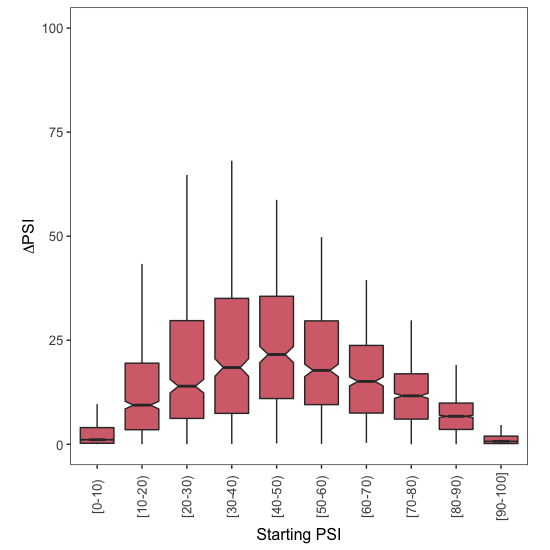

# Downstream Analysis

This document explains the code found in [002\_downstream\_analysis.R](002_downstream_analysis.R), which processes the `Tissues_Compared_Datasets.RData` file generated in the previous step to compare exon inclusion in brain and in skin. All the code in this document is written in R.


## 1. Data processing in R

We first load the file:

```r
load("Tissues_Compared_Datasets.RData")
```
For the comparison between 2 different tissues, I chose Brain and Skin because these are the tissues with the largest number of samples. We can confirm this by running the `table` command on the `Tissue` column of the `GTEX.Annotations` data frame:

```r
table(GTEX.Annotations$Tissue)
```
```
## 
##  Adipose Tissue   Adrenal Gland         Bladder           Blood 
##             797             190              11             537 
##    Blood Vessel     Bone Marrow           Brain          Breast 
##             913               0            1671             290 
##    Cervix Uteri           Colon       Esophagus  Fallopian Tube 
##              11             507            1021               7 
##           Heart          Kidney           Liver            Lung 
##             600              45             175             427 
##          Muscle           Nerve           Ovary        Pancreas 
##             564             414             133             248 
##       Pituitary        Prostate  Salivary Gland            Skin 
##             183             152              97            1203 
## Small Intestine          Spleen         Stomach          Testis 
##             137             162             262             259 
##         Thyroid          Uterus          Vagina 
##             446             111             115
```
Need to figure out the IDs of all brain or skin samples:

```r
# which row numbers refer to a sample in brain or skin?
Brain.Indices <- which(GTEX.Annotations$Tissue == "Brain")
Skin.Indices <- which(GTEX.Annotations$Tissue == "Skin")

# use those row numbers as indices to extract relevant IDs
Brain.Sample.IDs <- as.character(GTEX.Annotations$ID)[Brain.Indices]
Skin.Sample.IDs <- as.character(GTEX.Annotations$ID)[Skin.Indices]
```
After taking the IDs I wanted to work with, I used them to subset `PSI.Estimates` and create two small data frames (one for each of the 2 tissues I want to compare):

```r
Brain.PSI.Table <- PSI.Estimates[,Brain.Sample.IDs]
Skin.PSI.Table <- PSI.Estimates[,Skin.Sample.IDs]
```
For each of the two tissues, I calculated the mean inclusion level of each alternative exon event:

```r
# calculate mean PSI in brain
Brain.Mean.PSIs <- apply(X = Brain.PSI.Table,
                         MARGIN = 1,
                         FUN = mean,
                         na.rm=T)

# calculate mean PSI in skin
Skin.Mean.PSIs <- apply(X = Skin.PSI.Table,
                        MARGIN = 1,
                        FUN = mean,
                        na.rm=T)
```
I removed any events where there was not enough information to calculate a mean PSI in either tissue (i.e. events where I only observed NA's):

```r
# indices with bad data in each of the two tissues
Brain.To.Remove <- which(is.na(Brain.Mean.PSIs))
Skin.To.Remove <- which(is.na(Skin.Mean.PSIs))

# indices with bad data in either tissue
Rows.To.Remove <- union(Brain.To.Remove, Skin.To.Remove)

# remove datapoints that only have NA's
Brain.Mean.PSIs <- Brain.Mean.PSIs[-Rows.To.Remove]
Skin.Mean.PSIs <- Skin.Mean.PSIs[-Rows.To.Remove]

```

To calculate the effect of changing the tissue (from brain, the 'Starting PSI' condition, to skin, the 'final PSI' condition) on exon inclusion, I subtracted the mean PSI value in brain from the mean PSI value in skin:

```r
Skin.Minus.Brain <- Skin.Mean.PSIs - Brain.Mean.PSIs
```

There are many differences between these two tissues, and so some exons will be more included in brain and some will be more included in skin. To distinguish between exons that are more included when found in skin and those that are more skipped, I created two sub-tables called `Exons.Down` and `Exons.Up`:

```r
# exons that are more included in skin
Exons.Up <- data.frame(Brain = Brain.Mean.PSIs[which(Skin.Minus.Brain > 0)],
                       Skin = Skin.Mean.PSIs[which(Skin.Minus.Brain > 0)])

# exons that are less included in skin
Exons.Down <- data.frame(Brain = Brain.Mean.PSIs[which(Skin.Minus.Brain < 0)],
                         Skin = Skin.Mean.PSIs[which(Skin.Minus.Brain < 0)])
```
Finally, I assigned each exon skipping event to one of 10 groups, depending on the exon PSI in brain (the 'Starting PSI'):

```r
Exons.Up$Group <- findInterval(x = Exons.Up$Brain,
                               vec = seq(0,1,0.1),
                               rightmost.closed = T)
Exons.Up$Group <- factor(Exons.Up$Group, levels = 1:10)

Exons.Down$Group <- findInterval(x = Exons.Down $Brain,
                                 vec = seq(0,1,0.1),
                                 rightmost.closed = T)
Exons.Down$Group <- factor(Exons.Down$Group, levels = 1:10)

```


## 2. Plots

To visualise the effect of changing the tissue on exon inclusion, I used the ggplot2 library:

```r
library(ggplot2)
```

I then used the code below to draw boxplots and visualise how the ΔPSI depends on the starting levels of exon inclusion.

### 2.1. More exon inclusion

To visualise how the increase in exon inclusion depends on the starting PSI:

```r
# plot!
ggplot(data = Exons.Up,
       mapping = aes(x = Group,
                     y = (Skin - Brain)*100)) +
  geom_boxplot(outlier.shape = NA,
               notch = T,
               fill = "#D66F79") +
  theme_bw() +
  theme(panel.grid.major = element_blank(),
        panel.grid.minor = element_blank(),
        legend.position = "none",
        aspect.ratio = 1,
        axis.text.x = element_text(size = 10,
                                   angle = 90,
                                   vjust = 0.5),
        axis.text.y = element_text(size = 10),
        axis.title.x = element_text(size = 12),
        axis.title.y = element_text(size = 12)) +
  coord_cartesian(ylim = c(0,100)) + 
  ylab(expression(Delta*PSI)) +
  xlab("Starting PSI") +
  scale_x_discrete(labels = c("1" = "[0-10)",
                              "2" = "[10-20)",
                              "3" = "[20-30)",
                              "4" = "[30-40)",
                              "5" = "[40-50)",
                              "6" = "[50-60)",
                              "7" = "[60-70)",
                              "8" = "[70-80)",
                              "9" = "[80-90)",
                              "10" = "[90-100]"))
```
<p align="center">
  
  <br> Figure 7C
</p>

### 2.2. More exon skipping

To visualise how the decrease in exon inclusion depends on the starting PSI:

```r
# plot!
ggplot(data = Exons.Down,
       mapping = aes(x = Group,
                     y = (Skin - Brain)*100)) +
  geom_boxplot(outlier.shape = NA,
               notch = T,
               fill = "#6EA7D3") +
  theme_bw() +
  theme(panel.grid.major = element_blank(),
        panel.grid.minor = element_blank(),
        legend.position = "none",
        aspect.ratio = 1,
        axis.text.x = element_text(size = 10,
                                   angle = 90,
                                   vjust = 0.5),
        axis.text.y = element_text(size = 10),
        axis.title.x = element_text(size = 12),
        axis.title.y = element_text(size = 12)) +
  coord_cartesian(ylim = c(-100,0)) + 
  ylab(expression(Delta*PSI)) +
  xlab("Starting PSI") +
  scale_x_discrete(labels = c("1" = "[0-10)",
                              "2" = "[10-20)",
                              "3" = "[20-30)",
                              "4" = "[30-40)",
                              "5" = "[40-50)",
                              "6" = "[50-60)",
                              "7" = "[60-70)",
                              "8" = "[70-80)",
                              "9" = "[80-90)",
                              "10" = "[90-100]"))
```
<p align="center">
  
  <br> Figure 7C
</p>
