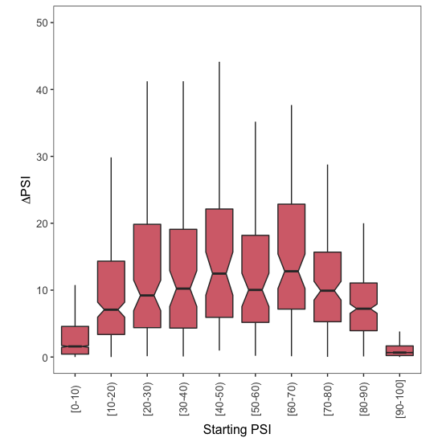
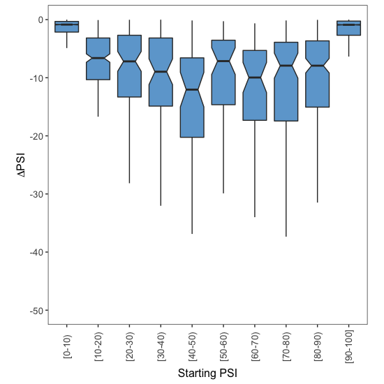

# Downstream Analysis

This document explains the code found in [002\_downstream\_analysis.R](002_downstream_analysis.R), which processes the `2C_4C_TABLE_EXONS.txt` file generated in the previous step. That file is provided in `Data` folder so feel free to jump straight to this code if you don't want to process the raw files yourself. All the code written in this document is written in R.


## 1. Data processing in R

We first load the file into R:

```r
Samples.Table <- read.table(file = "Data/2C_4C_TABLE_EXONS.txt",
                            sep = "\t",
                            header = TRUE)
```

For all exon skipping events in each of the two conditions to be compared (2-cell-state human embryo vs 4-cell-state), I took the average PSI across all samples whose quality scores were labelled as `Pass`. If there were none, the average PSI set to `NA`.

```r
# Calculate the mean PSI for all exon skipping events in the 2-cell stage
Samples.Table$Mean.2C <- apply(X = Samples.Table[,grep("^X2C",
                                                        colnames(Samples.Table),
                                                        perl = T)],
                                MARGIN = 1,
                                FUN = function(x){
                                  psi.values <- as.numeric(x[c(TRUE, FALSE)])
                                  psi.qualities <- as.character(x[c(FALSE, TRUE)])
                                  
                                  values.to.use <- which(psi.qualities == "Pass")
                                  
                                  if (length(values.to.use) > 0){
                                    mean.psi <- mean(psi.values[values.to.use])
                                  } else {
                                    mean.psi <- NA
                                  }
                                  
                                  mean.psi
                                })

# Calculate the mean PSI for all exon skipping events in the 4-cell stage
Samples.Table$Mean.4C <- apply(X = Samples.Table[,grep("^X4C",
                                                       colnames(Samples.Table),
                                                       perl = T)],
                               MARGIN = 1,
                               FUN = function(x){
                                 
                                 psi.values <- as.numeric(x[c(TRUE, FALSE)])
                                 psi.qualities <- as.character(x[c(FALSE, TRUE)])
                               
                                 values.to.use <- which(psi.qualities == "Pass")
                                 
                                 if (length(values.to.use) > 0){
                                   mean.psi <- mean(psi.values[values.to.use])
                                 } else {
                                   mean.psi <- NA
                                 }
                                 
                                 mean.psi
                               })
```
To calculate the effect of these two different developmental stages on exon inclusion, I subtracted the mean PSI value in the 2-cell stage (the 'starting PSI') from the mean PSI value in the 4-cell stage (the 'final PSI'):

```r
Samples.Table$FourCells.Minus.TwoCells <- Samples.Table$Mean.4C - Samples.Table$Mean.2C
```

These two conditions represent two developmental stages, and some exons may be more included in the 2-cell stage whereas others might be more included in the 4-cell stage. To distinguish between exons whose inclusion increases upon reaching the 4-cell stage, from those whose inclusion decreaases, I created two sub-tables called `Exons.Down` and `Exons.Up`:

```r
Exons.Down <- Samples.Table[which(Samples.Table$FourCells.Minus.TwoCells < 0),] 
Exons.Up <- Samples.Table[which(Samples.Table$FourCells.Minus.TwoCells > 0),] 
```

Finally, I assigned each exon skipping event to one of 10 groups, depending on the exon PSI in the 2-cell stage (the 'Starting PSI'):

```r
Exons.Up$Group <- findInterval(x = Exons.Up$Mean.2C,
                               vec = seq(0,100,10),
                               rightmost.closed = T)
Exons.Up$Group <- factor(Exons.Up$Group,
                         levels = 1:10)

Exons.Down$Group <- findInterval(x = Exons.Down$Mean.2C,
                                 vec = seq(0,100,10),
                                 rightmost.closed = T)
Exons.Down$Group <- factor(Exons.Down$Group,
                           levels = 1:10)
```


## 2. Plots

To visualise the effect of developmental stage on exon inclusion, I used the ggplot2 library:

```r
library(ggplot2)
```

I then used the code below to draw boxplots and visualise how the ΔPSI depends on the starting levels of exon inclusion.

### 2.1. More exon inclusion

To visualise how the increase in exon inclusion depends on the starting PSI:

```r
# plot!
ggplot(data = Exons.Up,
       mapping = aes(x = Group,
                     y = FourCells.Minus.TwoCells)) +
  geom_boxplot(outlier.shape = NA,
               notch = T,
               fill = "#D66F79") +
  theme_bw() +
  theme(panel.grid.major = element_blank(),
        panel.grid.minor = element_blank(),
        legend.position = "none",
        aspect.ratio = 1,
        axis.text.x = element_text(size = 10,
                                   angle = 90,
                                   vjust = 0.5),
        axis.text.y = element_text(size = 10),
        axis.title.x = element_text(size = 12),
        axis.title.y = element_text(size = 12)) +
  coord_cartesian(ylim = c(0,50)) + 
  ylab(expression(Delta*PSI)) +
  xlab("Starting PSI") +
  scale_x_discrete(labels = c("1" = "[0-10)",
                              "2" = "[10-20)",
                              "3" = "[20-30)",
                              "4" = "[30-40)",
                              "5" = "[40-50)",
                              "6" = "[50-60)",
                              "7" = "[60-70)",
                              "8" = "[70-80)",
                              "9" = "[80-90)",
                              "10" = "[90-100]"))
```
<p align="center">
  
  <br> Figure 7C
</p>

### 2.2. More exon skipping

To visualise how the decrease in exon inclusion depends on the starting PSI:

```r
# plot!
ggplot(data = Exons.Down,
       mapping = aes(x = Group,
                     y = FourCells.Minus.TwoCells)) +
  geom_boxplot(outlier.shape = NA,
               notch = T,
               fill = "#6EA7D3") +
  theme_bw() +
  theme(panel.grid.major = element_blank(),
        panel.grid.minor = element_blank(),
        legend.position = "none",
        aspect.ratio = 1,
        axis.text.x = element_text(size = 10,
                                   angle = 90,
                                   vjust = 0.5),
        axis.text.y = element_text(size = 10),
        axis.title.x = element_text(size = 12),
        axis.title.y = element_text(size = 12)) +
  coord_cartesian(ylim = c(-50,0)) + 
  ylab(expression(Delta*PSI)) +
  xlab("Starting PSI") +
  scale_x_discrete(labels = c("1" = "[0-10)",
                              "2" = "[10-20)",
                              "3" = "[20-30)",
                              "4" = "[30-40)",
                              "5" = "[40-50)",
                              "6" = "[50-60)",
                              "7" = "[60-70)",
                              "8" = "[70-80)",
                              "9" = "[80-90)",
                              "10" = "[90-100]"))
```
<p align="center">
  
  <br> Figure 7C
</p>