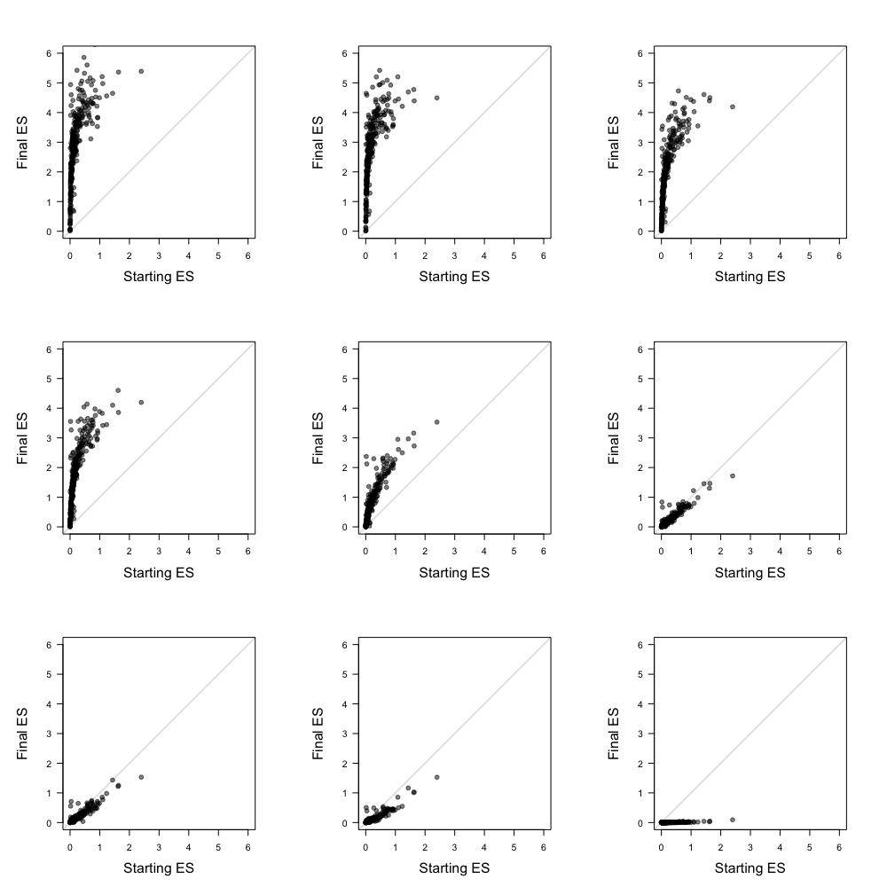

# WT1 exon 5

In this document I explain the code found in [WT1\_exon\_5.R](./WT1_exon_5.R), where I take supplementary table 2 from [Ke et al., 2018](https://genome.cshlp.org/content/28/1/11) and show that the effect of replacing a splicing regulatory sequence scales with the starting levels of exon inclusion. Note that the code in this document works with a [pre-downloaded version](./Data/All_HexMuts.xlsx) of supplementary table 2 that has already been pre-processed manually.

Unless stated otherwise, all the code in this document is written in R.

---

First, load some libraries we'll need:

```r
# library to read excel files
library(readxl)

# libraries for data wrangling
library(dplyr)
library(tidyr)
```
Read supplementary table 2 into R (note that 'HexMut' is the term used in Ke et al to refer to the splicing regulatory sequences we are looking at):

```r
# read supplementary table 2
Ke.et.al.2018 <- read_excel("Data/All_HexMuts.xlsx")
```
Give each genotype a unique identifier. Although I could have chosen to use something like "T-19-G;G-51-C" as I used in the phylogeny library, it was easier to just give each sequence a number from 1 to 556:

```r
# a unique genotype identifier
Ke.et.al.2018$ID <- rep(1:556,10)
```
Make a data frame called `ES.Table` where I take the bits of information I'm interested in:

* Hexmut (regulatory sequence)
* EI (enrichment index - this is how Ke et al refer to enrichment scores)
* Position of mutated dinucleotide
* ID (number between 1 and 556)

```r
# Build a table with the information we are interested
ES.Table <- Ke.et.al.2018[,c(1,2,8,9)]
```
Reshape `ES.Table` to wide format such that the enrichment score associated with each of the nine HexMuts/regulatory sequences of a given genotype is found in different columns of the same row:

```r
# reshape to wide format
ES.Table <- ES.Table %>% spread(Hexmut, EI)
ES.Table <- as.data.frame(ES.Table)
```
Generate the final vs starting PSI plots:

```r
# plot!
par(mfrow=c(3,3))
par(pty="s")
for (i in c(7,2,8,5,1,9,6,4,3)){
  plot(NULL,
       xlim = c(0,6),
       ylim = c(0,6),
       xlab = "",
       ylab = "",
       main = "",
       axes = F)
  abline(0,1, lwd = 2, col = "gray90")
  par(new=T)
  plot(ES.Table[which(ES.Table$Position > 23), 3],
       ES.Table[which(ES.Table$Position > 23), (3+i)],
       xlim = c(0,6),
       ylim = c(0,6),
       pch = 19,
       col = rgb(0,0,0,0.5),
       xlab = "Starting ES",
       ylab = "Final ES",
       las = 1,
       cex.lab = 1.5)
}
```
<p align="center">
  
  <br> Figure 7B
</p>
