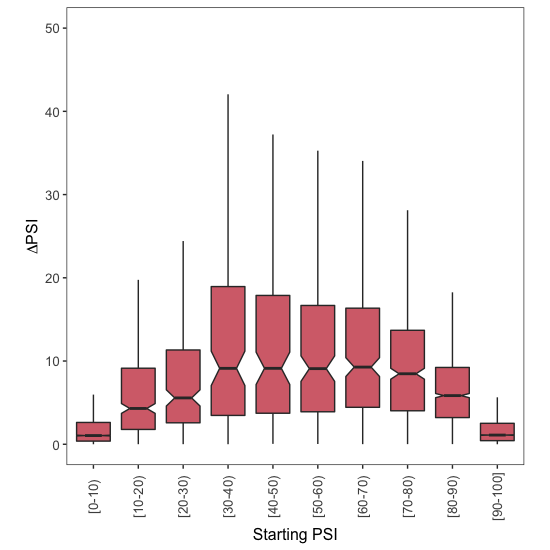
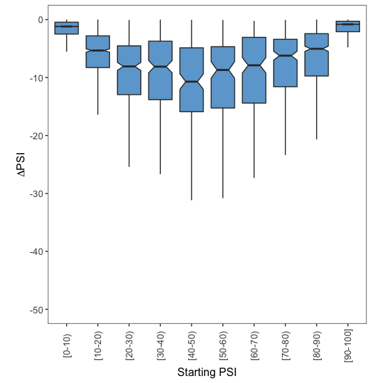

# Downstream Analysis

This document explains the code found in [002\_downstream\_analysis.R](002_downstream_analysis.R), which processes the `SF3B1wt_SF3B1mut_TABLE_EXONS.txt` file generated in the previous step. That file is provided in `Data` folder so feel free to jump straight to this code if you don't want to process the raw files yourself.  All the code written in this document is written in R.


## 1. Data processing in R

We first load the file into R:

```r
Samples.Table <- read.table(file = "Data/SF3B1wt_SF3B1mut_TABLE_EXONS.txt",
                            sep = "\t",
                            header = TRUE)
```

For all exon skipping events in each of the two conditions to be compared (WT SF3B1  vs mutated SF3B1), I took the average PSI across all samples whose quality scores were labelled as `Pass`. If there were none, the average PSI set to `NA`.

```r
# Calculate the mean PSI for all exon skipping events with WT SF3B1
Samples.Table$Mean.WT <- apply(X = Samples.Table[,grep("^SF3B1_wildtype",
                                                        colnames(Samples.Table),
                                                        perl = T)],
                                MARGIN = 1,
                                FUN = function(x){
                                  psi.values <- as.numeric(x[c(TRUE, FALSE)])
                                  psi.qualities <- as.character(x[c(FALSE, TRUE)])
                                  
                                  values.to.use <- which(psi.qualities == "Pass")
                                  
                                  if (length(values.to.use) > 0){
                                    mean.psi <- mean(psi.values[values.to.use])
                                  } else {
                                    mean.psi <- NA
                                  }
                                  
                                  mean.psi
                                })

# Calculate the mean PSI for all exon skipping events with mutated SF3B1
Samples.Table$Mean.Mutated <- apply(X = Samples.Table[,grep("^SF3B1_mutated",
                                                            colnames(Samples.Table),
                                                            perl = T)],
                                    MARGIN = 1,
                                    FUN = function(x){
                                      
                                      psi.values <- as.numeric(x[c(TRUE, FALSE)])
                                      psi.qualities <- as.character(x[c(FALSE, TRUE)])
                                    
                                      values.to.use <- which(psi.qualities == "Pass")
                                      
                                      if (length(values.to.use) > 0){
                                        mean.psi <- mean(psi.values[values.to.use])
                                      } else {
                                        mean.psi <- NA
                                      }
                                      
                                      mean.psi
                                    })
```

To calculate the effect of mutating SF3B1 on exon inclusion, I subtracted the mean PSI value under WT SF3B1 (the 'starting PSI') from the mean PSI value in the presence of a mutated SF3B1 (the 'final PSI'):

```r
Samples.Table$Mutated.Minus.WT <- Samples.Table$Mean.Mutated - Samples.Table$Mean.WT
```

These two conditions differ in the presence of a wild-type copy of the SF3B1 splicing factor, and so some exons will be more included under WT SF3B1 whereas others will be more included with a mutated version of the protein. To distinguish between those exons that are more included in the presence of a mutated SF3B1 protein and those that are more skipped, I created two sub-tables called `Exons.Down` and `Exons.Up`:

```r
Exons.Down <- Samples.Table[which(Samples.Table$Mutated.Minus.WT < 0),] 
Exons.Up <- Samples.Table[which(Samples.Table$Mutated.Minus.WT > 0),] 
```

Finally, I assigned each exon skipping event to one of 10 groups, depending on the exon PSI with WT SF3B1 (the 'Starting PSI'):

```r
Exons.Up$Group <- findInterval(x = Exons.Up$Mean.WT,
                               vec = seq(0,100,10),
                               rightmost.closed = T)
Exons.Up$Group <- factor(Exons.Up$Group,
                         levels = 1:10)

Exons.Down$Group <- findInterval(x = Exons.Down$Mean.WT,
                                 vec = seq(0,100,10),
                                 rightmost.closed = T)
Exons.Down$Group <- factor(Exons.Down$Group,
                           levels = 1:10)
```


## 2. Plots

To visualise the effect of SF3B1 mutations on exon inclusion, I used the ggplot2 library:

```r
library(ggplot2)
```

I then used the code below to draw boxplots and visualise how the ΔPSI depends on the starting levels of exon inclusion.

### 2.1. More exon inclusion

To visualise how the increase in exon inclusion depends on the starting PSI:

```r
ggplot(data = Exons.Up,
       mapping = aes(x = Group,
                     y = Mutated.Minus.WT)) +
  geom_boxplot(outlier.shape = NA,
               notch = T,
               fill = "#D66F79") +
  theme_bw() +
  theme(panel.grid.major = element_blank(),
        panel.grid.minor = element_blank(),
        legend.position = "none",
        aspect.ratio = 1,
        axis.text.x = element_text(size = 10,
                                   angle = 90,
                                   vjust = 0.5),
        axis.text.y = element_text(size = 10),
        axis.title.x = element_text(size = 12),
        axis.title.y = element_text(size = 12)) +
  coord_cartesian(ylim = c(0,50)) + 
  ylab(expression(Delta*PSI)) +
  xlab("Starting PSI") +
  scale_x_discrete(labels = c("1" = "[0-10)",
                              "2" = "[10-20)",
                              "3" = "[20-30)",
                              "4" = "[30-40)",
                              "5" = "[40-50)",
                              "6" = "[50-60)",
                              "7" = "[60-70)",
                              "8" = "[70-80)",
                              "9" = "[80-90)",
                              "10" = "[90-100]"))
```

<p align="center">
  
  <br> Figure 7C
</p>

### 2.2. More exon skipping

To visualise how the decrease in exon inclusion depends on the starting PSI:

```r
ggplot(data = Exons.Down,
       mapping = aes(x = Group,
                     y = Mutated.Minus.WT)) +
  geom_boxplot(outlier.shape = NA,
               notch = T,
               fill = "#6EA7D3") +
  theme_bw() +
  theme(panel.grid.major = element_blank(),
        panel.grid.minor = element_blank(),
        legend.position = "none",
        aspect.ratio = 1,
        axis.text.x = element_text(size = 10,
                                   angle = 90,
                                   vjust = 0.5),
        axis.text.y = element_text(size = 10),
        axis.title.x = element_text(size = 12),
        axis.title.y = element_text(size = 12)) +
  coord_cartesian(ylim = c(-50,0)) + 
  ylab(expression(Delta*PSI)) +
  xlab("Starting PSI") +
  scale_x_discrete(labels = c("1" = "[0-10)",
                              "2" = "[10-20)",
                              "3" = "[20-30)",
                              "4" = "[30-40)",
                              "5" = "[40-50)",
                              "6" = "[50-60)",
                              "7" = "[60-70)",
                              "8" = "[70-80)",
                              "9" = "[80-90)",
                              "10" = "[90-100]"))
```
<p align="center">
  
  <br> Figure 7C
</p>