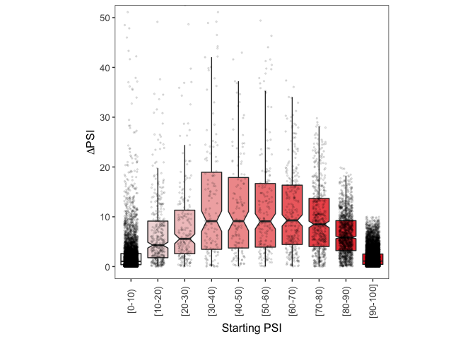
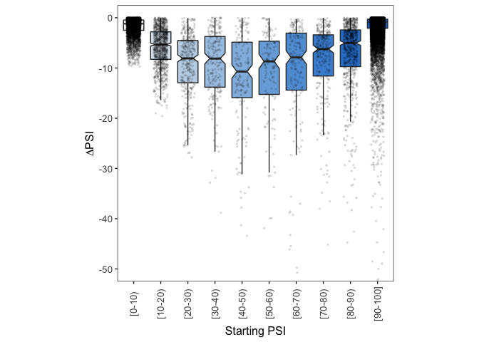

# Downstream Analysis


This document contains all the R code needed to process the `SF3B1wt_SF3B1mut_TABLE_EXONS.txt` file generated in the previous step. That file is provided in `Data` folder so feel free to jump straight to this code if you don't want to process the raw files. 

## Data processing in R

We first load the file into R:

```r
Samples.Table <- read.table(file = "Data/SF3B1wt_SF3B1mut_TABLE_EXONS.txt",
                            sep = "\t",
                            header = TRUE)
```

For all exon skipping events in each of the two conditions to be compared (WT SF3B1  vs mutated SF3B1), I took the average PSI across all samples whose quality scores were labelled as `Pass`. If there were none, the average PSI set to `NA`.

```r
# Calculate the mean PSI for all exon skipping events with WT SF3B1
Samples.Table$Mean.WT <- apply(X = Samples.Table[,grep("^SF3B1_wildtype",
                                                        colnames(Samples.Table),
                                                        perl = T)],
                                MARGIN = 1,
                                FUN = function(x){
                                  psi.values <- as.numeric(x[c(TRUE, FALSE)])
                                  psi.qualities <- as.character(x[c(FALSE, TRUE)])
                                  
                                  values.to.use <- which(psi.qualities == "Pass")
                                  
                                  if (length(values.to.use) > 0){
                                    mean.psi <- mean(psi.values[values.to.use])
                                  } else {
                                    mean.psi <- NA
                                  }
                                  
                                  mean.psi
                                })

# Calculate the mean PSI for all exon skipping events with mutated SF3B1
Samples.Table$Mean.Mutated <- apply(X = Samples.Table[,grep("^SF3B1_mutated",
                                                            colnames(Samples.Table),
                                                            perl = T)],
                                    MARGIN = 1,
                                    FUN = function(x){
                                      
                                      psi.values <- as.numeric(x[c(TRUE, FALSE)])
                                      psi.qualities <- as.character(x[c(FALSE, TRUE)])
                                    
                                      values.to.use <- which(psi.qualities == "Pass")
                                      
                                      if (length(values.to.use) > 0){
                                        mean.psi <- mean(psi.values[values.to.use])
                                      } else {
                                        mean.psi <- NA
                                      }
                                      
                                      mean.psi
                                    })
```

To calculate the effect of mutating SF3B1 on exon inclusion, I subtracted the mean PSI value under WT SF3B1 (the 'starting PSI') from the mean PSI value in the presence of a mutated SF3B1 (the 'final PSI'):

```r
Samples.Table$Mutated.Minus.WT <- Samples.Table$Mean.Mutated - Samples.Table$Mean.WT
```

These two conditions differ in the presence of a wild-type copy of the SF3B1 splicing factor, and so some exons will be more included under WT SF3B1 whereas others will be more included with a mutated version of the protein. To distinguish between those exons that are more included in the presence of a mutated SF3B1 protein and those that are more skipped, I created two sub-tables called `Exons.Down` and `Exons.Up`:

```r
Exons.Down <- Samples.Table[which(Samples.Table$Huvek.Minus.HepG2 < 0),] 
Exons.Up <- Samples.Table[which(Samples.Table$Huvek.Minus.HepG2 > 0),] 
```

Finally, I assigned each exon skipping event to one of 10 groups, depending on the exon PSI with WT SF3B1 (the 'Starting PSI'):

```r
Exons.Up$Group <- findInterval(x = Exons.Up$Mean.WT,
                               vec = seq(0,100,10),
                               rightmost.closed = T)
Exons.Up$Group <- factor(Exons.Up$Group,
                         levels = 1:10)

Exons.Down$Group <- findInterval(x = Exons.Down$Mean.WT,
                                 vec = seq(0,100,10),
                                 rightmost.closed = T)
Exons.Down$Group <- factor(Exons.Down$Group,
                           levels = 1:10)
```


## Plots

To visualise the effect of changing the cell line on exon inclusion, I used two libraries:

```r
library(ggplot2)
library(RColorBrewer)
```

I then used the code below to draw boxplots and visualise how the ΔPSI depends on the starting levels of exon inclusion.

### More exon inclusion

To visualise how the increase in exon inclusion depends on the starting PSI:

```r
# colour palette for this plot
myPalette <- colorRampPalette(c("gray95", "firebrick2"))(n = 10)

# plot!
ggplot(data = Exons.Up, mapping = aes(x = Group,
                                      y = Mutated.Minus.WT,
                                      fill = Group)) +
  geom_boxplot(outlier.shape = NA, notch = T) +
  geom_jitter(aes(Group,Mutated.Minus.WT),
              position=position_jitter(width=0.25,
                                       height=0),
              alpha=0.1,
              size=0.5,
              show.legend=FALSE) +
  theme_bw() +
  theme(panel.grid.major = element_blank(),
        panel.grid.minor = element_blank(),
        legend.position = "none",
        aspect.ratio = 1,
        axis.text.x = element_text(size = 10,
                                   angle = 90,
                                   vjust = 0.5),
        axis.text.y = element_text(size = 10),
        axis.title.x = element_text(size = 12),
        axis.title.y = element_text(size = 12)) +
  coord_cartesian(ylim = c(0,50)) + 
  scale_fill_manual(values = c(myPalette[1:10])) +
  ylab(expression(Delta*PSI)) +
  xlab("Starting PSI") +
  scale_x_discrete(labels = c("1" = "[0-10)",
                              "2" = "[10-20)",
                              "3" = "[20-30)",
                              "4" = "[30-40)",
                              "5" = "[40-50)",
                              "6" = "[50-60)",
                              "7" = "[60-70)",
                              "8" = "[70-80)",
                              "9" = "[80-90)",
                              "10" = "[90-100]"))
```




### More exon skipping

To visualise how the decrease in exon inclusion depends on the starting PSI:

```r
# colour palette for this plot
myPalette <- colorRampPalette(c("gray95", "dodgerblue3"))(n = 10)

# plot!
ggplot(data = Exons.Down, mapping = aes(x = Group,
                                        y = Mutated.Minus.WT,
                                        fill = Group)) +
  geom_boxplot(outlier.shape = NA,
               notch = T) +
  geom_jitter(aes(Group,Mutated.Minus.WT),
              position=position_jitter(width=0.25,
                                       height=0),
              alpha=0.1,
              size=0.5,
              show.legend=FALSE) +
  theme_bw() +
  theme(panel.grid.major = element_blank(),
        panel.grid.minor = element_blank(),
        legend.position = "none",
        aspect.ratio = 1,
        axis.text.x = element_text(size = 10,
                                   angle = 90,
                                   vjust = 0.5),
        axis.text.y = element_text(size = 10),
        axis.title.x = element_text(size = 12),
        axis.title.y = element_text(size = 12)) +
  coord_cartesian(ylim = c(-50,0)) + 
  scale_fill_manual(values = c(myPalette[1:10])) +
  ylab(expression(Delta*PSI)) +
  xlab("Starting PSI") +
  scale_x_discrete(labels = c("1" = "[0-10)",
                              "2" = "[10-20)",
                              "3" = "[20-30)",
                              "4" = "[30-40)",
                              "5" = "[40-50)",
                              "6" = "[50-60)",
                              "7" = "[60-70)",
                              "8" = "[70-80)",
                              "9" = "[80-90)",
                              "10" = "[90-100]"))
```
