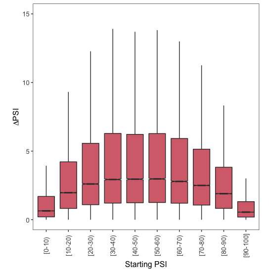
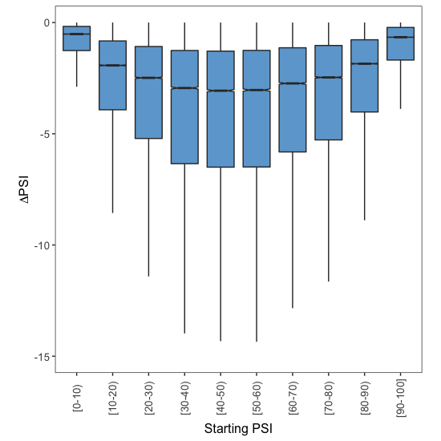

# Scaling of effects across all sQTLs

In this document I go over the code found in [009\_scaling\_all\_sqtls.R](009_scaling_all_sqtls.R), where information about the effects of all sQTLs are collected into one large matrix and later plotted into boxplots (Figure 7D from the paper). All the code in this document is written in R.


## 1. Collect information from all sQTLs & splicing events

First, load the dplyr library:

```r
# load data handling library that contains the %>% command
library(dplyr)
```
Next, start an empty matrix (`sQTL.Information.Matrix `) where each row will contain the following information for a given sQTL-splicing event combination:

* PSI of the exon in all different tissues (where we could quantify this)
* the effect of the sQTL in all different tissues (where we could quantify this)

```r
# empty matrix that we'll fill in with effects from all sQTLs
# in different tissues and the PSIs where those effects take place
sQTL.Information.Matrix <- matrix(nrow = 0, ncol = 60)
```
Fill in `sQTL.Information.Matrix` with this information:

```r
for (i in 1:35153){
  print(i)
  
  # go through each directory and take the files (with information
  # about tissue PSI level at Gt 0 and effect of adding one Gt to that
  # tissue)
  Target.Directory <- paste("/sQTL_test/", i, sep = "")
  setwd(Target.Directory)
  
  # which files (if any) should I load?
  Files.To.Open <- list.files()[list.files() %>%
                                  grep(pattern = "Effect.Of.sQTL.In.Different.Tissues",
                                       fixed = T)]
  
  # if I found files to load
  if (length(Files.To.Open) > 0) {
    
    # open each file (vector) and rbind it to current matrix or w/e
    for (each.file in Files.To.Open) {
      load(each.file)
      
      # add a row to sQTL matrix
      sQTL.Information.Matrix <- rbind(sQTL.Information.Matrix,
                                       This.sQTL.Information)
      
    }
  
  # go back up
  setwd("../..")
  
  }
}
```
If you want, you can save this file for later since building it might take some time:

```r
# save the matrix
save(sQTL.Information.Matrix,
     file = "sQTL.Information.Matrix.RData")
```


## 2. Prepare data for plots


If you don't have `sQTL.Information.Matrix` in your R environment, load it:

```r
# load sQTL.Information.Matrix
load("sQTL.Information.Matrix.RData")
```
Make `Plotting.Table`, a reformatted version of `sQTL.Information.Matrix` that should be easier to understand by ggplot:

```r
# Reformat sQTL.Information.Matrix into something easier to understand by ggplot
Plotting.Table <- data.frame(Starting.PSI = as.vector(sQTL.Information.Matrix[,1:30]),
                             Effect = as.vector(sQTL.Information.Matrix[,31:60]))
```
Remove rows corresponding to splicing event whose PSI was estimated to be below 0% or above 100%:

```r
# filter out exons with estimated starting and final PSI lie beyond
# the limits of splicing (< 0% or > 100%)
Plotting.Table <- Plotting.Table[-which(Plotting.Table$Starting.PSI < 0 | Plotting.Table$Starting.PSI > 1),]
```
Bin the data points into 10 groups, according to the starting PSI:

```r
# bin into 10 different groups
Plotting.Table$Group <- findInterval(x = Plotting.Table$Starting.PSI,
                                     vec = seq(0,1,0.1),
                                     rightmost.closed = T)
Plotting.Table$Group <- factor(Plotting.Table$Group, levels = 1:10)
```
Finally, divide `Plotting.Table` in 2 according to whether the effect of the sQTL is positive or negative: 

```r
Exons.Up <- Plotting.Table[which(Plotting.Table$Effect > 0),]
Exons.Down <- Plotting.Table[which(Plotting.Table$Effect < 0),]
```


## 3. Plot

Load ggplot2 library:

```r
# plotting library
library(ggplot2)
```
Plot the effect of sQTLs that increase exon inclusion:

```r
# plot!
ggplot(data = Exons.Up,
       mapping = aes(x = Group,
                     y = (Effect)*100)) +
  geom_boxplot(outlier.shape = NA,
               notch = T,
               fill = "#D66F79") +
  theme_bw() +
  theme(panel.grid.major = element_blank(),
        panel.grid.minor = element_blank(),
        legend.position = "none",
        aspect.ratio = 1,
        axis.text.x = element_text(size = 10,
                                   angle = 90,
                                   vjust = 0.5),
        axis.text.y = element_text(size = 10),
        axis.title.x = element_text(size = 12),
        axis.title.y = element_text(size = 12)) +
  coord_cartesian(ylim = c(0,15)) + 
  ylab(expression(Delta*PSI)) +
  xlab("Starting PSI") +
  scale_x_discrete(labels = c("1" = "[0-10)",
                              "2" = "[10-20)",
                              "3" = "[20-30)",
                              "4" = "[30-40)",
                              "5" = "[40-50)",
                              "6" = "[50-60)",
                              "7" = "[60-70)",
                              "8" = "[70-80)",
                              "9" = "[80-90)",
                              "10" = "[90-100]"))
```

<p align="center">
  
  <br> Figure 7D
</p>

And plot the effect of sQTLs that decrease exon inclusion:

```r
# plot!
ggplot(data = Exons.Down,
       mapping = aes(x = Group,
                     y = (Effect)*100)) +
  geom_boxplot(outlier.shape = NA,
               notch = T,
               fill = "#6EA7D3") +
  theme_bw() +
  theme(panel.grid.major = element_blank(),
        panel.grid.minor = element_blank(),
        legend.position = "none",
        aspect.ratio = 1,
        axis.text.x = element_text(size = 10,
                                   angle = 90,
                                   vjust = 0.5),
        axis.text.y = element_text(size = 10),
        axis.title.x = element_text(size = 12),
        axis.title.y = element_text(size = 12)) +
  coord_cartesian(ylim = c(-15,0)) + 
  ylab(expression(Delta*PSI)) +
  xlab("Starting PSI") +
  scale_x_discrete(labels = c("1" = "[0-10)",
                              "2" = "[10-20)",
                              "3" = "[20-30)",
                              "4" = "[30-40)",
                              "5" = "[40-50)",
                              "6" = "[50-60)",
                              "7" = "[60-70)",
                              "8" = "[70-80)",
                              "9" = "[80-90)",
                              "10" = "[90-100]"))
```

<p align="center">
  
  <br> Figure 7D
</p>