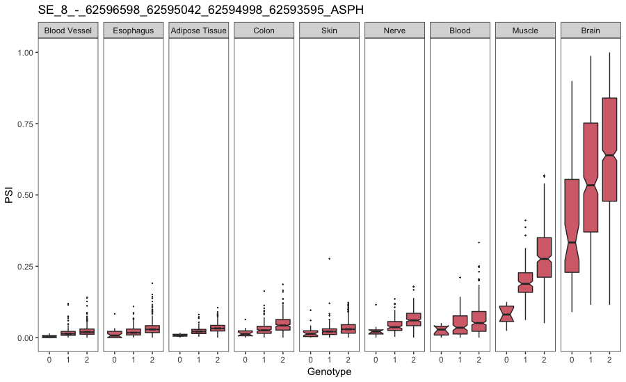
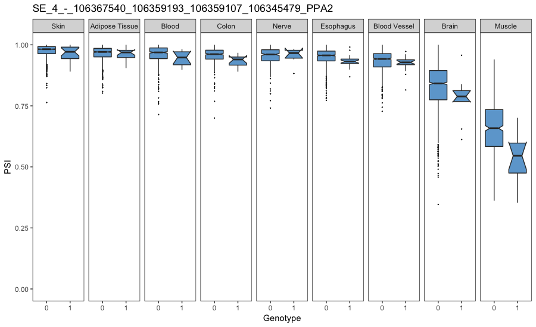

# Two examples of scaling of sQTL effects


All the code included in this document is written in R.


## 1. Data preparation
Load the data table library:

```r
# data table library
library(data.table)
```
Obtain the index of the two splicing events we will study (their position in a vector with all the splicing events analysed):

```r
# load an object with the ID of all splicing events
Splicing.Events <- fread(input = "Gene_Regions.bed")

# index for ASPH exon 3
index.ASPH.exon.3 <- which(as.character(Splicing.Events$ID) == "SE_8_-_62596598_62595042_62594998_62593595_ASPH")

# index for PPA2 exon 6
index.PPA2.exon.6 <- which(as.character(Splicing.Events$ID) == "SE_4_-_106367540_106359193_106359107_106345479_PPA2")

# cleanup
rm(Splicing.Events)
```

Next, obtain the index of two sQTLs which affect the inclusion of the two exons chosen earlier:

```r
# load parsed genotype file for ASPH exon 3
Genotypes.ASPH.exon.3 <- fread(input = paste("sQTL_tests/",
                                             index.ASPH.exon.3,
                                             "/genotypes.MAF01.GeneRegions.Parsed.txt",
                                             sep = "",
                                             collapse = ""),
                               skip = "#CHROM")

# load parsed genotype file for PPA2 exon 6
Genotypes.PPA2.exon.6 <- fread(input = paste("sQTL_tests/",
                                             index.PPA2.exon.6,
                                             "/genotypes.MAF01.GeneRegions.Parsed.txt",
                                             sep = "",
                                             collapse = ""),
                               skip = "#CHROM")

# index for an sQTL that affects ASPH exon 3 inclusion
index.ASPH.exon.3.sQTL <- which(as.character(Genotypes.ASPH.exon.3$ID) == "8_62598774_G_A_b37")

# index for an sQTL that affects PPA2 exon 6 inclusion
index.PPA2.exon.6.sQTL <- which(as.character(Genotypes.PPA2.exon.6$ID) == "4_106391195_A_G_b37")
```
Now we ned to figure out how many copies of each sQTL are present in every sample of the GTEx data set:

```r
# genotypes for the sQTL that affects ASPH exon 3 inclusion
ASPH.exon.3.Genotypes <- as.numeric(Genotypes.ASPH.exon.3[index.ASPH.exon.3.sQTL,4:ncol(Genotypes.ASPH.exon.3)])
names(ASPH.exon.3.Genotypes) <- colnames(Genotypes.ASPH.exon.3)[4:ncol(Genotypes.ASPH.exon.3)]

# genotypes for the sQTL that affects PPA2 exon 6 inclusion
PPA2.exon.6.Genotypes <- as.numeric(Genotypes.PPA2.exon.6[index.PPA2.exon.6.sQTL,4:ncol(Genotypes.PPA2.exon.6)])
names(PPA2.exon.6.Genotypes) <- colnames(Genotypes.PPA2.exon.6)[4:ncol(Genotypes.PPA2.exon.6)]
```
Extract the PSI of ASPH exon 3 and PPA2 exon 6 across all GTEx samples:

```r
# load PSI.Estimates
load("Annotations_PSIestimates.RData")

# PSI values for these two events
ASPH.exon.3.PSI <- as.numeric(PSI.Estimates[index.ASPH.exon.3,])
PPA2.exon.6.PSI <- as.numeric(PSI.Estimates[index.PPA2.exon.6,])
```

Create a data frame for each of the two alternative exon events including the following columns:

* PSI across every sample
* subject ID for every sample
* sQTL genotype in each sample


```r
# build a df for this particular exon splicing event
Table.ASPH.exon.3 <- GTEX.Dataset.Annotations
Table.PPA2.exon.6 <- GTEX.Dataset.Annotations

# add psi column
Table.ASPH.exon.3$PSI <- ASPH.exon.3.PSI
Table.PPA2.exon.6$PSI <- PPA2.exon.6.PSI

# add subject ID column
Table.ASPH.exon.3$Subject.ID <- sapply(Table.ASPH.exon.3$Subject.ID,
                                               function(x){
                                                 sub(pattern = "\\.",
                                                     replacement = "-",
                                                     x = x)
                                               })
Table.PPA2.exon.6$Subject.ID <- sapply(Table.PPA2.exon.6$Subject.ID,
                                       function(x){
                                         sub(pattern = "\\.",
                                             replacement = "-",
                                             x = x)
                                       })

# add genotype column
Genotypes.For.Table <- c()
for(each.id in Table.ASPH.exon.3$Subject.ID) {
  if (each.id %in% names(ASPH.exon.3.Genotypes)) {
    Genotypes.For.Table <- c(Genotypes.For.Table,
                             as.numeric(ASPH.exon.3.Genotypes[each.id]))
  } else {
    Genotypes.For.Table <- c(Genotypes.For.Table, NA)
  }
}
Table.ASPH.exon.3$Genotype <- Genotypes.For.Table

Genotypes.For.Table <- c()
for(each.id in Table.PPA2.exon.6$Subject.ID) {
  if (each.id %in% names(PPA2.exon.6.Genotypes)) {
    Genotypes.For.Table <- c(Genotypes.For.Table,
                             as.numeric(PPA2.exon.6.Genotypes[each.id]))
  } else {
    Genotypes.For.Table <- c(Genotypes.For.Table, NA)
  }
}
Table.PPA2.exon.6$Genotype <- Genotypes.For.Table

# remove NA's
Table.ASPH.exon.3 <- Table.ASPH.exon.3[- which(is.na(Table.ASPH.exon.3$PSI)),]
Table.PPA2.exon.6 <- Table.PPA2.exon.6[- which(is.na(Table.PPA2.exon.6$PSI)),]
```
For the ASPH exon 3 boxplots, I chose to visualise only tissues with more than 10 samples in each genotype category (0, 1 or 2):

```r
# which tissues have enough observations?
Table.Tissues <- table(Table.ASPH.exon.3$Tissue, Table.ASPH.exon.3$Genotype)
Tissues.To.Keep <- which(Table.Tissues[,1] > 10 & Table.Tissues[,2] > 10 & Table.Tissues[,3] > 10 )
Table.ASPH.exon.3 <- Table.ASPH.exon.3[which(as.character(Table.ASPH.exon.3$Tissue) %in% as.character(names(Tissues.To.Keep))),]
```
This resulted in the 9 tissues that appear in Figure 7E. I chose the same tissues for PPA exon 6, as they all have more than 10 samples for each genotype category (except for brain, which has 9):

```r
# Table.Tissues <- table(Table.PPA2.exon.6$Tissue, Table.PPA2.exon.6$Genotype)
# Tissues.To.Keep <- which(Table.Tissues[,1] > 10 & Table.Tissues[,2] > 10 )
# for comparison, keep same tissues in the other exon. Also have many reads here
Table.PPA2.exon.6 <- Table.PPA2.exon.6[which(as.character(Table.PPA2.exon.6$Tissue) %in% as.character(names(Tissues.To.Keep))),]
```
I will plot the boxplots in an order that depends on the PSI of the exon in each tissue:

```r
# order of tissues and factorise tissues following this order
# ASPH exon 3
Tissues_Median_PSI_Zero_Gt <- sapply(as.character(unique(Table.ASPH.exon.3$Tissue)),
                                     function(x){
                                       median(Table.ASPH.exon.3$PSI[which(as.character(Table.ASPH.exon.3$Tissue)==x & Table.ASPH.exon.3$Genotype == 0)], na.rm = T)
                                     })
Order.of.Tissues <- names(Tissues_Median_PSI_Zero_Gt)[order(Tissues_Median_PSI_Zero_Gt, decreasing = F)]
Table.ASPH.exon.3$Tissue <- factor(Table.ASPH.exon.3$Tissue, levels = Order.of.Tissues)

# PPA2 exon 6
Tissues_Median_PSI_Zero_Gt <- sapply(as.character(unique(Table.PPA2.exon.6$Tissue)),
                                     function(x){
                                       median(Table.PPA2.exon.6$PSI[which(as.character(Table.PPA2.exon.6$Tissue)==x & Table.PPA2.exon.6$Genotype == 0)], na.rm = T)
                                     })
Order.of.Tissues <- names(Tissues_Median_PSI_Zero_Gt)[order(Tissues_Median_PSI_Zero_Gt, decreasing = T)]
Table.PPA2.exon.6$Tissue <- factor(Table.PPA2.exon.6$Tissue, levels = Order.of.Tissues)
```


## 2. Plot

Load the ggplot library:

```r
library(ggplot2)
```
Plot the effect of sQTL rs2350919 on ASPH exon 3:

```r
ggplot(data.frame(PSI = Table.ASPH.exon.3$PSI,
                  Genotype = as.factor(Table.ASPH.exon.3$Genotype),
                  Tissue = Table.ASPH.exon.3$Tissue),
       aes(x=Genotype, y=PSI)) +
  geom_boxplot(notch = T,
               outlier.size = 0.1,
               fill = "#D66F79") +
  coord_cartesian(ylim = c(0,1)) +
  scale_x_discrete(breaks=c("0","1","2"),
                   labels=c("0", "1", "2"),
                   name ="Genotype") +
  theme_bw()+
  facet_grid(.~Tissue) +
  ggtitle("SE_8_-_62596598_62595042_62594998_62593595_ASPH") +
  theme(legend.position="none",
        panel.grid.major = element_blank(),
        panel.grid.minor = element_blank()) 
```
<p align="center">
  
  <br> Figure 7E
</p>

Plot the effect of sQTL rs7672469 on PPA2 exon 6:

```r
ggplot(data.frame(PSI = Table.PPA2.exon.6$PSI,
                  Genotype = as.factor(Table.PPA2.exon.6$Genotype),
                  Tissue = Table.PPA2.exon.6$Tissue),
       aes(x=Genotype, y=PSI)) +
  geom_boxplot(notch = T,
               outlier.size = 0.1,
               fill = "#6EA7D3") +
  coord_cartesian(ylim = c(0,1)) +
  scale_x_discrete(breaks=c("0","1","2"),
                   labels=c("0", "1", "2"),
                   name ="Genotype") +
  theme_bw()+
  facet_grid(.~Tissue) +
  ggtitle("SE_4_-_106367540_106359193_106359107_106345479_PPA2") +
  theme(legend.position="none",
        panel.grid.major = element_blank(),
        panel.grid.minor = element_blank())


```

<p align="center">
  
  <br> Figure 7E
</p>
