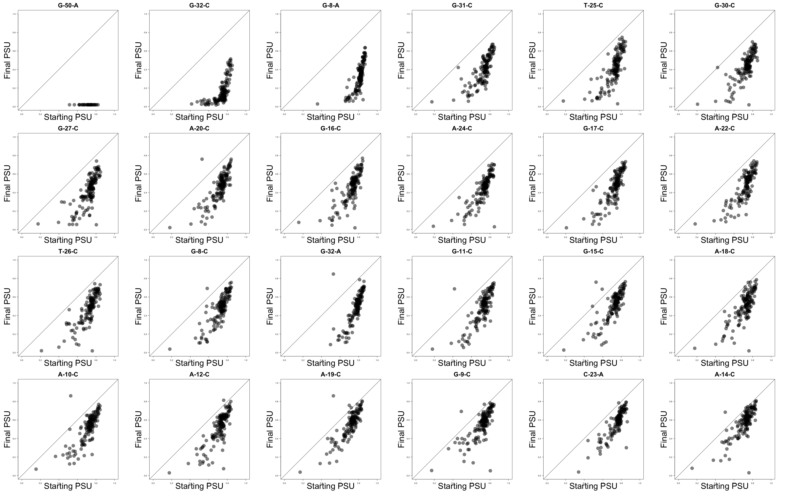
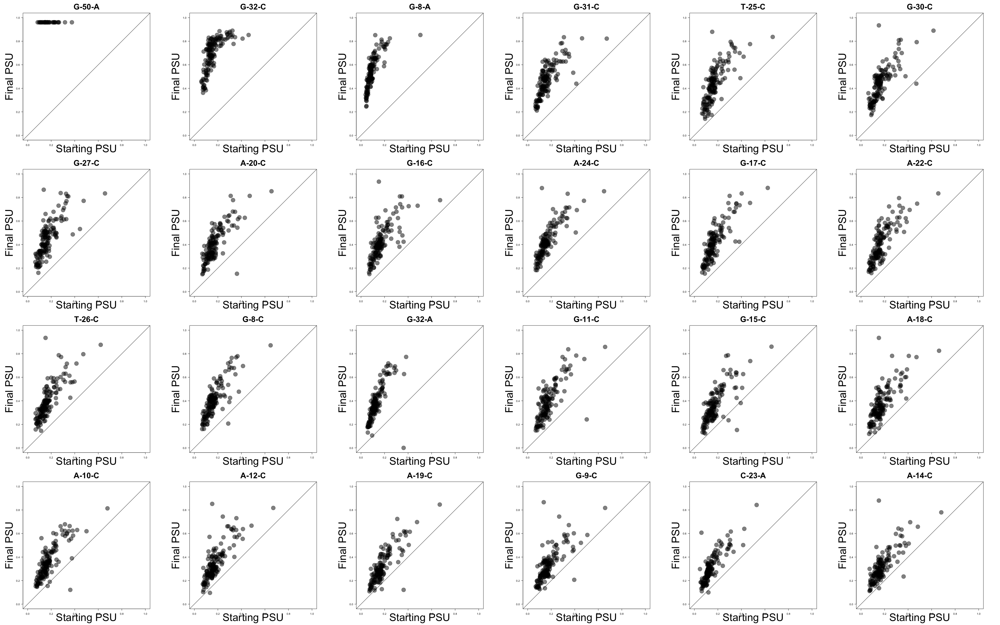

# Final vs starting PSU

In this document I explain the code found in [002\_final\_vs\_starting\_psu.R](./002_final_vs_starting_psu.R), where I look at how the effect of a mutation on the PSU of a given splice site depends on the starting levels of splice site usage.

Unless stated otherwise, all the code in this document is written in R.

## 1. Process `A5SS_dataset.txt`

Load `A5SS_dataset.txt` as an object called `A5SS` in R:

```r
# open table in R
A5SS <- read.table(file = "Data/A5SS_dataset.txt", header = T)
```
Rename the columns of `A5SS`:

```r
# rename columns
colnames(A5SS) <- c("Barcode", "SD1", "SD2", "SD_cryp", "noSD")
```
Change the barcodes from factor to character and use that as the row names:

```r
# the barcode is a factor; change to character
A5SS$Barcode <- as.character(A5SS$Barcode)

# rownames = barcode
rownames(A5SS) <- A5SS$Barcode
```
Add 2 more columns to `A5SS` corresponding to the PSU of the two major splice sites, SD<sub>1</sub> and SD<sub>2</sub>:

```r
# add columns for the PSU of each of the two major splice sites
A5SS$PSU_SD1 <- A5SS$SD1/(A5SS$SD1 + A5SS$SD2 + A5SS$SD_cryp + A5SS$noSD)
A5SS$PSU_SD2 <- A5SS$SD2/(A5SS$SD1 + A5SS$SD2 + A5SS$SD_cryp + A5SS$noSD)
```

## 2. Process `A5SS_sequences.txt`

Load `A5SS_sequences.txt` as an object called `Barcode.Table` in R:

```r
# open table in R
Barcode.Table <- read.table(file = "Data/A5SS_sequences.txt", header = T)
```
Rename the columns of `Barcode.Table`:

```r
# rename columns
colnames(Barcode.Table) <- c("Barcode", "Sequence")
```
Change the barcodes (and sequence) from factor to character and use the barcodes as the row names:

```r
# factor -> character
Barcode.Table$Barcode <- as.character(Barcode.Table$Barcode)
Barcode.Table$Sequence <- as.character(Barcode.Table$Sequence)

# rownames = barcode
rownames(Barcode.Table) <- Barcode.Table$Barcode
```
Subset `Barcode.Table` so it includes the same genotypes as `A5SS`:

```r
# which barcodes are found in A5SS?
Filtered.Reads <- intersect(A5SS$Barcode, Barcode.Table$Barcode)

# subset Barcode.Table to only include those barcodes
Barcode.Table <- Barcode.Table[Filtered.Reads,]
A5SS <- A5SS[Filtered.Reads,] # reorder
```

## 3. Final vs starting PSU

Since this is a library based on an artificial set of sequences, there is no reference sequence from which to call mutations. Therefore we will arbitrarily choose a "wild-type" sequence which will be the seqeunce containing the median SD<sub>1</sub> PSU from in the library:

```r
# there is no WT sequence, so we'll take the one with the median PSI as the WT,
# as this will be a sequence from which we can increase or decrease the splice site PSU
WT.Barcode <- A5SS$Barcode[which(A5SS$PSU_SD1 == median(A5SS$PSU_SD1[1:13281]))[1]]
WT.Sequence <- Barcode.Table[WT.Barcode, "Sequence"]

# store the sequence as a vector of nucleotides
WT.Vector <- strsplit(WT.Sequence, "")[[1]]
```
Now that we have a WT sequence, we will use that to create genotype IDs for all sequences:

```r
# a column with the id of each genotype
A5SS$ID <- sapply(A5SS$Barcode,
                  function(x){
                    this.sequence <- Barcode.Table[x,"Sequence"]
                    this.sequence.vector <- strsplit(this.sequence, "")[[1]]
                    positions <- which(this.sequence.vector != WT.Vector)

                    id <- paste(WT.Vector[positions],
                                as.character(positions),
                                this.sequence.vector[positions],
                                sep = "-",
                                collapse = ";")
                    id
                  })
```
Also generate a vector with all the single mutations in the library:

```r
# what are the single mutations in this library?
Singles <- vector(mode = "character")
for (id in rev(A5SS$ID)) {
  Singles <- c(Singles, strsplit(id, ";")[[1]])
}
Singles <- unique(Singles)
```
Now, we'll make a matrix where each row corresponds to a different genotype, and each column corresponds to a point mutation:

| Genotype        | Mutation A | Mutation B | Mutation C | Mutation C | ... |
|-----------------|------------|------------|------------|------------|-----|
| CATTACCTGGCC... | 1          | 0          | 0          | 0          | ... |
| GGCACTGGACA...  | 0          | 1          | 0          | 1          | ... |
| AAACATGCACAC... | 0          | 1          | 0          | 0          | ... |

A number 1 indicates the mutation is present in that particular genotype. A zero means the mutation is not found in that genotype.

```r
# Matrix full of 0's.
# No. of rows = no of genotypes in A5SS
# No. of columns = no. of single mutations present
Mutations.Matrix <- matrix(data = 0,
                           nrow = nrow(A5SS),
                           ncol = length(Singles),
                           dimnames = list(as.character(rownames(A5SS)),
                                           Singles))

# go row by row, filling matrix with 1's whenever a given mutation is found
# in that particular genotype
for (i in 1:nrow(Mutations.Matrix)) {
  print(i)
  id <- as.character(A5SS$ID)[i]
  mutations.here <- strsplit(id, ";")[[1]]
  Mutations.Matrix[i,mutations.here] <- 1
}
```

We're going to order the final vs starting PSU plots according to the effects of each mutation on the PSU of SD<sub>1</sub>. Therefore, we will rearrange `Singles` so it reflects this order:

```r
# arrange single mutations according to their effect size:
# empty vector
Median.Effects <- vector()
names(Median.Effects) <- Singles

# calculate median PSU of genotypes containing each mutation
for (each.single in Singles) {
  Median.Effects <- c(Median.Effects, median(A5SS$PSU_SD1[which(Mutations.Matrix[,each.single]==1)]))
}

# use median effects to reorder Singles
Singles <- Singles[order(Median.Effects)]
```
Plot:

```r
# plot SD1
par(mfrow=c(4,6))

# each plot
for (i in 1:length(Singles)) {
  
  # What is this single mutant?
  This.Single <- Singles[i]
  
  # Empty vector for PSU without This.Single
  Median.PSU.Other.Singles <- vector(mode = "numeric", length = length(Singles)-1)
  names(Median.PSU.Other.Singles) <- Singles[-which(Singles == This.Single)]
  
  # Empty vector for PSU with This.Single
  Median.PSU.Other.Singles.Plus.This.Single <- vector(mode = "numeric", length = length(Singles)-1)
  names(Median.PSU.Other.Singles.Plus.This.Single) <- Singles[-which(Singles == This.Single)]
  
  # calculate PSUs and fill empty vectors
  for (each.other.single in Singles[-which(Singles == This.Single)]) {
    
    # PSU without This.Single
    Median.PSU.Other.Singles[each.other.single] <- median(A5SS$PSU_SD1[which(Mutations.Matrix[,This.Single]==0 & Mutations.Matrix[,each.other.single]== 1)])
    
    # PSU with This.Single
    Median.PSU.Other.Singles.Plus.This.Single[each.other.single] <- median(A5SS$PSU_SD1[which(Mutations.Matrix[,This.Single]==1 & Mutations.Matrix[,each.other.single]== 1)])
    
  }
  
  # plot!
  par(pty="s")
  plot(Median.PSU.Other.Singles,
       Median.PSU.Other.Singles.Plus.This.Single,
       xlim = c(0,1),ylim = c(0,1),
       pch=19,
       cex=3.5,
       col=rgb(0,0,0,0.5),
       main = This.Single,
       xlab = "Starting PSU",
       ylab = "Final PSU",
       las = 1,
       cex.lab = 4,
       cex.main = 3)
  abline(0,1)
}

par(mfrow = c(1,1))
```
<p align="center">
  
  <br> Figure S7A
</p>


And the same plots can be generated for the effect of these mutations on the other major splice site, SD<sub>2</sub>:

```r
# plot SD2 PSU
par(mfrow=c(4,6))

for (i in 1:length(Singles)){
  
  # What is this single mutant?
  This.Single <- Singles[i]
  
  # Empty vector for PSU without This.Single
  Median.PSU.Other.Singles <- vector(mode = "numeric", length = length(Singles)-1)
  names(Median.PSU.Other.Singles) <- Singles[-which(Singles == This.Single)]
  
  # Empty vector for PSU with This.Single
  Median.PSU.Other.Singles.Plus.This.Single <- vector(mode = "numeric", length = length(Singles)-1)
  names(Median.PSU.Other.Singles.Plus.This.Single) <- Singles[-which(Singles == This.Single)]
  
  # calculate PSUs and fill empty vectors
  for (each.other.single in Singles[-which(Singles == This.Single)]) {
    
    # PSU without This.Single
    Median.PSU.Other.Singles[each.other.single] <- median(A5SS$PSU_SD2[which(Mutations.Matrix[,This.Single]==0 & Mutations.Matrix[,each.other.single]== 1)])
    
    # PSU with This.Single
    Median.PSU.Other.Singles.Plus.This.Single[each.other.single] <- median(A5SS$PSU_SD2[which(Mutations.Matrix[,This.Single]==1 & Mutations.Matrix[,each.other.single]== 1)])
    
  }
  
  # plot!
  par(pty="s")
  plot(Median.PSU.Other.Singles,
       Median.PSU.Other.Singles.Plus.This.Single,
       xlim = c(0,1),
       ylim = c(0,1),
       pch=19,
       cex=3.5,
       col=rgb(0,0,0,0.5),
       main = This.Single,
       xlab = "Starting PSU",
       ylab = "Final PSU",
       las = 1)
  abline(0,1)
}

par(mfrow = c(1,1))
```

<p align="center">
  
  <br> Figure S7A
</p>