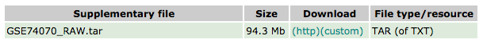

# Pre-process raw files

In this document I explain how I downloaded and pre-processed some of the raw files from [Rosenberg et al., 2015](https://www.ncbi.nlm.nih.gov/pubmed/26496609). The code in this document is written in bash and can be found in [001\_preprocess\_raw\_file.sh](001_preprocess_raw_file.sh).


## 1. Download files

The final processed files from Rosenberg et al can be downloaded from the supplementary file link [here](https://www.ncbi.nlm.nih.gov/geo/query/acc.cgi?acc=GSE74070).

<p align="center">
  
</p>

After downloading and extracting `GSE74070_RAW.tar`, we'll see there are many different files. We are interested in two, which will need to be decompressed:

* `GSM1911085_A5SS_seq.txt.gz`
* `GSM1911086_A5SS_spliced_reads.txt.gz`

`GSM1911085_A5SS_seq.txt` is a text file that matches each library genotype to a barcode. `GSM1911086_A5SS_spliced_reads.txt` shows the number of reads supporting a splice site at every nucleotide position in the intron:

| Barcode         | Position 0 | Position 1 | Position 2 | Position 3 | ... |
|-----------------|------------|------------|------------|------------|-----|
| CATTACCTGGCC... | 109        | 0          | 0          | 0          | ... |
| GGCACTGGACA...  | 45         | 0          | 0          | 1          | ... |
| AAACATGCACAC... | 64         | 0          | 0          | 0          | ... |


## 2. Pre-process `GSM1911086_A5SS_spliced_reads.txt`

Rosenberg et al define the following splice sites:

* **SD<sub>1</sub>** - at intron position 0, this is the most upstream splice site donor.
* **SD<sub>2</sub>** - at intron position 44, this is the second donor site designed in the original experiment.
* **SD<sub>crypt</sub>** - a cryptic splice site found at intron position 79

If no splice site is chosen:

* **noSD** - there is intron retention and this should be reflected in a high number of reads at intron position 303 (the end of the intron).

So we used the following **bash** script to filter `GSM1911086_A5SS_spliced_reads.txt` and remove any columns corresponding to positions other than the four above, as well as rows containing fewer than 100 total reads. The processed file was named `A5SS_dataset.txt`:

```bash
# filter GSM1911086_A5SS_spliced_reads.txt
cut -f 1,2,46,81,305 GSM1911086_A5SS_spliced_reads.txt | awk -v min=100 '$2 + $3 + $4 + $5 >= min {print $0}' > A5SS_dataset.txt
```
Note that the 1st column is the barcode column and the 2nd column is position 0, so to select position 44 we need to select column 46.

## 3. Rename `GSM1911085_A5SS_seq.txt`

I renamed this file to `A5SS_sequences.txt`:

```bash
mv GSM1911085_A5SS_seq.txt A5SS_sequences.txt
```

The two files (`A5SS_dataset.txt` and `A5SS_sequences.txt`) needed for further analysis are available in the [Data](./Data) folder.
