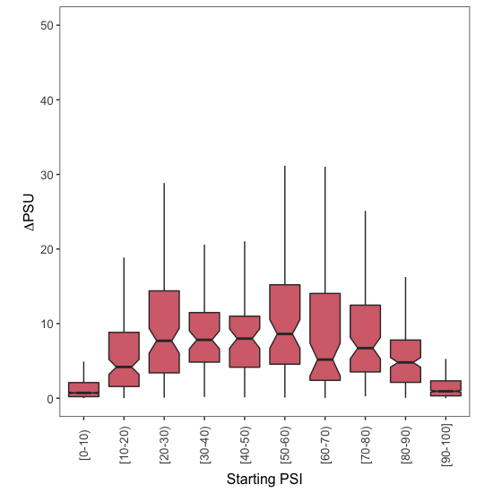
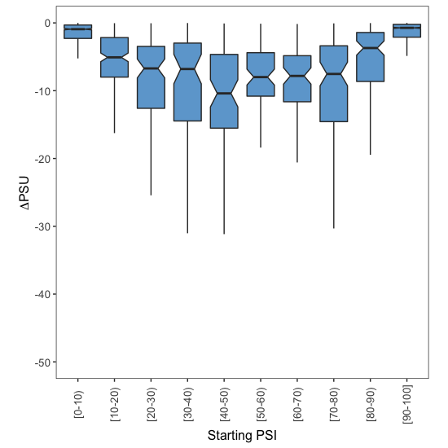
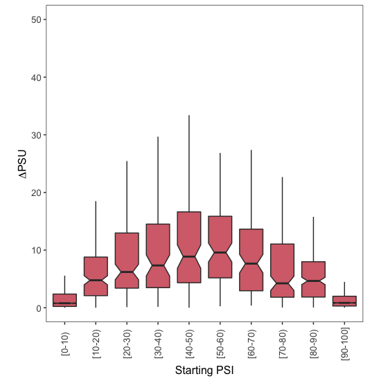
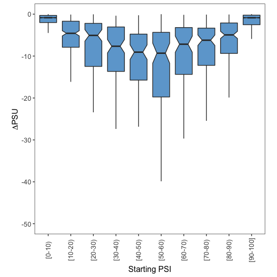

# Analysis of alternative splice site usage in patients with WT SF3B1 vs patients with mutations in SF3B1


In this document I describe the code found in [build\_tables.sh](build_tables.sh) and [boxplots.R](boxplots.R), where I compared splice site usage in two classes of MDS patients: those with mutations in SF3B1 and those without mutations in SF3B1. The code in this document is written in bash or in R, as indicated in each section.

## 1. Build table containing PSU values for splice sites in both conditions

**The code in this section is written in bash.**

We will first generate a table equivalent to [SF3B1wt\_SF3B1mut\_TABLE\_EXONS.txt](../../009_Exon_Inclusion_Across_Conditions/003_WT_SF3B1_vs_Mutated_SF3B1/Data/SF3B1wt_SF3B1mut_TABLE_EXONS.txt) (built in section [009\_Exon\_Inclusion\_Across\_Conditions](../../009_Exon_Inclusion_Across_Conditions)), but containing information about 5' and 3' splice sites throughout the genome. To run the following code, you will need the file named [SF3B1wt\_SF3B1mut\_TABLE.txt](../../009_Exon_Inclusion_Across_Conditions/003_WT_SF3B1_vs_Mutated_SF3B1/Data/SF3B1wt_SF3B1mut_TABLE.txt) that was built in that section.

```bash
# alternative 5' splice sites
awk 'NR==1 {print}; $2 ~ /^HsaALTD / {print $0}' SF3B1wt_SF3B1mut_TABLE.txt >> Data/SF3B1wt_SF3B1mut_TABLE_ALTD.txt

# alternative 3' splice sites
awk 'NR==1 {print}; $2 ~ /^HsaALTA / {print $0}' SF3B1wt_SF3B1mut_TABLE.txt >> Data/SF3B1wt_SF3B1mut_TABLE_ALTA.txt
```

These tables are provided in the `Data/` subdirectory in the current folder. With these tables ready, we can now run R scripts that will generate the boxplots from Figures 7H and S7B.


## 2. Alternative 5' splice sites

**The code in this section is written in R.**

We first load the file into R:

```r
Samples.Table <- read.table(file = "Data/SF3B1wt_SF3B1mut_TABLE_ALTD.txt",
                            sep = "\t",
                            header = TRUE)
```

For all alternative 5' splice site events in each of the two conditions to be compared (WT SF3B1 vs mutations in SF3B1), I took the average PSU (percent splice site usage) across all samples whose quality scores were labelled as `Pass`. If there were none, the average PSU set to `NA`.

```r
# Calculate the mean PSU for all alternative splice site events with WT SF3B1
Samples.Table$Mean.WT <- apply(X = Samples.Table[,grep("^SF3B1_wildtype",
                                                        colnames(Samples.Table),
                                                        perl = T)],
                                MARGIN = 1,
                                FUN = function(x){
                                  psi.values <- as.numeric(x[c(TRUE, FALSE)])
                                  psi.qualities <- as.character(x[c(FALSE, TRUE)])
                                  
                                  values.to.use <- which(psi.qualities == "Pass")
                                  
                                  if (length(values.to.use) > 0){
                                    mean.psi <- mean(psi.values[values.to.use])
                                  } else {
                                    mean.psi <- NA
                                  }
                                  
                                  mean.psi
                                })

# Calculate the mean PSU for all events with mutated SF3B1
Samples.Table$Mean.Mutated <- apply(X = Samples.Table[,grep("^SF3B1_mutated",
                                                            colnames(Samples.Table),
                                                            perl = T)],
                                    MARGIN = 1,
                                    FUN = function(x){
                                      
                                      psi.values <- as.numeric(x[c(TRUE, FALSE)])
                                      psi.qualities <- as.character(x[c(FALSE, TRUE)])
                                    
                                      values.to.use <- which(psi.qualities == "Pass")
                                      
                                      if (length(values.to.use) > 0){
                                        mean.psi <- mean(psi.values[values.to.use])
                                      } else {
                                        mean.psi <- NA
                                      }
                                      
                                      mean.psi
                                    })
```
To calculate the effect of mutating SF3B1 on splice site usage, I subtracted the mean PSU value under WT SF3B1 (the 'starting PSU') from the mean PSU value in the presence of a mutated SF3B1 (the 'final PSU'):

```r
Samples.Table$Mutated.Minus.WT <- Samples.Table$Mean.Mutated - Samples.Table$Mean.WT
```

There are many differences between these two cell lines, and so some splice sites will be used more often in HepG2 and some will be used more often in Huvec. To distinguish between those splice sites that are preferentially used in Huvec and those that are more skipped, I created two sub-tables called `PSU.Down` and `PSU.Up`:

```r
PSU.Down <- Samples.Table[which(Samples.Table$Mutated.Minus.WT < 0),] 
PSU.Up <- Samples.Table[which(Samples.Table$Mutated.Minus.WT > 0),] 
```

Finally, I assigned each exon skipping event to one of 10 groups, depending on the splice site usage under WT SF3B1 (the 'Starting PSU'):

```r
PSU.Up$Group <- findInterval(x = PSU.Up$Mean.WT,
                             vec = seq(0,100,10),
                             rightmost.closed = T)
PSU.Up$Group <- factor(PSU.Up $Group,
                       levels = 1:10)

PSU.Down$Group <- findInterval(x = PSU.Down$Mean.WT,
                               vec = seq(0,100,10),
                               rightmost.closed = T)
PSU.Down$Group <- factor(PSU.Down$Group,
                         levels = 1:10)
```
To visualise the effect of SF3B1 mutations on exon splice site usage, I used the ggplot2 library:

```r
library(ggplot2)
```

I then used the code below to draw boxplots and visualise how the ΔPSU depends on the starting levels of splice site usage.

### 2.1. More splice site usage

To visualise how the increase in splice site usage depends on the starting PSU:

```r
# plot!
ggplot(data = PSU.Up, mapping = aes(x = Group,
                                    y = Mutated.Minus.WT)) +
  geom_boxplot(outlier.shape = NA,
               notch = T,
               fill = "#D66F79") +
  theme_bw() +
  theme(panel.grid.major = element_blank(),
        panel.grid.minor = element_blank(),
        legend.position = "none",
        aspect.ratio = 1,
        axis.text.x = element_text(size = 10,
                                   angle = 90,
                                   vjust = 0.5),
        axis.text.y = element_text(size = 10),
        axis.title.x = element_text(size = 12),
        axis.title.y = element_text(size = 12)) +
  coord_cartesian(ylim = c(0,50)) + 
  ylab(expression(Delta*PSU)) +
  xlab("Starting PSI") +
  scale_x_discrete(labels = c("1" = "[0-10)",
                              "2" = "[10-20)",
                              "3" = "[20-30)",
                              "4" = "[30-40)",
                              "5" = "[40-50)",
                              "6" = "[50-60)",
                              "7" = "[60-70)",
                              "8" = "[70-80)",
                              "9" = "[80-90)",
                              "10" = "[90-100]"))
```
<p align="center">
  
  <br> Figure S7B
</p>

### 2.2. Less splice site usage

To visualise how the decrease in splice site usage depends on the starting PSU:

```r
# plot!
ggplot(data = PSU.Down,
       mapping = aes(x = Group,
                     y = Mutated.Minus.WT)) +
  geom_boxplot(outlier.shape = NA,
               notch = T,
               fill = "#6EA7D3") +
  theme_bw() +
  theme(panel.grid.major = element_blank(),
        panel.grid.minor = element_blank(),
        legend.position = "none",
        aspect.ratio = 1,
        axis.text.x = element_text(size = 10,
                                   angle = 90,
                                   vjust = 0.5),
        axis.text.y = element_text(size = 10),
        axis.title.x = element_text(size = 12),
        axis.title.y = element_text(size = 12)) +
  coord_cartesian(ylim = c(-50,0)) + 
  ylab(expression(Delta*PSU)) +
  xlab("Starting PSI") +
  scale_x_discrete(labels = c("1" = "[0-10)",
                              "2" = "[10-20)",
                              "3" = "[20-30)",
                              "4" = "[30-40)",
                              "5" = "[40-50)",
                              "6" = "[50-60)",
                              "7" = "[60-70)",
                              "8" = "[70-80)",
                              "9" = "[80-90)",
                              "10" = "[90-100]"))
```
<p align="center">
  
  <br> Figure S7B
</p>


## 3. Alternative 3' splice sites


The code used to analyse alternative 3' splice site usage was the same as for 5' splice sites. The resulting plots were the following:

<p align="center">
  
  <br> Figure 7H
</p>

<p align="center">
  
  <br> Figure 7H
</p>
