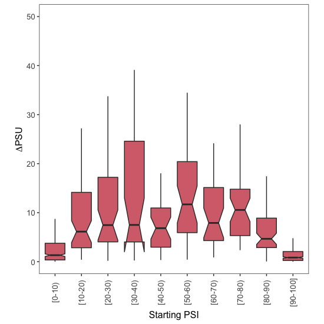
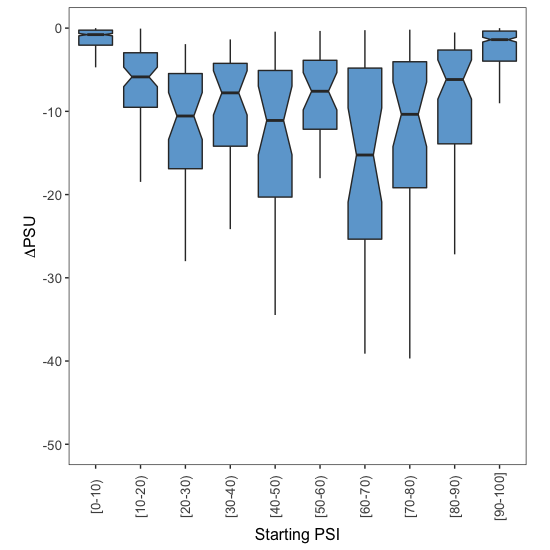
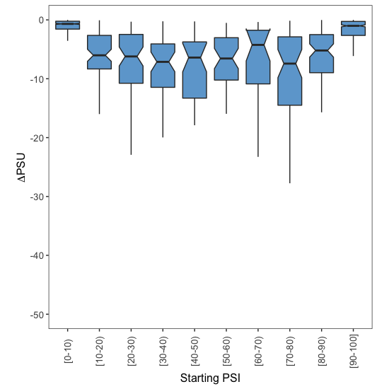

# Analysis of alternative splice site usage the 2-cell vs the 4-cell-state of the human embryo

In this document I describe the code found in [build\_tables.sh](build_tables.sh) and [boxplots.R](boxplots.R), where I compared splice site usage in two developmental stages of the human embryo: in the 2-cell stage and the 4-cell stage. The code in this document is written in bash or in R, as indicated in each section.

## 1. Build table containing PSU values for splice sites in both conditions

**The code in this section is written in bash.**

We will first generate a table equivalent to [2C\_4C\_TABLE\_EXONS.txt](../../008_Exon_Inclusion_Across_Conditions/004_2Cell_vs_4Cell/Data/2C_4C_TABLE_EXONS.txt) (built in section [008\_Exon\_Inclusion\_Across\_Conditions](../../008_Exon_Inclusion_Across_Conditions)), but containing information about 5' and 3' splice sites throughout the genome. To run the following code, you will need the file named [SF3B1wt\_SF3B1mut\_TABLE.txt](../../008_Exon_Inclusion_Across_Conditions/004_2Cell_vs_4Cell/Data/2C_4C_TABLE.txt) that was built in that section.

```bash
# alternative 5' splice sites
awk 'NR==1 {print}; $2 ~ /^HsaALTD / {print $0}' 2C_4C_TABLE.txt >> Data/2C_4C_TABLE_ALTD.txt

# alternative 3' splice sites
awk 'NR==1 {print}; $2 ~ /^HsaALTA / {print $0}' 2C_4C_TABLE.txt >> Data/2C_4C_TABLE_ALTA.txt
```

These tables are provided in the `Data/` subdirectory in the current folder. With these tables ready, we can now run R scripts that will generate the boxplots from Figures 7H and S7B.


## 2. Alternative 5' splice sites

**The code in this section is written in R.**

We first load the file into R:

```r
Samples.Table <- read.table(file = "Data/2C_4C_TABLE_ALTD.txt",
                            sep = "\t",
                            header = TRUE)
```

For all alternative 5' splice site events in each of the two conditions to be compared (2-cell-state human embryo vs 4-cell-state), I took the average PSU (percent splice site usage) across all samples whose quality scores were labelled as `Pass`. If there were none, the average PSU set to `NA`.

```r
# Calculate the mean PSU for all alternative splice site events in the 2-cell stage
Samples.Table$Mean.2C <- apply(X = Samples.Table[,grep("^X2C",
                                                       colnames(Samples.Table),
                                                       perl = T)],
                               MARGIN = 1,
                               FUN = function(x){
                                 psi.values <- as.numeric(x[c(TRUE, FALSE)])
                                 psi.qualities <- as.character(x[c(FALSE, TRUE)])
                                 
                                 values.to.use <- which(psi.qualities == "Pass")
                                 
                                 if (length(values.to.use) > 0){
                                   mean.psi <- mean(psi.values[values.to.use])
                                 } else {
                                   mean.psi <- NA
                                 }
                                 
                                 mean.psi
                               })

# Calculate the mean PSU for all events in the 4-cell stage
Samples.Table$Mean.4C <- apply(X = Samples.Table[,grep("^X4C",
                                                       colnames(Samples.Table),
                                                       perl = T)],
                               MARGIN = 1,
                               FUN = function(x){
                                 
                                 psi.values <- as.numeric(x[c(TRUE, FALSE)])
                                 psi.qualities <- as.character(x[c(FALSE, TRUE)])
                               
                                 values.to.use <- which(psi.qualities == "Pass")
                                 
                                 if (length(values.to.use) > 0){
                                   mean.psi <- mean(psi.values[values.to.use])
                                 } else {
                                   mean.psi <- NA
                                 }
                                 
                                 mean.psi
                               })
```
To calculate the effect of these two different developmental stages on splice site usage, I subtracted the mean PSU value uin the 2-cell stage (the 'starting PSU') from the mean PSU value in the 4-cell stage (the 'final PSU'):

```r
Samples.Table$FourCells.Minus.TwoCells <- Samples.Table$Mean.4C - Samples.Table$Mean.2C
```

There are many differences between these two developmental stages, and so some splice sites will be used more often in the 2-cell stage and some will be used more often in 4-cell stage. To distinguish between those splice sites that are preferentially used in the 2-cell stage and those that are more skipped, I created two sub-tables called `PSU.Down` and `PSU.Up`:

```r
PSU.Down <- Samples.Table[which(Samples.Table$FourCells.Minus.TwoCells < 0),]
PSU.Up <- Samples.Table[which(Samples.Table$FourCells.Minus.TwoCells > 0),]
```

Finally, I assigned each exon skipping event to one of 10 groups, depending on the splice site usage in the 2-cell stage (the 'Starting PSU'):

```r
PSU.Up$Group <- findInterval(x = PSU.Up$Mean.2C,
                             vec = seq(0,100,10),
                             rightmost.closed = T)
PSU.Up$Group <- factor(PSU.Up $Group,
                       levels = 1:10)

PSU.Down$Group <- findInterval(x = PSU.Down$Mean.2C,
                               vec = seq(0,100,10),
                               rightmost.closed = T)
PSU.Down$Group <- factor(PSU.Down$Group,
                         levels = 1:10)
```
To visualise the effect of developmental stage on exon splice site usage, I used the ggplot2 library:

```r
library(ggplot2)
```

I then used the code below to draw boxplots and visualise how the ΔPSU depends on the starting levels of splice site usage.

### 2.1. More splice site usage

To visualise how the increase in splice site usage depends on the starting PSU:

```r
# plot!
ggplot(data = PSU.Up, mapping = aes(x = Group,
                                    y = FourCells.Minus.TwoCells)) +
  geom_boxplot(outlier.shape = NA,
               notch = T,
               fill = "#D66F79") +
  theme_bw() +
  theme(panel.grid.major = element_blank(),
        panel.grid.minor = element_blank(),
        legend.position = "none",
        aspect.ratio = 1,
        axis.text.x = element_text(size = 10,
                                   angle = 90,
                                   vjust = 0.5),
        axis.text.y = element_text(size = 10),
        axis.title.x = element_text(size = 12),
        axis.title.y = element_text(size = 12)) +
  coord_cartesian(ylim = c(0,100)) + 
  ylab(expression(Delta*PSU)) +
  xlab("Starting PSI") +
  scale_x_discrete(labels = c("1" = "[0-10)",
                              "2" = "[10-20)",
                              "3" = "[20-30)",
                              "4" = "[30-40)",
                              "5" = "[40-50)",
                              "6" = "[50-60)",
                              "7" = "[60-70)",
                              "8" = "[70-80)",
                              "9" = "[80-90)",
                              "10" = "[90-100]"))
```
<p align="center">
  
  <br> Figure S7B
</p>

### 2.2. Less splice site usage

To visualise how the decrease in splice site usage depends on the starting PSU:

```r
# plot!
ggplot(data = PSU.Down,
       mapping = aes(x = Group,
                     y = FourCells.Minus.TwoCells)) +
  geom_boxplot(outlier.shape = NA,
               notch = T,
               fill = "#6EA7D3") +
  theme_bw() +
  theme(panel.grid.major = element_blank(),
        panel.grid.minor = element_blank(),
        legend.position = "none",
        aspect.ratio = 1,
        axis.text.x = element_text(size = 10,
                                   angle = 90,
                                   vjust = 0.5),
        axis.text.y = element_text(size = 10),
        axis.title.x = element_text(size = 12),
        axis.title.y = element_text(size = 12)) +
  coord_cartesian(ylim = c(-100,0)) + 
  ylab(expression(Delta*PSU)) +
  xlab("Starting PSI") +
  scale_x_discrete(labels = c("1" = "[0-10)",
                              "2" = "[10-20)",
                              "3" = "[20-30)",
                              "4" = "[30-40)",
                              "5" = "[40-50)",
                              "6" = "[50-60)",
                              "7" = "[60-70)",
                              "8" = "[70-80)",
                              "9" = "[80-90)",
                              "10" = "[90-100]"))
```
<p align="center">
  
  <br> Figure S7B
</p>


## 3. Alternative 3' splice sites


The code used to analyse alternative 3' splice site usage was the same as for 5' splice sites. The resulting plots were the following:

<p align="center">
  
  <br> Figure 7H
</p>

<p align="center">
  
  <br> Figure 7H
</p>
