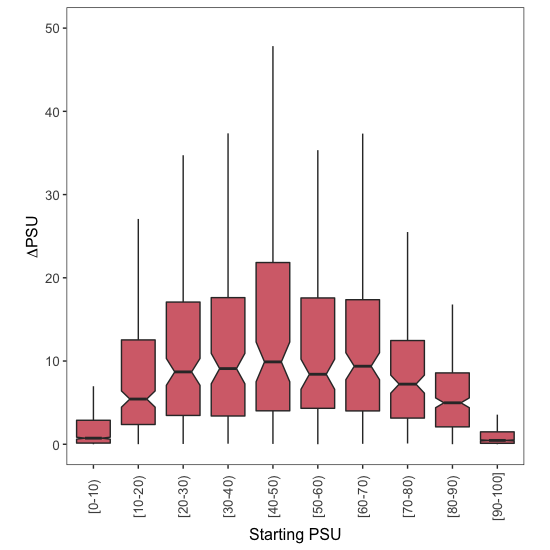
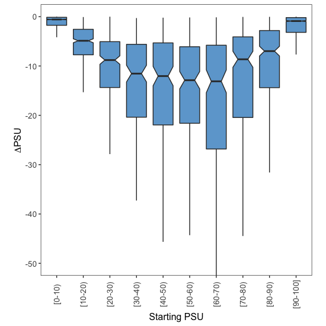
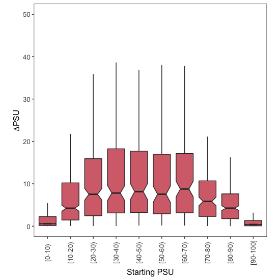
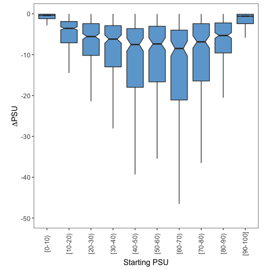

# Downstream Analysis

This document explains the code found in [002\_downstream\_analysis.R](002_downstream_analysis.R), which processes the `Tissues_Compared_Datasets.RData` file generated in the previous step to compare splice site usage in brain and in skin. All the code in this document is written in R.


## 1. Data processing in R

We first load the file:

```r
load("Tissues_Compared_Datasets.RData")
```
For the comparison between 2 different tissues, I chose Brain and Skin because these are the tissues with the largest number of samples. We can confirm this by running the `table` command on the `Tissue` column of the `GTEX.Annotations` data frame:

```r
table(GTEX.Annotations$Tissue)
```
```
## 
##  Adipose Tissue   Adrenal Gland         Bladder           Blood 
##             797             190              11             537 
##    Blood Vessel     Bone Marrow           Brain          Breast 
##             913               0            1671             290 
##    Cervix Uteri           Colon       Esophagus  Fallopian Tube 
##              11             507            1021               7 
##           Heart          Kidney           Liver            Lung 
##             600              45             175             427 
##          Muscle           Nerve           Ovary        Pancreas 
##             564             414             133             248 
##       Pituitary        Prostate  Salivary Gland            Skin 
##             183             152              97            1203 
## Small Intestine          Spleen         Stomach          Testis 
##             137             162             262             259 
##         Thyroid          Uterus          Vagina 
##             446             111             115
```
Need to figure out the IDs of all brain or skin samples:

```r
# which row numbers refer to a sample in brain or skin?
Brain.Indices <- which(GTEX.Annotations$Tissue == "Brain")
Skin.Indices <- which(GTEX.Annotations$Tissue == "Skin")

# use those row numbers as indices to extract relevant IDs
Brain.Sample.IDs <- as.character(GTEX.Annotations$ID)[Brain.Indices]
Skin.Sample.IDs <- as.character(GTEX.Annotations$ID)[Skin.Indices]
```
After taking the IDs I wanted to work with, I used them to subset `PSU.Estimates` and create two small data frames (one for each of the 2 tissues I want to compare):

```r
Brain.PSU.Table <- PSU.Estimates[,Brain.Sample.IDs]
Skin.PSU.Table <- PSU.Estimates[,Skin.Sample.IDs]
```
For each of the two tissues, I calculated the mean inclusion level of each alternative exon event:

```r
# calculate mean PSU in brain
Brain.Mean.PSUs <- apply(X = Brain.PSU.Table,
                         MARGIN = 1,
                         FUN = mean,
                         na.rm = T)

# calculate mean PSU in skin
Skin.Mean.PSUs <- apply(X = Skin.PSU.Table,
                        MARGIN = 1,
                        FUN = mean,
                        na.rm = T)
```
I removed any events where there was not enough information to calculate a mean PSU in either tissue (i.e. events where I only observed NA's):

```r
# indices with bad data in each of the two tissues
Brain.To.Remove <- which(is.na(Brain.Mean.PSUs))
Skin.To.Remove <- which(is.na(Skin.Mean.PSUs))

# indices with bad data in either tissue
Rows.To.Remove <- union(Brain.To.Remove, Skin.To.Remove)

# remove datapoints that only have NA's
Brain.Mean.PSUs <- Brain.Mean.PSUs[-Rows.To.Remove]
Skin.Mean.PSUs <- Skin.Mean.PSUs[-Rows.To.Remove]
```

To calculate the effect of changing the tissue (from brain, the 'Starting PSU' condition, to skin, the 'final PSU' condition) on splice site usage, I subtracted the mean PSU value in brain from the mean PSU value in skin:

```r
Skin.Minus.Brain <- Skin.Mean.PSUs - Brain.Mean.PSUs
```

There are many differences between these two tissues, and so some splice sites will be more used in brain and some will be more used in skin. To distinguish between splice sites that are more used in skin and those that are more skipped, I created two sub-tables called `PSU.Down` and `PSU.Up`:

```r
# exons that are more included in skin
PSU.Up <- data.frame(Brain = Brain.Mean.PSUs[which(Skin.Minus.Brain > 0)],
                     Skin = Skin.Mean.PSUs[which(Skin.Minus.Brain > 0)])

# exons that are less included in skin
PSU.Down <- data.frame(Brain = Brain.Mean.PSUs[which(Skin.Minus.Brain < 0)],
                       Skin = Skin.Mean.PSUs[which(Skin.Minus.Brain < 0)])
```
Finally, I assigned each alternative splice site event to one of 10 groups, depending on the splice site PSU in brain (the 'Starting PSU'):

```r
PSU.Up$Group <- findInterval(x = PSU.Up$Brain,
                             vec = seq(0,1,0.1),
                             rightmost.closed = T)
PSU.Up$Group <- factor(PSU.Up$Group, levels = 1:10)

PSU.Down$Group <- findInterval(x = PSU.Down$Brain,
                               vec = seq(0,1,0.1),
                               rightmost.closed = T)
PSU.Down$Group <- factor(PSU.Down$Group, levels = 1:10)
```


## 2. Plots

To visualise the effect of changing the tissue on exon inclusion, I used the ggplot2 library:

```r
library(ggplot2)
```

I then used the code below to draw boxplots and visualise how ΔPSU depends on the starting PSU.

### 2.1. More splice site usage

To visualise how the increase in splice site usage depends on the starting PSU:

```r
# plot!
ggplot(data = PSU.Up,
       mapping = aes(x = Group,
                     y = (Skin - Brain)*100)) +
  geom_boxplot(outlier.shape = NA,
               notch = T,
               fill = "#D66F79") +
  theme_bw() +
  theme(panel.grid.major = element_blank(),
        panel.grid.minor = element_blank(),
        legend.position = "none",
        aspect.ratio = 1,
        axis.text.x = element_text(size = 10,
                                   angle = 90,
                                   vjust = 0.5),
        axis.text.y = element_text(size = 10),
        axis.title.x = element_text(size = 12),
        axis.title.y = element_text(size = 12)) +
  coord_cartesian(ylim = c(0,50)) + 
  ylab(expression(Delta*PSU)) +
  xlab("Starting PSU") +
  scale_x_discrete(labels = c("1" = "[0-10)",
                              "2" = "[10-20)",
                              "3" = "[20-30)",
                              "4" = "[30-40)",
                              "5" = "[40-50)",
                              "6" = "[50-60)",
                              "7" = "[60-70)",
                              "8" = "[70-80)",
                              "9" = "[80-90)",
                              "10" = "[90-100]"))
```
<p align="center">
  
  <br> Figure S7B
</p>

### 2.2. Less splice site usage

To visualise how the decrease in splice site usage depends on the starting PSU:

```r
# plot!
ggplot(data = PSU.Down,
       mapping = aes(x = Group,
                     y = (Skin - Brain)*100)) +
  geom_boxplot(outlier.shape = NA,
               notch = T,
               fill = "#6EA7D3") +
  theme_bw() +
  theme(panel.grid.major = element_blank(),
        panel.grid.minor = element_blank(),
        legend.position = "none",
        aspect.ratio = 1,
        axis.text.x = element_text(size = 10,
                                   angle = 90,
                                   vjust = 0.5),
        axis.text.y = element_text(size = 10),
        axis.title.x = element_text(size = 12),
        axis.title.y = element_text(size = 12)) +
  coord_cartesian(ylim = c(-50,0)) + 
  ylab(expression(Delta*PSU)) +
  xlab("Starting PSU") +
  scale_x_discrete(labels = c("1" = "[0-10)",
                              "2" = "[10-20)",
                              "3" = "[20-30)",
                              "4" = "[30-40)",
                              "5" = "[40-50)",
                              "6" = "[50-60)",
                              "7" = "[60-70)",
                              "8" = "[70-80)",
                              "9" = "[80-90)",
                              "10" = "[90-100]"))
```
<p align="center">
  
  <br> Figure S7B
</p>


## 3. Plots for 3' splice site usage

Essentially the same code would be used to analyse the effect of tissue on 3' splice site usage. The only difference is that the line containing `eventType <- getSplicingEventTypes()[3]` in [001b\_process\_raw\_files.R](001b_process_raw_files.R) should be changed to `eventType <- getSplicingEventTypes()[4]`, as stated in the previous document. The resulting plots are:

<p align="center">
  
  <br> Figure 7H
</p>

<p align="center">
  
  <br> Figure 7H
</p>
