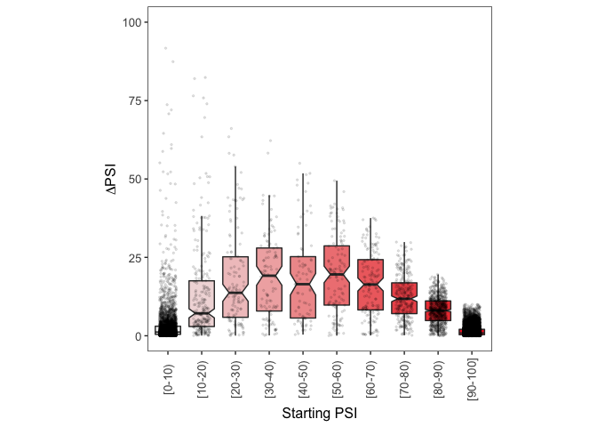
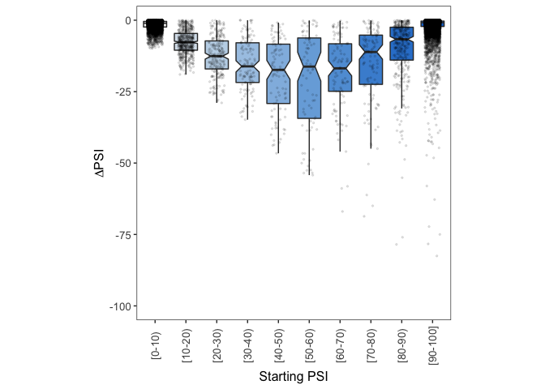

# Downstream Analysis


This document contains all the R code needed to process the `Huvec_HepG2_TABLE_EXONS.txt` file generated in the previous step. That file is provided in `Data` folder so feel free to jump straight to this code if you don't want to process the raw files. 

## Data processing in R

We first load the file into R:

```r
Samples.Table <- read.table(file = "Data/Huvec_HepG2_TABLE_EXONS.txt",
                            sep = "\t",
                            header = TRUE)
```

For all exon skipping events in each of the two conditions to be compared (HepG2 cell line vs HUVEK cell line), I took the average PSI across all samples whose quality scores were labelled as `Pass`. If there were none, the average PSI set to `NA`.

```r
# Calculate the mean PSI for all exon skipping events in HepG2
Samples.Table$Mean.HepG2 <- apply(X = Samples.Table[,grep("^HepG2",
                                                          colnames(Samples.Table),
                                                          perl = T)],
                                  MARGIN = 1,
                                  FUN = function(x){
                                    psi.values <- as.numeric(x[c(TRUE, FALSE)])
                                    psi.qualities <- as.character(x[c(FALSE, TRUE)])
                                    
                                    values.to.use <- which(psi.qualities == "Pass")
                                    
                                    if (length(values.to.use) > 0){
                                      mean.psi <- mean(psi.values[values.to.use])
                                    } else {
                                      mean.psi <- NA
                                    }
                                    
                                    mean.psi
                                  })

# Calculate the mean PSI for all exon skipping events in HUVEK
Samples.Table$Mean.Huvek <- apply(X = Samples.Table[,grep("^Huvec",
                                                          colnames(Samples.Table),
                                                          perl = T)],
                                  MARGIN = 1,
                                  FUN = function(x){
                                    
                                    psi.values <- as.numeric(x[c(TRUE, FALSE)])
                                    psi.qualities <- as.character(x[c(FALSE, TRUE)])
                                    
                                    values.to.use <- which(psi.qualities == "Pass")
                                    
                                    if (length(values.to.use) > 0){
                                      mean.psi <- mean(psi.values[values.to.use])
                                    } else {
                                      mean.psi <- NA
                                    }
                                    
                                    mean.psi
                                  })
```

To calculate the effect of changing the cell line (from HepG2, the 'Starting PSI' condition, to HUVEK, the 'final PSI' condition) on exon inclusion, I subtracted the mean PSI value in HepG2 from the mean PSI value in HUVEK:

```r
Samples.Table$Huvek.Minus.HepG2 <- Samples.Table$Mean.Huvek - Samples.Table$Mean.HepG2
```

There are many differences between these two cell lines, and so some exons will be more included in HepG2 and some will be more included in HUVEK. To distinguish between those exons that are more included when introduced in HUVEK and those that are more skipped, I created two sub-tables called `Exons.Down` and `Exons.Up`:

```r
Exons.Down <- Samples.Table[which(Samples.Table$Huvek.Minus.HepG2 < 0),] 
Exons.Up <- Samples.Table[which(Samples.Table$Huvek.Minus.HepG2 > 0),] 
```

Finally, I assigned each exon skipping event to one of 10 groups, depending on the exon PSI in HepG2 (the 'Starting PSI'):

```r
Exons.Up$Group <- findInterval(x = Exons.Up$Mean.HepG2,
                               vec = seq(0,100,10),
                               rightmost.closed = T)
Exons.Up$Group <- factor(Exons.Up$Group,
                         levels = 1:10)

Exons.Down$Group <- findInterval(x = Exons.Down$Mean.HepG2,
                                 vec = seq(0,100,10),
                                 rightmost.closed = T)
Exons.Down$Group <- factor(Exons.Down$Group,
                           levels = 1:10)
```


## Plots

To visualise the effect of changing the cell line on exon inclusion, I used two libraries:

```r
library(ggplot2)
library(RColorBrewer)
```

I then used the code below to draw boxplots and visualise how the ΔPSI depends on the starting levels of exon inclusion.

### More exon inclusion

To visualise how the increase in exon inclusion depends on the starting PSI:

```r
# colour palette for this plot
myPalette <- colorRampPalette(c("gray95", "firebrick2"))(n = 10)

# plot!
ggplot(data = Exons.Up, mapping = aes(x = Group,
                                      y = Huvek.Minus.HepG2,
                                      fill = Group)) +
  geom_boxplot(outlier.shape = NA, notch = T) +
  geom_jitter(aes(Group,Huvek.Minus.HepG2),
              position=position_jitter(width=0.25,
                                       height=0),
              alpha=0.1,
              size=0.5,
              show.legend=FALSE) +
  theme_bw() +
  theme(panel.grid.major = element_blank(),
        panel.grid.minor = element_blank(),
        legend.position = "none",
        aspect.ratio = 1,
        axis.text.x = element_text(size = 10,
                                   angle = 90,
                                   vjust = 0.5),
        axis.text.y = element_text(size = 10),
        axis.title.x = element_text(size = 12),
        axis.title.y = element_text(size = 12)) +
  coord_cartesian(ylim = c(0,100)) + 
  scale_fill_manual(values = c(myPalette[1:10])) +
  ylab(expression(Delta*PSI)) +
  xlab("Starting PSI") +
  scale_x_discrete(labels = c("1" = "[0-10)",
                              "2" = "[10-20)",
                              "3" = "[20-30)",
                              "4" = "[30-40)",
                              "5" = "[40-50)",
                              "6" = "[50-60)",
                              "7" = "[60-70)",
                              "8" = "[70-80)",
                              "9" = "[80-90)",
                              "10" = "[90-100]"))
```




### More exon skipping

To visualise how the decrease in exon inclusion depends on the starting PSI:

```r
# colour palette for this plot
myPalette <- colorRampPalette(c("gray95", "dodgerblue3"))(n = 10)

# plot!
ggplot(data = Exons.Down, mapping = aes(x = Group,
                                        y = Huvek.Minus.HepG2,
                                        fill = Group)) +
  geom_boxplot(outlier.shape = NA,
               notch = T) +
  geom_jitter(aes(Group,Huvek.Minus.HepG2),
              position=position_jitter(width=0.25,
                                       height=0),
              alpha=0.1,
              size=0.1,
              show.legend=FALSE) +
  theme_bw() +
  theme(panel.grid.major = element_blank(),
        panel.grid.minor = element_blank(),
        legend.position = "none",
        aspect.ratio = 1,
        axis.text.x = element_text(size = 10,
                                   angle = 90,
                                   vjust = 0.5),
        axis.text.y = element_text(size = 10),
        axis.title.x = element_text(size = 12),
        axis.title.y = element_text(size = 12)) +
  coord_cartesian(ylim = c(-100,0)) + 
  scale_fill_manual(values = c(myPalette[1:10])) +
  ylab(expression(Delta*PSI)) +
  xlab("Starting PSI") +
  scale_x_discrete(labels = c("1" = "[0-10)",
                              "2" = "[10-20)",
                              "3" = "[20-30)",
                              "4" = "[30-40)",
                              "5" = "[40-50)",
                              "6" = "[50-60)",
                              "7" = "[60-70)",
                              "8" = "[70-80)",
                              "9" = "[80-90)",
                              "10" = "[90-100]"))
```
