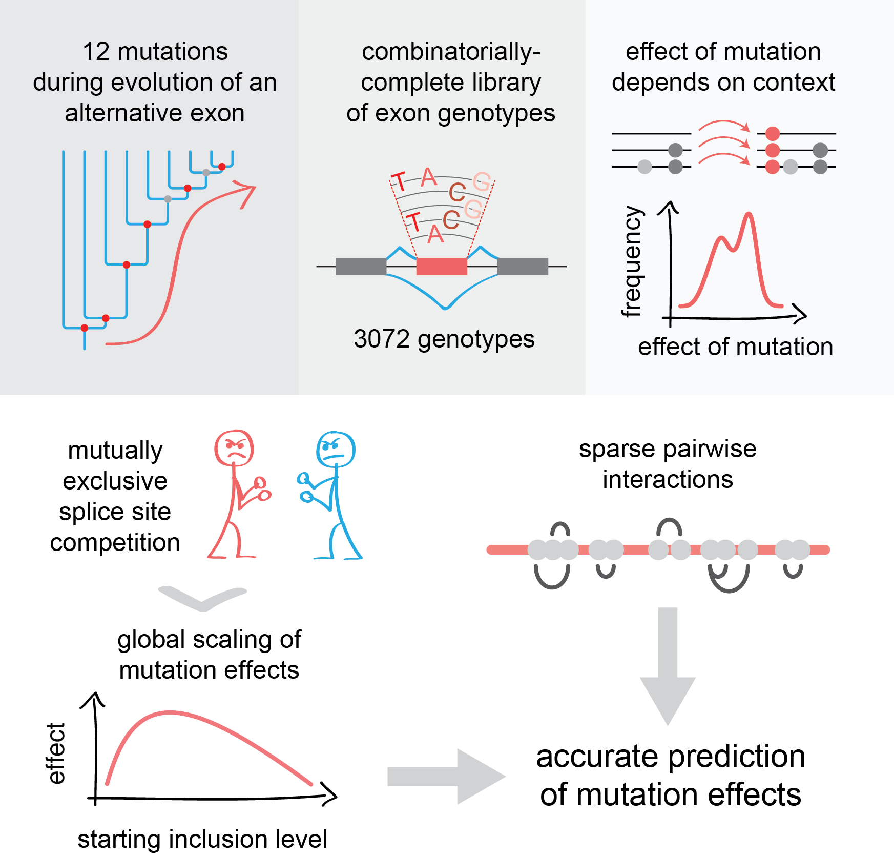

# About

Hi, welcome to the GitHub repository for the manuscript titled **_Combinatorial genetics reveals a scaling law for the effects of mutations on splicing_** (which can be accessed [here](https://doi.org/10.1016/j.cell.2018.12.010)).

  

In this repository you'll find the scripts necessary to reproduce the results from the computational analyses described in the paper. Most scripts are accompanied by a markdown file (.md extension) that describes the code in a bit more detail, although the scripts are generally well commented.
